# Anthropoid Calculus Microbiome Evolution

Additional code, analysis and results to extend the supplementary information of Fellows Yates, J.A. _et al._ (2020) XXXX. Please read section R1 before proceeding. 

## Table of Contents

<!-- MarkdownTOC autolink="true" levels="1,2,3" -->

- [R1 Introduction](#r1-introduction)
- [R2 Resources](#r2-resources)
  - [R2.1 Software](#r21-software)
  - [R2.2 R Packages](#r22-r-packages)
  - [R2.3 Sequence Databases](#r23-sequence-databases)
  - [R2.4 Single Reference Genomes](#r24-single-reference-genomes)
- [R3 Software Paths](#r3-software-paths)
- [R4 Database and Genome Indexing](#r4-database-and-genome-indexing)
  - [R4.1 MALT Database](#r41-malt-database)
  - [R4.2 AADDER Database](#r42-aadder-database)
  - [R4.3 BWA Indexing](#r43-bwa-indexing)
  - [R4.4 UniRef Database](#r44-uniref-database)
  - [R4.5 Database analysis profile](#r45-database-analysis-profile)
- [R5 Data Acquisition](#r5-data-acquisition)
  - [R5.1 Additional Individuals](#r51-additional-individuals)
  - [R5.2 Comparative Sources](#r52-comparative-sources)
- [R6 Data Preprocessing](#r6-data-preprocessing)
  - [R6.1 Preprocessing](#r61-preprocessing)
  - [R6.2 Post-Processing](#r62-post-processing)
  - [R6.3 Poly-G Trimming Assessment](#r63-poly-g-trimming-assessment)
  - [R6.4 Processing Results Summary](#r64-processing-results-summary)
- [R7 Metagenomic Screening](#r7-metagenomic-screening)
  - [R7.1 MALT](#r71-malt)
  - [R7.2 MEGAN](#r72-megan)
  - [R7.3 Database Comparison](#r73-database-comparison)
- [R8 Preservation Screening](#r8-preservation-screening)
  - [R8.1 Cumulative Proportion Decay Plots](#r81-cumulative-proportion-decay-plots)
  - [R8.2 Source Estimation](#r82-source-estimation)
  - [R8.3 Ratio of Eukaryotic to Prokaryotic Alignments](#r83-ratio-of-eukaryotic-to-prokaryotic-alignments)
  - [R8.4 Damage Patterns](#r84-damage-patterns)
  - [R8.5 Laboratory Contaminants](#r85-laboratory-contaminants)
  - [R8.5.1 decontam](#r851-decontam)
  - [R8.5.2 Contaminant Impact Check](#r852-contaminant-impact-check)
- [R9 Compositional Analysis](#r9-compositional-analysis)
  - [R9.1 Principal Coordinate Analysis](#r91-principal-coordinate-analysis)
  - [R9.2 PERMANOVA](#r92-permanova)
  - [R9.3 Hierarchical Clustering Heatmaps](#r93-hierarchical-clustering-heatmaps)
  - [R9.3.2 Indicator Analysis](#r932-indicator-analysis)
  - [R9.4 Clustering by Diet?](#r94-clustering-by-diet)
- [R10 Core Microbiome Analysis](#r10-core-microbiome-analysis)
  - [R10.1 Core Microbiome Calculation](#r101-core-microbiome-calculation)
  - [R10.2 Core Microbiome MaltExtract](#r102-core-microbiome-maltextract)
- [R11 Genome Reconstruction and Phylogenetics](#r11-genome-reconstruction-and-phylogenetics)
  - [R11.1 Production dataset sequencing depth calculations](#r111-production-dataset-sequencing-depth-calculations)
  - [R11.2 Super-reference construction](#r112-super-reference-construction)
  - [R11.3 Super-reference alignment and species selection](#r113-super-reference-alignment-and-species-selection)
  - [R11.4 Comparative single reference mapping](#r114-comparative-single-reference-mapping)
  - [R11.5 Performance of super-reference vs. single genome mapping](#r115-performance-of-super-reference-vs-single-genome-mapping)
  - [R11.6 Variant calling and single-allelic position assessment](#r116-variant-calling-and-single-allelic-position-assessment)
  - [R11.7 Phylogenies](#r117-phylogenies)
  - [R11.8 Pre- and Post-14k BP Observation Verification](#r118-pre--and-post-14k-bp-observation-verification)
- [R12 Functional Analysis](#r12-functional-analysis)
  - [R12.1 Virulence Factors](#r121-virulence-factors)
  - [R12.2 Amylase](#r122-amylase)
  - [R12.3 HUMANn2](#r123-humann2)
  - [R12.4 AADDER Analysis](#r124-aadder-analysis)
  - [R12.5 MALT RefSeq](#r125-malt-refseq)
  - [R12.6 Running AADDER](#r126-running-aadder)
  - [R12.7 Overlap between HUMAnN2 and AADDER](#r127-overlap-between-humann2-and-aadder)

<!-- /MarkdownTOC -->

## R1 Introduction

This README acts as **walkthrough** guidance of the order of analyses for 
Fellows Yates, J.A. _et al._ (2020) XXXX. It acts as a **practical methods** 
supplement as well as for displaying additional **figures** only. Justification 
and discussion of figures and results are sparsely described, and the main 
publication should be referred to for scientific interpretation and context.

The repository contains additional data files, R notebooks, scripts and 
commands where a program was initiated directly from the command line, as well 
as _some_ additional results.

The following objects referred to in the supplementary information of the paper
can be found here:
 * External Data Repository Section RXX (in this README)
 * External Data Repository Figure RXX (in this README and under `05-images/`.)
 * External Data Repository Table RXX (in this README)
 * External Data Repository File RXX  (in this README and under `06-additional_data_files/`.)

Code can be found under the directory `02-scripts.backup`, 'raw' 
analysis results can be seen under `04-analysis`. 'Cleaned-up'/summary analysis 
results and metadata files can be seen under `00-documentation`. Figures 
displayed within this README are stored under `05-images`. Additional data 
files for fast access/referral in the main publication can be seen under 
`06-additional_data_files`.

> `01-data` and `03-preprocessing` only contains empty directories as these 
contain very large sequencing files that cannot be uploaded to this repository.
They are kept here so if reproducing analysis, paths in scripts do not need to 
be modified. Raw data can be found on the ENA under project accession ID: 
PRJEB34569. 

In more detail, the general structure of this project is typically as follows 
(although variants will occur):

```text
README.md             ## This walkthrough
00-documentation/     ## Contains main metadata files and summary result files
  00-document_1.txt
  01-document_2.txt
01-data/              ## Only contains directories where raw data FASTQ files
  raw_data/           ## are stored (must be downloaded yourself, not included 
    screening/        ## due to large file size)
    deep/
  databases/
    <database_1>/
02-scripts.backup/    ## Contains all scripts and R notebooks used in this project
  000-ANALYSIS_CONFIG ## and referred to throughout this README
  001-script.sh
  002-notebook.Rmd
03-preprocessing      ## Only contains directories where pre-processed FASTQ files
  screening/          ## are stored (must be processed yourself, not included 
    human_filtering/  ## due to large file size)
      input/
      output/
    library_merging/
      input/
      output/
  deep/
    human_filtering
      input/
      output/
    library_merging/
      input/
      output/
04-analysis/         ## Contains all small(ish) results files from analyses, 
  screening/         ## such as tables, .txt. files etc. Large files (BAM, RAM6
    analysis_1/      ##  etc.) not included here due to large suze and must be
      input          ##  generated yourself
      output
    analysis_2/
      input
      output
  deep/
    analysis_1/
      input
     output
    analysis_2/
      input
      output
05-images/           ## Stores images displayed in this README
  Figure_R01/
  Figure_R02/
06-additional_data_files  ## A fast look-up location for certain important files
                          ## referred to in the supplementary text of the 
                          ## associated manuscript. Typically copies of files
                          ## stored in 04-analysis.
```

> Important: The code in this repository was written over multiple 'learning' 
> years by non-bioinformaticians. Quality will vary and may not be immediately 
> rer-unable or readable - if you encounter any issues please leave 
> an [issue](https://github.com/jfy133/Anthropoid_Calculus_Microbiome_Evolution/issues) 
> and we will endeavour to clarify.

> We have tried to auto replace all file paths to make it relative to this 
> repository. This may not have been perfect, so please check the path 
> begins with `../0{1,2,4}`. If it does not, let us know and we will fix
> this accordingly.
 
## R2 Resources

Here is a list of programs and databases that will be used in this analysis
and that you should have ready installed/downloaded prior carrying out the
analysis. Note that the download and set up of the databases are described 
below.

This analysis was performed on a server running Ubuntu 14.04 LTS, and a SLURM 
submission scheduler. Some scripts or commands may heavily refer to SLURM, 
however these are directly related to our system. As far as we can, we have 
removed SLURM commands and/or MPI-SHH specific paths or parameters, but you 
should always check this for each command and script.

### R2.1 Software

Name                    | Version                 | Citation
------------------------|-------------------------|------------------------------------------------------------
GNU bash                | 4.3.11                  | NA
sratoolkit              | 2.8.0                   | https://www.ncbi.nlm.nih.gov/books/NBK158900/
EAGER                   | 1.9.55                  | Peltzer et al. 2016 Genome Biol.
AdapterRemoval          | 2.3.0                   | Schubert et al. 2016 BMC Resarch Notes
bwa                     | 0.7.12                  | Li and Durbin 2009 Bioinformatics
samtools                | 1.3                     | Li et al. 2009 Bioinformatics
PicardTools             | 1.140                   | https://github.com/broadinstitute/picard
GATK                    | 3.5                     | DePristo et al. 2011 Nat. Genets.
mapDamage               | 2.0.6                   | Jónsson et al. ‎2013 Bioinformatics
DeDup                   | 0.12.1                  | Peltzer et al. 2016 Genome Bio
MALT                    | 0.4.0                   | Herbig et al. 2016 bioRxiv, Vagene et al. 2018 Nat. Eco. Evo.
MEGANCE                 | 6.12.0                  | Huson et al. 2016 PLoS Comp. Bio.
FastP                   | 0.19.3                  | Chen et al. 2018 Bioinformatics
Entrez Direct           | Jun 2016                | http://www.ncbi.nlm.nih.gov/books/NBK179288
QIIME                   | 1.9.1                   | Caporaso et al. 2010 Nat. Methods.
Sourcetracker           | 1.0.1                   | Knights et al. 2011 Nat. Methods.
conda                   | 4.7.0                   | https://conda.io/projects/conda/en/latest/
pigz                    | 2.3                     | https://zlib.net/pigz/
R                       | 3.4.4                   | https://www.R-project.org/
MaltExtract             | 1.5                     | Hübler et al. 2019 Genome Biology
MultiVCFAnalyzer        | 0.87                    | Bos et al. 2014 Nature
bedtools                | 2.25.0                  | Quinlan et al. 2010 Bioinformatics
panX                    | 1.5.1                   | Ding et al. 2018 Nucleic Acids Research
MetaPhlAn2              | 2.7.1                   | Truong et al. 2015 Nat. Methods
HuMANn2                 | 0.11.2                  | Franzosa et al. 2018 Nat. Methods.
blastn                  | 2.7.1+                  | Package: blast 2.7.1, build Oct 18 2017 19:57:24
seqtk                   | 1.2-r95-dirty           | https://github.com/lh3/seqtk
Geneious                | R8                      | https://www.geneious.com/
IGV                     | 2.4                     | https://software.broadinstitute.org/software/igv/
Inkscape                | 0.92                    | www.inkscape.org

### R2.2 R Packages

Here we used R version 3.6.1

|      name      |  version   |                                                  URL                                                   |
|:---------------|:-----------|:-------------------------------------------------------------------------------------------------------|
|    markdown    |    1.1     |                                  https://github.com/rstudio/markdown                                   |
| zCompositions  |  1.3.2-1   |                                              Not provided                                              |
|   truncnorm    |   1.0-8    |                               https://github.com/olafmersmann/truncnorm                                |
|      NADA      |   1.6-1    |                                              Not provided                                              |
|    survival    |  2.44-1.1  |                                  https://github.com/therneau/survival                                  |
|      XML       | 3.98-1.20  |                                     http://www.omegahat.net/RSXML                                      |
|    viridis     |   0.5.1    |                                 https://github.com/sjmgarnier/viridis                                  |
|  viridisLite   |   0.3.0    |                               https://github.com/sjmgarnier/viridisLite                                |
|  VennDiagram   |   1.6.20   |                                              Not provided                                              |
| futile.logger  |   1.4.3    |                                              Not provided                                              |
|      vcfR      |   1.8.0    |             https://github.com/knausb/vcfR,; https://knausb.github.io/vcfR_documentation/              |
|    usedist     |   0.1.0    |                                              Not provided                                              |
|     UpSetR     |   1.4.0    |                                   http://github.com/hms-dbmi/UpSetR                                    |
|    forcats     |   0.4.0    |                   http://forcats.tidyverse.org, https://github.com/tidyverse/forcats                   |
|     purrr      |   0.3.2    |                     http://purrr.tidyverse.org, https://github.com/tidyverse/purrr                     |
|   tidyverse    |   1.2.1    |                http://tidyverse.tidyverse.org,; https://github.com/tidyverse/tidyverse                 |
|     tidyr      |   0.8.3    |                     http://tidyr.tidyverse.org, https://github.com/tidyverse/tidyr                     |
|     tictoc     |    1.0     |                                http://github.com/collectivemedia/tictoc                                |
|     tibble     |   2.1.3    |                   http://tibble.tidyverse.org/, https://github.com/tidyverse/tibble                    |
|   textutils    |   0.1-11   |     http://enricoschumann.net/R/packages/textutils/,; https://github.com/enricoschumann/textutils      |
|     taxize     |   0.9.8    | https://github.com/ropensci/taxize (devel),; https://ropenscilabs.github.io/taxize-book/ (user manual) |
|    stringr     |   1.4.0    |                   http://stringr.tidyverse.org, https://github.com/tidyverse/stringr                   |
|     seqinr     |   3.4-5    |                                  http://seqinr.r-forge.r-project.org/                                  |
|     scales     |   1.0.0    |                       https://scales.r-lib.org, https://github.com/r-lib/scales                        |
|    reshape2    |   1.4.3    |                                   https://github.com/hadley/reshape                                    |
|    rentrez     |   1.2.2    |                                   http://github.com/ropensci/rentrez                                   |
|     readxl     |   1.3.1    |                   https://readxl.tidyverse.org, https://github.com/tidyverse/readxl                    |
|     readr      |   1.3.1    |                     http://readr.tidyverse.org, https://github.com/tidyverse/readr                     |
|  RColorBrewer  |   1.1-2    |                                              Not provided                                              |
|     psych      |   1.8.12   |      https://personality-project.org/r/psych; https://personality-project.org/r/psych-manual.pdf       |
|     plotly     |   4.9.0    |          https://plotly-r.com, https://github.com/ropensci/plotly#readme,; https://plot.ly/r           |
|    phytools    |   0.6-99   |                                 http://github.com/liamrevell/phytools                                  |
|      maps      |   3.3.0    |                                              Not provided                                              |
|    phyloseq    |   1.28.0   |                            http://dx.plos.org/10.1371/journal.pone.0061217                             |
|     philr      |   1.10.1   |                                   https://github.com/jsilve24/philr                                    |
|    phangorn    |   2.5.5    |                                 https://github.com/KlausVigo/phangorn                                  |
|   patchwork    |   0.0.1    |                                 https://github.com/thomasp85/patchwork                                 |
| pairwiseAdonis |   0.0.1    |                                              Not provided                                              |
|    cluster     |   2.1.0    |                           https://svn.r-project.org/R-packages/trunk/cluster                           |
|     vegan      |   2.5-6    |                     https://cran.r-project.org, https://github.com/vegandevs/vegan                     |
|    mixOmics    |   6.8.1    |                                        http://www.mixOmics.org                                         |
|    lattice     |  0.20-38   |                                 http://lattice.r-forge.r-project.org/                                  |
|      MASS      |  7.3-51.4  |                                  http://www.stats.ox.ac.uk/pub/MASS4/                                  |
|    janitor     |   1.2.0    |                                   https://github.com/sfirke/janitor                                    |
|  indicspecies  |   1.7.6    |                                              Not provided                                              |
|    permute     |   0.9-5    |                                https://github.com/gavinsimpson/permute                                 |
|   gridExtra    |    2.3     |                                              Not provided                                              |
|     gplots     |  3.0.1.1   |                                              Not provided                                              |
|     ggtree     |   1.16.5   |                               https://yulab-smu.github.io/treedata-book/                               |
|    ggridges    |   0.5.1    |                                 https://github.com/clauswilke/ggridges                                 |
|    ggrepel     |   0.8.1    |                                   http://github.com/slowkow/ggrepel                                    |
|   ggfortify    |   0.4.7    |                                  https://github.com/sinhrks/ggfortify                                  |
|   ggbeeswarm   |   0.6.0    |                                 https://github.com/eclarke/ggbeeswarm                                  |
|   ggalluvial   |   0.9.1    |                                http://corybrunson.github.io/ggalluvial/                                |
|    ggplot2     |   3.2.1    |                   http://ggplot2.tidyverse.org, https://github.com/tidyverse/ggplot2                   |
|     furrr      |   0.1.0    |                                 https://github.com/DavisVaughan/furrr                                  |
|     future     |   1.14.0   |                               https://github.com/HenrikBengtsson/future                                |
|      fpc       |   2.2-3    |                           https://www.unibo.it/sitoweb/christian.hennig/en/                            |
|     dplyr      |   0.8.3    |                     http://dplyr.tidyverse.org, https://github.com/tidyverse/dplyr                     |
|  directlabels  | 2018.05.22 |                               http://directlabels.r-forge.r-project.org/                               |
|    decontam    |   1.4.0    |                                  https://github.com/benjjneb/decontam                                  |
|   data.table   |   1.12.2   |                                         http://r-datatable.com                                         |
|    dabestr     |   0.2.2    |                                   https://github.com/ACCLAB/dabestr                                    |
|    magrittr    |    1.5     |                                              Not provided                                              |
|      boot      |   1.3-23   |                                              Not provided                                              |
|    cowplot     |   1.0.0    |                                      https://wilkelab.org/cowplot                                      |
|  compositions  |   1.40-2   |                                http://www.stat.boogaart.de/compositions                                |
|     bayesm     |   3.1-3    |                                   http://www.perossi.org/home/bsm-1                                    |
|     energy     |   1.7-6    |                                  https://github.com/mariarizzo/energy                                  |
|   robustbase   |   0.93-5   |                                http://robustbase.r-forge.r-project.org/                                |
|    tensorA     |   0.36.1   |                                  http://www.stat.boogaart.de/tensorA                                   |
|     clues      |   0.5.9    |                                              Not provided                                              |
|     broom      |   0.5.2    |                                   http://github.com/tidyverse/broom                                    |
|    BacDiveR    |   0.9.0    |                                https://github.com/TIBHannover/BacDiveR                                 |
|      ape       |    5.3     |                                       http://ape-package.ird.fr/                                       |
|      amap      |   0.8-17   |                                              Not provided                                              |
|     ALDEx2     |   1.16.0   |                                    https://github.com/ggloor/ALDEx2                                    |
|    adegenet    |   2.1.1    |                               https://github.com/thibautjombart/adegenet                               |
|      ade4      |   1.7-13   |      http://pbil.univ-lyon1.fr/ADE-4, Mailing list:; http://listes.univ-lyon1.fr/wws/info/adelist      |

### R2.3 Sequence Databases

If did not come with package itself, we downloaded the following:

Name             | Version                      | Date          | Download Location
-----------------|------------------------------|---------------|-------------------------------------------------------
NCBI Nucleotide  | nt.gz                        | Dec. 2016     | ftp://ftp.ncbi.nlm.nih.gov/blast/db/FASTA/
NCBI RefSeq      | Custom                       | Nov. 2018     | ftp://ftp.ncbi.nlm.nih.gov/genomes/
SILVA            | 128_SSURef_Nr99              | Mar. 2017     | http://ftp.arb-silva.de/release_128/Exports/
UniRef           | uniref90_ec_filtered_diamond | Oct. 2018     | https://bitbucket.org/biobakery/humann2

### R2.4 Single Reference Genomes

Species                                       | Strain      | Date           | Completeness | Type           | Source
----------------------------------------------|-------------|---------------:|--------------|----------------|-----------------------------------------------------
_Homo sapiens_                                | HG19        | 2016-01-14     | Complete     | Reference      | http://hgdownload.cse.ucsc.edu/downloads.html#human
_Actinomyces dentalis_                        | DSM 19115   | 2019-02-25     | Scaffold     | Representative | ftp://ftp.ncbi.nlm.nih.gov/genomes/all/GCF/000/429/225/GCF_000429225.1_ASM42922v1/
_Campylobacter gracilis_                      | -           | 2019-05-22     | Complete     | Representative | ftp://ftp.ncbi.nlm.nih.gov/genomes/all/GCF/001/190/745/GCF_001190745.1_ASM119074v1/
_Aggregatibacter aphrophilus_                 | W10433      | 2017-06-14     | Complete     | Representative | ftp://ftp.ncbi.nlm.nih.gov/genomes/all/GCF/000/022/985/GCF_000022985.1_ASM2298v1/
_Capnocytophaga gingivalis_                   | ATCC 33624  | 2019-02-25     | Contigs      | Representative | ftp://ftp.ncbi.nlm.nih.gov/genomes/all/GCF/000/174/755/GCF_000174755.1_ASM17475v1/
_Corynebacterium matruchotii_                 | ATCC 14266  | 2019-05-22     | Contigs      | Representative | ftp://ftp.ncbi.nlm.nih.gov/genomes/all/GCF/000/175/375/GCF_000175375.1_ASM17537v1/
_Desulfobulbus_ sp. oral taxon 041            | Dsb1-5      | 2018-06-06     | Contigs      | Assembly       | ftp://ftp.ncbi.nlm.nih.gov/genomes/all/GCA/000/403/865/GCA_000403865.1_Dsb1-5/
_Fretibacterium fastidiosum_                  | -           | 2018-12-11     | Chromosome   | Unknown        | https://www.ncbi.nlm.nih.gov/nuccore/FP929056.1
_Fusobacterium hwasookii_                     | ChDC F206   | 2019-10-27     | Complete     | Representative | ftp://ftp.ncbi.nlm.nih.gov/genomes/all/GCF/001/455/105/GCF_001455105.1_ASM145510v1/
_Fusobacterium nucleatum_ subsp. _nucleatum_  | ATCC 25586  | 2017-06-14     | Complete     | Representative | ftp://ftp.ncbi.nlm.nih.gov/genomes/all/GCF/000/007/325/GCF_000007325.1_ASM732v1/
_Olsenella sp. oral taxon 807_                | 807         | 2019-01-10     | Complete     | Unknown        | ftp://ftp.ncbi.nlm.nih.gov/genomes/all/GCF/001/189/515/GCF_001189515.2_ASM118951v2/
_Ottowia sp. oral taxon 894_                  | 894         | 2019-05-22     | Complete     | Unknown        | ftp://ftp.ncbi.nlm.nih.gov/genomes/all/GCF/001/262/075/GCF_001262075.1_ASM126207v1/
_Porphyromonas gingivalis_                    | ATCC 33277  | 2018-12-11     | Complete     | Representative | ftp://ftp.ncbi.nlm.nih.gov/genomes/all/GCF/000/010/505/GCF_000010505.1_ASM1050v1/
_Prevotella loescheii_                        | DSM 19665   | 2019-05-22     | Scaffolds    | Representative | ftp://ftp.ncbi.nlm.nih.gov/genomes/all/GCF/000/378/085/GCF_000378085.1_ASM37808v1/
_Pseudopropionibacterium propionicum_         | F0230a      | 2018-12-11     | Complete     | Representative | ftp://ftp.ncbi.nlm.nih.gov/genomes/all/GCF/000/277/715/GCF_000277715.1_ASM27771v1
_Rothia dentocariosa_                         | ATCC 17831  | 2017-06-14     | Complete     | Representative | ftp://ftp.ncbi.nlm.nih.gov/genomes/all/GCF/000/164/695/GCF_000164695.2_ASM16469v2/
_Selenomonas sp. F0473_                       | F0473       | 2019-05-22     | Scaffolds    | Unknown        | ftp://ftp.ncbi.nlm.nih.gov/genomes/all/GCF/000/315/545/GCF_000315545.1_Seleno_sp_F0473_V1/
_Streptococcus gordonii_                      | CH1         | 2018-06-14     | Complete     | Representative | ftp://ftp.ncbi.nlm.nih.gov/genomes/all/GCF/000/017/005/GCF_000017005.1_ASM1700v1
_Streptococcus sanguinis_                     | SK36        | 2018-12-11     | Complete     | Reference      | ftp://ftp.ncbi.nlm.nih.gov/genomes/all/GCF/000/014/205/GCF_000014205.1_ASM1420v1/
_Tannerella forsythia_                        | 92A2        | 2018-12-18     | Complete     | Representative | ftp://ftp.ncbi.nlm.nih.gov/genomes/all/GCF/000/238/215/GCF_000238215.1_ASM23821v1/
_Treponema socranskii subsp. paredies_        | ATCC 35535  | 2018-05-31     | Scaffolds    | Representative | ftp://ftp.ncbi.nlm.nih.gov/genomes/all/GCF/000/413/015/GCF_000413015.1_Trep_socr_subsp_paredis_ATCC_35535_V1/

## R3 Software Paths

Some scripts used in this project use variables stored a central profile called
`02-scripts.backup/000-analysis_profile`. These variables indicate the location
of certain programs in your servers file-system. The scripts loading the 
profile will therefore look for and use the program stored in the variable.

You will need to replace the paths stored there to where each tool is stored
on your personal server, I have replaced our central storage to `<YOUR_PATH>`, 
however you will need to check each path correctly.

> Note: not all scripts use the 'profile', so please check each one before running

For direct commands (i.e. not used in a script), the path will either 
be defined in the command block or assumed already in your `$PATH`.

## R4 Database and Genome Indexing

### R4.1 MALT Database

The MALT nt databases was downloaded and generated as follows.

```bash

## MALT indexed NT database
mkdir -p 01-data/databases/malt/raw 01-data/databases/malt/indexed
cd 01-data/databases/malt/raw 

### Download nucleotide database fasta and md5sum file into a database directory
wget ftp://ftp-trace.ncbi.nih.gov/blast/db/FASTA/nt.gz .
wget ftp://ftp-trace.ncbi.nih.gov/blast/db/FASTA/nt.gz.md5 .

### Generate the md5sum of the downloaded file, and comapre with contents of
### the NCBI .md5 version
md5sum nt.gz
cat nt.gz.md5

### Download into a different directory the accession to taxonomy mapping file
### as provided on the MEGAN6 website, and unzip
mkdir 01-data/databases/malt/acc2bin
cd !$
wget http://ab.inf.uni-tuebingen.de/data/software/megan6/download/nucl_acc2tax-May2017.abin.zip
unzip nucl_acc2tax-May2017.abin.zip

malt-build \
--step 2 \
-i "$DBDIR"/malt/raw/nt.gz \
-s DNA \
-d "$DBDIR"/malt/indexed \
-t 112 -a2taxonomy "$DBDIR"/malt/raw/nucl_acc2tax-May2017.abin
```

> The database files are not provided here due to the large size.

For the custom NCBI Genome RefSeq database containing bacterial and archaea
assemblies at scaffold, chromosome and complete levels - we follow the
R notebook  here: `02-scripts.backup/099-refseq_genomes_bacteria_archaea_homo_complete_chromosome_scaffold_walkthrough_20181029.Rmd`. 
A corresponding list of genomes selected for use in this database can be seen 
in in `06-additional_data_files` under Data R10.

### R4.2 AADDER Database

To build the `aadder` database for functional analysis - based on the RefSeq
MALT database above, we run the command
`01-data/027-aadder_build_refseqCGS_bacarch_sbatch_script_20181104.sh`. This 
calls the `adder-build` command as provided in the MEGAN install directory's
`tools` folder. Note we have to change the `MEGAN.vmoptions` to have a large 
enough memory allocation in the MEGAN install directory.

### R4.3 BWA Indexing

The SILVA reference database, and all single genomes (HG19, bacterial etc.) were
indexed as follows - with the SILVA database FASTA file as an example.

```bash
BWA=<PATH_TO>/bwa
SAMTOOLS=<PATH_TO>/samtools
PICARDTOOLS=<PATH_TO>/picard

mkdir $DBDIR/silva
cd !$

wget http://ftp.arb-silva.de/release_128/Exports/SILVA_128_SSURef_Nr99_tax_silva_trunc.fasta.gz
"$BWA" index SILVA_128_SSURef_Nr99_tax_silva_trunc.fasta
"$SAMTOOLS" faidx SILVA_128_SSURef_Nr99_tax_silva_trunc.fasta
"$PICARDTOOLS" CreateSequenceDictionary \
REFERENCE=SILVA_128_SSURef_Nr99_tax_silva_trunc.fasta \
O=SILVA_128_SSURef_Nr99_tax_silva_trunc.fasta.dict

```

> The database files are not provided here due to the large size.

### R4.4 UniRef Database

For acquiring the UniRef database for [HUMANn2](#r123-humann2), we used the script
that comes with HUMANn2, and run as follows:

```bash
humann2_databases --download uniref uniref90_ec_filtered_diamond 01-data/databases/uniref90
```

### R4.5 Database analysis profile

For the scripts using `analysis_profile` file, ensure to update the paths to in
the analysis profile to your corresponding location.

```bash
## MALT DB Directory containing all database files
MALTDB=<PATH_TO>/malt/databases/indexed/index038/full-nt_2017-10
## SILVA DB directory containing the converted U to T FASTA file and associated bwa indexed files
SILVADB=<PATH_TO>01/databases/silva/release_128_DNA/
## GreenGenes DB directory, as provided in QIIME
GREENGENESDB=<PATH_TO>/tools/qiime-environment/1.9.1/lib/python2.7/site-packages/qiime_default_reference/gg_13_8_otus

HG19REF=<PATH_TO>/Reference_Genomes/Human/HG19/hg19_complete.fasta
```

## R5 Data Acquisition

All raw FASTQ files should be downloaded sample specific directories in `01-data/public_data/raw`.

General laboratory and sequencing and meta information about all newly generated 
libraries for this study can be seen in 
`06-additional_data_files/`. under Data R01 and Data R02.

The same information but for controls can be seen in Data R03.

### R5.1 Additional Individuals

In addition to the samples sequenced in this study (or generated by our 
group, but previously published in the case of JAE), we downloaded the shotgun 
sequenced individuals from Weyrich et al. 2017 (Nature).

For this, I downloaded the 'processed' files from the OAGR database, as the
original data had barcodes, and they used AdapterRemoval as done here.

The list of files and hard links can be seen in the documentation under
`00-documentation.backup/99-public_data-Weyrich_Neanderthals.txt`.

I downloaded each file with `wget`, renaming with the file as listed in the 
OAGR website, concatenated multi-file samples if required (i.e. ElSidron1) then 
renamed to the EAGER standard.

An example:

```bash
cd 01-data/public_data/
mkdir ElSidron1

wget https://www.oagr.org.au/api/v1/dataset_file/3086/download
rename s/download/2NoAdapt_ELSIDRON1L7_lTACTG_rCTCGA_R1R2_Collapsed.fastq.gz/ download
wget https://www.oagr.org.au/api/v1/dataset_file/3109/download
rename s/download/2NoAdapt_ELSIDRON1L7_lTACTG_rCTCGA_R1R2_Collapsed_Truncated.fastq.gz/ download

cat *fastq.gz > ElSidron1_S0_L000_R1_000.fastq.merged.fq.gz

## If no concatenation required
# mv 2NoAdapt_CHIMP_150519_lACGTG_rATTGA_R1R2_Collapsed.fastq.gz Chimp.150519_S0_L000_R1_000.fastq.merged.fq.gz

```

The final merged individual fastq files were moved to individual directories in 
`/01-data/public_data/prepped`. 

The just renamed files were just symlinked into the above.

> The FASTQ files are not provided here due to the large size.

### R5.2 Comparative Sources

In addition to ancient and calculus samples, we also require comparative data
from different sources of microbiomes (e.g. soil, skin, gut etc.). 

> Note that the bone 'environmental' sample comparative data was also sequenced
> in this study and can be found in the ENA repository PRJEB34569.

Comparative source files were selected based on the following criteria:

  * Had to be shotgun metagenomes
  * Have had no modification or treatment made to DNA selection or host (e.g. 
  no pesticide)
  * Must have been generated on the Illumina platform
  * Must have more than 10 million reads
  * Must have contain than 1000 16S rRNA reads in the shotgun data (detected 
  during analysis - see QIIME section)
  
In addition the Human Microbiome Project gut and plaque samples had the 
additional criteria of:

  * Must be from unique individuals (checked using the biospecimen column) 
  * Aim for approximately 50/50 male and female where possible

The files were downloaded from the NCBI SRA and EBI ENA 
databases. A list of these libraries can be seen either in 
`06-additional_data_files` under R04 in the 'mapping' file 
`02-microbiome_calculus-deep_evolution-individualscontrolssources_metadata.tsv`. 
Metadata on the HMP samples can be seen in 
`00-documentation/99-sourcemetadata-hmp_SraRunTable_allRuns.tsv`, with 
samples selected for each source type coming from unique individuals, as 
inferred by the hmp_subject_id column. Metadata for the other datasets can be 
seen in the `00-documentation/99-sourcemetadata-*` files

A file containing the ERR and SRR numbers of each library on each line was 
given to the scripts `001-SRA_download_script.sh` and `002-ERR_download_script.sh`.

Some HMP project samples were not available directly from the FTP server,
in which case these were directly pulled using either `prefetch -v`, which is 
a similar command as in the `001-SRA_download_script.sh` file, but without 
the `wget` step.

```bash
SRATOOLKIT=/projects1/tools/sratoolkit/2.8.0/sratoolkit.2.8.0-ubuntu64/bin

"$SRATOOKIT"/prefetch -v SRR514306
"$SRATOOKIT"/fastq-dump -F --split-files --readids /projects1/clusterhomes/fellows/ncbi/public/sra/SRR514306.sra --gzip --outdir .
```

These were then renamed using

```bash
cd 01-data/public_data/raw/
rename s/_1.fastq.gz/_S0_L001_R1_000.fastq.gz/ */*.fastq.gz
rename s/_2.fastq.gz/_S0_L001_R2_000.fastq.gz/ */*.fastq.gz

```

The final fastq files were then placed symlinked to individual directories in
`01-data/public_data/prepped`

For the sediment data from Slon et al. 2017, I also resort to 
downloading the FASTQ files directly. However, unfortunately, the uploaded
data was actually not 'raw' but the already merged data from the Slon 2017 paper. 
We will download the FASTQ data anyway and do a modified pre-processing.

I did this with the following command, and utilising the file generated from
 the parsing script of the two metadata files which is stored here
 `02-scripts.backup/99-Slon2017_DataFinderScript.R`.

```bash
cat 00-documentation.backup/99-Slon2017_AccessionsToDownload_2.tsv | while read LINE; do
  mkdir 01-data/raw_data/screening/$(echo $LINE | cut -d ';' -f1 | rev | cut -d/ -f 2 | rev) && \
  wget $(echo $LINE | cut -d ';' -f1) -P 01-data/raw_data/screening/$(echo $LINE | cut -d ';' -f1 | rev | cut -d/ -f 2 | rev)/ && \
  wget $(echo $LINE | cut -d ';' -f2) -P 01-data/raw_data/screening/$(echo $LINE | cut -d ';' -f1 | rev | cut -d/ -f 2 | rev)/ && \
  wget $(echo $LINE | cut -d ';' -f3) -P 01-data/raw_data/screening/$(echo $LINE | cut -d ';' -f1 | rev | cut -d/ -f 2 | rev)/ && \
  rename s/.fastq.gz/_S0_L001_R1_000.merged.fastq.gz/ \
  01-data/raw_data/screening/$(echo $LINE | cut -d ';' -f1 | rev | cut -d/ -f 2 | rev)/$(echo $LINE | cut -d ';' -f1 | rev | cut -d/ -f 2 | rev).fastq.gz && \
  rename s/_1.fastq.gz/_S0_L001_R1_000.fastq.gz/ 01-data/raw_data/screening/$(echo $LINE | cut -d ';' -f1 | rev | cut -d/ -f 2 | rev)/*.fastq.gz && \
  rename s/_2.fastq.gz/_S0_L001_R2_000.fastq.gz/ 01-data/raw_data/screening/$(echo $LINE | cut -d ';' -f1 | rev | cut -d/ -f 2 | rev)/*.fastq.gz
done

```

To complete standardisation of this data, we can combine singleton files.

```bash
cat 00-documentation.backup/99-Slon2017_AccessionsToDownload_2.tsv | while read LINE; do
  mkdir 03-preprocessing/screening/human_filtering/input/$(echo $LINE | cut -d ';' -f1 | rev | cut -d/ -f 2 | rev)/ && \
  cat 01-data/raw_data/screening/$(echo $LINE | cut -d ';' -f1 | rev | cut -d/ -f 2 | rev)/*.fastq.gz >> \
  03-preprocessing/screening/human_filtering/input/$(echo $LINE | cut -d ';' -f1 | rev | cut -d/ -f 2 | rev)/$(echo $LINE | cut -d ';' -f1 | rev | cut -d/ -f 2 | rev)_S0_L001_R1_000.merged.fq.gz
done
```

The final merged individual fastq files were moved to individual directories in 
`01-data/public_data/prepped`

> The FASTQ files are not provided here due to the large size.

## R6 Data Preprocessing

Now downloaded, we can begin preprocessing by performing a sequencing quality 
check, merge any of the PE data (as well as trimming low quality bases), remove 
any DNA that maps to the human genome (but preserving the statistics) and 
extract all-non human DNA for downstream processing.

We perform this in two different ways. When this project first started our 
build of EAGER was broken, so we made our own script version(s)
(`02-scripts.backup/003-preprocessing_human_filtering.sh`, and 
`02-scripts.backup/004-preprocessing_human_filtering_premerged.sh`) utilising the same 
commands and tool versions as run by EAGER. Once EAGER was fixed, we returned 
to using to this as it was more robust. The only addition to the script 
version was `samtools fastq` to convert unmapped reads (i.e. non-human reads, 
used for metagenomic screening) to FASTQ.

> The FASTQ files are not provided here due to the large size.

### R6.1 Preprocessing

#### R6.1.1 Script Version 

Below I provide a loop that makes sure to run the
script on libraries you have not already run that are present in the output
directory. All you need to do is change the paths in the variables `INDIR` and
`OUTDIR`. 

If you need to increase the number of cores of memory, you can
modify this in the `CPU` and `MEM` variables in the script itself.

You will need to check if this manual script is working correctly
manually, as I didn't have time to inbuilt checks. You can do this by checking 
all the fields in the output of the next script (below) are filled with numbers.

An example is below with 'premerged' script.

```bash
## Cycle through INDIR corresponding to each type of data (paired/single, hiseq/nextseq, pre-merged etc.)
INDIR=03-preprocessing/screening/human_filtering/input/hiseq_single
OUTDIR=03-preprocessing/screening/human_filtering/output
SCRIPTS=02-scripts.backup

for LIBDIR in "$INDIR"/*/; do
  LIBNAME=$(echo "$LIBDIR" | rev | cut -d/ -f2 | rev)
  if [ -d "$OUTDIR"/"$LIBNAME" ]; then
    printf "\n $LIBNAME already Processed \n\n"
  else
    mkdir "$OUTDIR"/"$LIBNAME" 
    $SCRIPTS/03-preprocessing_human_filtering_premerged.sh $OUTDIR/$LIBNAME $LIBDIR $LIBNAME
    sleep 1
done
```

#### R6.1.2 EAGER Version

For the Slon et al. 2017 and Weyrich et al. 2017 datasets, we ran EAGER without 
AdapterRemoval as the ENA uploaded data was already trimmed and merged. 

For the VLC/ARS/DLV/PLV/RIG/OFN samples, some the blanks and deep 
sequenced samples, I ran the same as below, but with FastQC and AdapterRemoval 
turned on with default settings. 

```text
Organism: Human
Age: Ancient
Treated Data: non-UDG [Deep : UDG]
Pairment: Single End (VLC/EXB/LIB - Paired End)
Input is already concatenated (skip merging): Y (VLC/EXB/LIB - N)
Concatenate Lanewise together: N (VLC -Y, EXB/LIB - N)
Reference: HG19
Name of mitocondrial chromosome: chrMT
FastQC: Off (VLC/EXB/LIB/ARS - On)
AdapterRemoval: Off (VLC/EXB/LIB - On)
Mapping: BWA
  Seedlength: 32
  Max # diff: 0.01
  Qualityfilter: 0
  Filter unmapped: Off
  Extract Mapped/Unmapped: On
Remove Duplicates: DeDup
  Treat all reads as merged: On
Damage Calculation: Damageprofiler
CleanUp: On
Create Report: On

```

These settings can be seen in table format in `06-additional_data_files` 
under Data R05.

The EAGER runs can then be submitted with 

```bash
EAGER=<PATH_TO>/1.92.55/bin/eager
EAGERCLI=<PATH_TO>/1.92.55/bin/eagercli

for FILE in $(find 03-preprocessing/screening/human_filtering/output/* -name '*.xml'); do
  unset DISPLAY && $EAGERCLI $(readlink -f $FILE)
done

```

For the screening data to clean up the EAGER results directories so 
that they are in the same format as the script version others you can run the 
following couple of commands.

> All production dataset files were run with EAGER, so clean up was not required
> and the default ReportTable output was used.

For single samples:

```bash
cd 03-preprocessing/screening/human_filtering/output

## Clean up
SAMPLE=LIB007.A0124
SAMTOOLS=<PATH_TO>/samtools_1.3/bin/samtools

for DIR in $(readlink -f "$SAMPLE"); do
  cd "$DIR"
  mkdir fastqc
  mv 0-FastQC/*zip fastqc
  mv 1-AdapClip/*settings .
  mv 4-Samtools/*mapped.bam.stats .
  mv 4-Samtools/*extractunmapped.bam .
  mv 5-DeDup/*.mapped.sorted.cleaned.hist .
  mv 5-DeDup/*.log .
  mv 6-QualiMap/*/ qualimap
  mv 7-DnaDamage/*/ damageprofiler
done

cd ..

for DIR in $(readlink -f "$SAMPLE"); do
  cd "$DIR"
  "$SAMTOOLS" idxstats $(readlink -f 4-Samtools/*.mapped.sorted.bam) >> $(readlink -f 4-Samtools/*.mapped.sorted.bam).idxstats
  mv 4-Samtools/*idxstats .
  rm -r 0-FastQC
  rm -r 1-AdapClip
  rm -r 3-Mapper
  rm -r 4-Samtools
  rm -r 5-DeDup
  rm -r 6-QualiMap
  rm -r 7-DnaDamage
  rm DONE.CleanUpRedundantData
  rm EAGER.log
done


```

or for multiple samples

```bash
SAMPLES=($(find -name '2019*.xml' -type f -exec readlink -f {} \;))

SAMTOOLS=<PATH_TO>/samtools_1.3/bin/samtools

for DIR in ${SAMPLES[@]}; do 
  cd $(dirname "$DIR") 
  mkdir fastqc
  mv 0-FastQC/*zip fastqc
  mv 1-AdapClip/*settings .
  mv 4-Samtools/*mapped.bam.stats .
  mv 4-Samtools/*extractunmapped.bam .
  mv 5-DeDup/*.mapped.sorted.cleaned.hist .
  mv 5-DeDup/*.log .
  mv 6-QualiMap/*/ qualimap
  mv 7-DnaDamage/*/ damageprofiler
done

cd ..

for DIR in ${SAMPLES[@]}; do 
  cd $(dirname "$DIR")
  "$SAMTOOLS" idxstats $(readlink -f 4-Samtools/*.mapped.sorted.bam) >> $(readlink -f 4-Samtools/*.mapped.sorted.bam).idxstats
  mv 4-Samtools/*idxstats .
  rm -r 0-FastQC
  rm -r 1-AdapClip
  rm -r 3-Mapper
  rm -r 4-Samtools
  rm -r 5-DeDup
  rm -r 6-QualiMap
  rm -r 7-DnaDamage
  rm DONE.CleanUpRedundantData
  rm EAGER.log
done
```

> The per-sample EAGER run files are not provided here due to the large size.

### R6.2 Post-Processing

#### R6.2.1 EAGER preprocessing dataset BAM to FASTQ Conversion

As EAGER itself does not have ability to convert unmapped read BAMs to FASTQ 
(whereas), we have to do this manually for EAGER preprocessed files with:

```bash
FILES=($(find -L 03-preprocessing/{screening,deep}/human_filtering/output/{FUM,GOY,PES,GDN}*.2/ -name '*.extractunmapped.bam' -type f))

for i in 1:${#FILES[@]}; do
  samtools fastq ${FILES[$i]} | gzip > ${FILES[$i]} .fq.gz;
done

```

> The FASTQ files are not provided here due to the large size.


#### R6.2.2 Statistics
We can then extract the statistics of this pre-processing with the script 
`02-scripts.backup/005-statistics_human_filtering.sh`. Once checked, we move the resulting 
`human_filtering_statistics.csv` script to our `00-documents` folder and
rename as `03-human_filtering_statistics.csv`.

```bash
SCRIPTS=02-scripts.backup

cd 03-preprocessing/screening/human_filtering

"$SCRIPTS"/005-statistics_human_filtering.sh output/

## Copy to documentation folder
mv human_filtering_statistics_"$(date +"%Y%m%d")".csv ..
cp ../human_filtering_statistics_"$(date +"%Y%m%d")".csv ../../../00-documentation.backup/03-human_filtering_statistics_"$(date +"%Y%m%d")".csv
```

NOTE: if you get a "Runtime error (func=(main), adr=6): Divide by zero" error,
don't worry, this is related to the cluster factor calculation for when there 
are no human reads after de-duplication. I just manually fill in with NA.

The summarised results from this preprocessing can be seen in 
`06-additional_data_files` under Data R06

For the deep data, the EAGER table was used for report statistics (see below for
further information), and can be seen in `06-additional_data_files` under 
Data R08.

#### R6.2.3 Library Merging

Next, we can merge together libraries that have been sequenced multiple times,
or Individuals with multiple calculus samples.

A list of libraries that have been merged together can be seen for the screening
data at `06-additional_data_files` under Data R07 or
`00-documentation/04-library_merging_information.csv`. For the production 
dataset the same is either under Data R09 or 
at `00-documentation/17-samples_deep_library_merging_information_20190708.csv`.

The structure of the MPI-SHH sample naming system can be seen here:

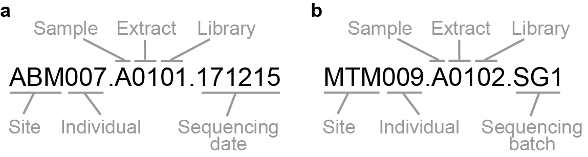

Library merging in this case can therefore be worked out by merging together any library that 
shares the first six character section of each library. For example:

```text
CDC005.A0101
CDC005.A0101.170817

or

ECO002.B0101
ECO002.C0101
```

These represent distinct individuals (but different libraries of a single
sample or multiple sequencing of the same library), and for this study we are 
not considering differences in sampling source of the calculus.

Into our final output preprocessing directory (library_merging), we can quickly 
import the files not needing merging like so:

```bash
cd 03-preprocessing/screening/library_merging

## Make directory
for DIR in ../../screening/human_filtering/output/*/; do 
  mkdir "$(echo $DIR | rev | cut -d/ -f2 | rev)/"
done

## Make symlink of FastQ into new directory above.
for DIR in ../../screening/human_filtering/output/*/; do 
  ln -s $(readlink -f "$DIR")/*fq.gz "$(echo $DIR | rev | cut -d/ -f2 | rev)/"; 
done
```

Now remove those 'extra' libraries that will be collapsed into the 
first entry 

```bash
rm \
ABM007.A0101/*.fq.gz \
ABM008.A0101/*.fq.gz \
BIT001.A0101/*.fq.gz \
CDC005.A0101/*.fq.gz \
CDC011.A0101/*.fq.gz \
DJA006.A0101/*.fq.gz \
DJA007.A0101/*.fq.gz \
EBO008.A0101/*.fq.gz \
EBO009.A0101/*.fq.gz \
ECO002.B0101/*.fq.gz \
ECO004.B0101/*.fq.gz \
FDM001.A0101/*.fq.gz \
GDN001.A0101/*.fq.gz \
IBA001.A0101/*.fq.gz \
IBA002.A0101/*.fq.gz \
LOB001.A0101/*.fq.gz \
MOA001.A0101/*.fq.gz \
MTK001.A0101/*.fq.gz \
MTM003.A0101/*.fq.gz \
MTM010.A0101/*.fq.gz \
MTM011.A0101/*.fq.gz \
MTM012.A0101/*.fq.gz \
MTM013.A0101/*.fq.gz \
MTS001.A0101/*.fq.gz \
MTS002.A0101/*.fq.gz \
MTS003.A0101/*.fq.gz \
TAF017.A0101/*.fq.gz \
TAF018.A0101/*.fq.gz \
WAL001.A0101/*.fq.gz
```

These extras are merged into a single FASTQ file and placed in an 
independent file with the following example command:

```bash
INDIR=03-preprocessing/screening/human_filtering/output
OUTDIR=03-preprocessing/screening/library_merging

cat "$INDIR"/ABM007*/*.fq.gz >> "$OUTDIR"/ABM007.A0101/ABM007_S0_L000_R1_000.fastq.merged.prefixed.hg19unmapped.fq.gz
cat "$INDIR"/ABM008*/*.fq.gz >> "$OUTDIR"/ABM008.A0101/ABM008_S0_L000_R1_000.fastq.merged.prefixed.hg19unmapped.fq.gz
cat "$INDIR"/BIT001*/*.fq.gz >> "$OUTDIR"/BIT001.A0101/BIT001_S0_L000_R1_000.fastq.merged.prefixed.hg19unmapped.fq.gz
cat "$INDIR"/CDC005*/*.fq.gz >> "$OUTDIR"/CDC005.A0101/CDC005_S0_L000_R1_000.fastq.merged.prefixed.hg19unmapped.fq.gz
cat "$INDIR"/CDC011*/*.fq.gz >> "$OUTDIR"/CDC011.A0101/CDC011_S0_L000_R1_000.fastq.merged.prefixed.hg19unmapped.fq.gz
cat "$INDIR"/DJA006*/*.fq.gz >> "$OUTDIR"/DJA006.A0101/DJA006_S0_L000_R1_000.fastq.merged.prefixed.hg19unmapped.fq.gz
cat "$INDIR"/DJA007*/*.fq.gz >> "$OUTDIR"/DJA007.A0101/DJA007_S0_L000_R1_000.fastq.merged.prefixed.hg19unmapped.fq.gz
cat "$INDIR"/EBO008*/*.fq.gz >> "$OUTDIR"/EBO008.A0101/EBO008_S0_L000_R1_000.fastq.merged.prefixed.hg19unmapped.fq.gz
cat "$INDIR"/EBO009*/*.fq.gz >> "$OUTDIR"/EBO009.A0101/EBO009_S0_L000_R1_000.fastq.merged.prefixed.hg19unmapped.fq.gz
cat "$INDIR"/ECO002*/*.fq.gz >> "$OUTDIR"/ECO002.B0101/ECO002_S0_L000_R1_000.fastq.merged.prefixed.hg19unmapped.fq.gz
cat "$INDIR"/ECO004*/*.fq.gz >> "$OUTDIR"/ECO004.B0101/ECO004_S0_L000_R1_000.fastq.merged.prefixed.hg19unmapped.fq.gz
cat "$INDIR"/FDM001*/*.fq.gz >> "$OUTDIR"/FDM001.A0101/FDM001_S0_L000_R1_000.fastq.merged.prefixed.hg19unmapped.fq.gz
cat "$INDIR"/GDN001*/*.fq.gz >> "$OUTDIR"/GDN001.A0101/GDN001_S0_L000_R1_000.fastq.merged.prefixed.hg19unmapped.fq.gz
cat "$INDIR"/IBA001*/*.fq.gz >> "$OUTDIR"/IBA001.A0101/IBA001_S0_L000_R1_000.fastq.merged.prefixed.hg19unmapped.fq.gz
cat "$INDIR"/IBA002*/*.fq.gz >> "$OUTDIR"/IBA002.A0101/IBA002_S0_L000_R1_000.fastq.merged.prefixed.hg19unmapped.fq.gz
cat "$INDIR"/LOB001*/*.fq.gz >> "$OUTDIR"/LOB001.A0101/LOB001_S0_L000_R1_000.fastq.merged.prefixed.hg19unmapped.fq.gz
cat "$INDIR"/MOA001*/*.fq.gz >> "$OUTDIR"/MOA001.A0101/MOA001_S0_L000_R1_000.fastq.merged.prefixed.hg19unmapped.fq.gz
cat "$INDIR"/MTK001*/*.fq.gz >> "$OUTDIR"/MTK001.A0101/MTK001_S0_L000_R1_000.fastq.merged.prefixed.hg19unmapped.fq.gz
cat "$INDIR"/MTM003*/*.fq.gz >> "$OUTDIR"/MTM003.A0101/MTM003_S0_L000_R1_000.fastq.merged.prefixed.hg19unmapped.fq.gz
cat "$INDIR"/MTM010*/*.fq.gz >> "$OUTDIR"/MTM010.A0101/MTM010_S0_L000_R1_000.fastq.merged.prefixed.hg19unmapped.fq.gz
cat "$INDIR"/MTM011*/*.fq.gz >> "$OUTDIR"/MTM011.A0101/MTM011_S0_L000_R1_000.fastq.merged.prefixed.hg19unmapped.fq.gz
cat "$INDIR"/MTM012*/*.fq.gz >> "$OUTDIR"/MTM012.A0101/MTM012_S0_L000_R1_000.fastq.merged.prefixed.hg19unmapped.fq.gz
cat "$INDIR"/MTM013*/*.fq.gz >> "$OUTDIR"/MTM013.A0101/MTM013_S0_L000_R1_000.fastq.merged.prefixed.hg19unmapped.fq.gz
cat "$INDIR"/MTS001*/*.fq.gz >> "$OUTDIR"/MTS001.A0101/MTS001_S0_L000_R1_000.fastq.merged.prefixed.hg19unmapped.fq.gz
cat "$INDIR"/MTS002*/*.fq.gz >> "$OUTDIR"/MTS002.A0101/MTS002_S0_L000_R1_000.fastq.merged.prefixed.hg19unmapped.fq.gz
cat "$INDIR"/MTS003*/*.fq.gz >> "$OUTDIR"/MTS003.A0101/MTS003_S0_L000_R1_000.fastq.merged.prefixed.hg19unmapped.fq.gz
cat "$INDIR"/TAF017*/*.fq.gz >> "$OUTDIR"/TAF017.A0101/TAF017_S0_L000_R1_000.fastq.merged.prefixed.hg19unmapped.fq.gz
cat "$INDIR"/TAF018*/*.fq.gz >> "$OUTDIR"/TAF018.A0101/TAF018_S0_L000_R1_000.fastq.merged.prefixed.hg19unmapped.fq.gz
cat "$INDIR"/WAL001*/*.fq.gz >> "$OUTDIR"/WAL001.A0101/WAL001_S0_L000_R1_000.fastq.merged.prefixed.hg19unmapped.fq.gz


```

> The FASTQ are files not provided here due to the large size.

For screening data, the final number of reads going downstream analysis is also 
recorded in the file `04-samples_library_merging_information.csv`. For libraries 
sequenced twice, I manually added the two values together.

For deep sequencing data, The same concatenating of multiple samples and/or 
lanes was done for the deep sequencing samples. However the statistics were 
summarised across replicates using the R notebook 
`02-scripts.backup/099-eager_table_individual_summarised.Rmd`.

### R6.3 Poly-G Trimming Assessment

The human DNA GC content could be a bit off in some of the new libraries 
generated in this study, as we are sequencing with Illumina NextSeqs, which 
have a 2 colour chemistry that considers no light emission as a 'G'. Thus, 
empty or finished clusters can be read as long poly G reads - which can still 
map to the human genome in regions with long repetitive regions. Modern
contamination with long human DNA reads on a failed flow cell cluster may also 
containing poly-G stretches if the florescence failed before the entire read is
complete and the adapter had not been sequenced.

To get improved human DNA content calculations, we can run EAGER to get the 
mapped reads. Then run `fastp` on the bam2fastq mapped reads and use their 
`--trim_poly_g` function to remove complete G reads or remove from reads that 
has the last 10 reads as Gs this tail. This procedure is recorded in 
`04-analysis/screening/eager` under the `polyGremoval*` directories.

The polyG issue would not likely affect our ancient microbial data because
these should be so short that each read would have both ends of the read
entirely sequenced (the whole read with both adapters or most of both adapters 
would fit in 75 cycles). Thus, adapter removal would remove anything that 
comes after the adapters which would be the poly Gs. Poly G tails would 
only affect single index reads, where the read itself is too short and doesn't
have an adapter to indicate the read has ended.

1. AdapterRemoval with no quality trimming or merging, just adapter removal

```bash
sbatch 02-scripts.backup/099-polyGcomplexity_filter_preFastPprep.sh
```

2. Clean up the output in `04-analysis/screening/eager/polyGremoval_input/output/` with

```bash
find . ! -name '*fastq.gz' -type f -delete
```

3. Run FastP on output of AdapterRemoval with

```bash
sbatch 02-scripts.backup/099-polyGcomplexity_filter.sh
```

4. Finally try running mapping on output of FastP again with EAGER. Need to run 
   AR still to merge but not important for re-clipping as there shouldn't be 
   any adapters, so will put minimum adapter overlap to 11 (EAGER doesn't allow 
   merging only)

```text
Organism: Human
Age: Ancient
Treated Data: non-UDG
Pairment: Single End (R1) or Paired End (R1/R2)
Input is already concatenated (skip merging): N
Concatenate Lanewise together: N (as lane concatenation already done)
Reference: HG19
Name of mitochondrial chromosome: chrMT

AdapterRemoval: N
  minimum adapter overlap: 11
Mapping: BWA
  Seedlength: 32
  Max # diff: 0.01
  Qualityfilter: 0
  Filter unmapped: On
  Extract Mapped/Unmapped: Off
Remove Duplicates: DeDup
  Treat all reads as merged: Y
Damage Calculation: Y
CleanUp: On
Create Report: On

```

And submit with 
`02-scripts.backup/02-scripts.backup/021-eager_microbiota_slurm_array.sh` after
updating the path in find.

The resulting human mapping data after poly-G removal can be seen in 
`00-documentation.backup/99-PolyGRemoved_HumanMapping_EAGERReport_output.csv`

> The FASTQ files are not provided here due to the large size.

### R6.4 Processing Results Summary

Sequencing quality control results for both screening and production datasets
can be seen in `02-scripts.backup/099-SequencingQCMetrics_v2.Rmd`

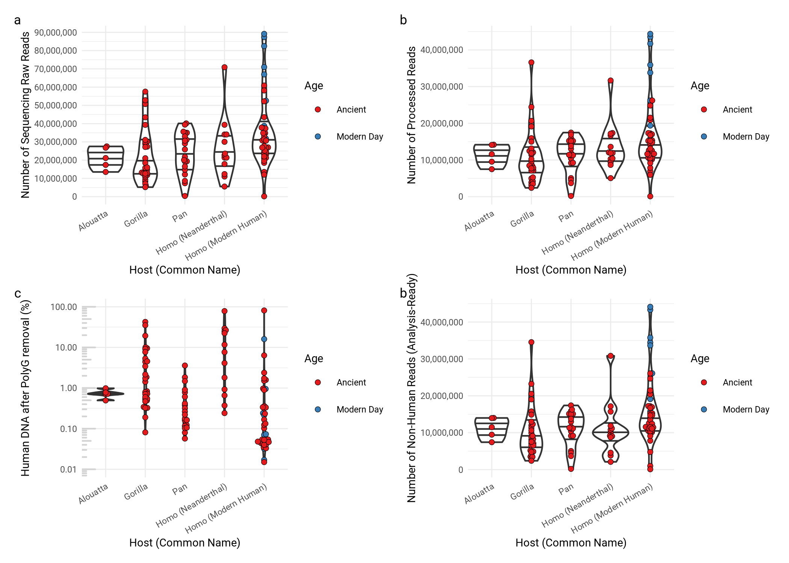

**Figure R1 | Sequencing metric distributions of the screening dataset of ancient and modern calculus samples newly sequenced during this study.** Each point represents a single indiviudal (i.e. all samples, libraries and re-sequencing runs combined). **a** Raw sequencing read counts (prior to adapter removal and merging). **b** Pre-processed read counts after adapter removal and read merging. **c** Proportion of human DNA. **d** Count of non-human reads used for downstream analysis (pre-processed reads with human sequences removed).

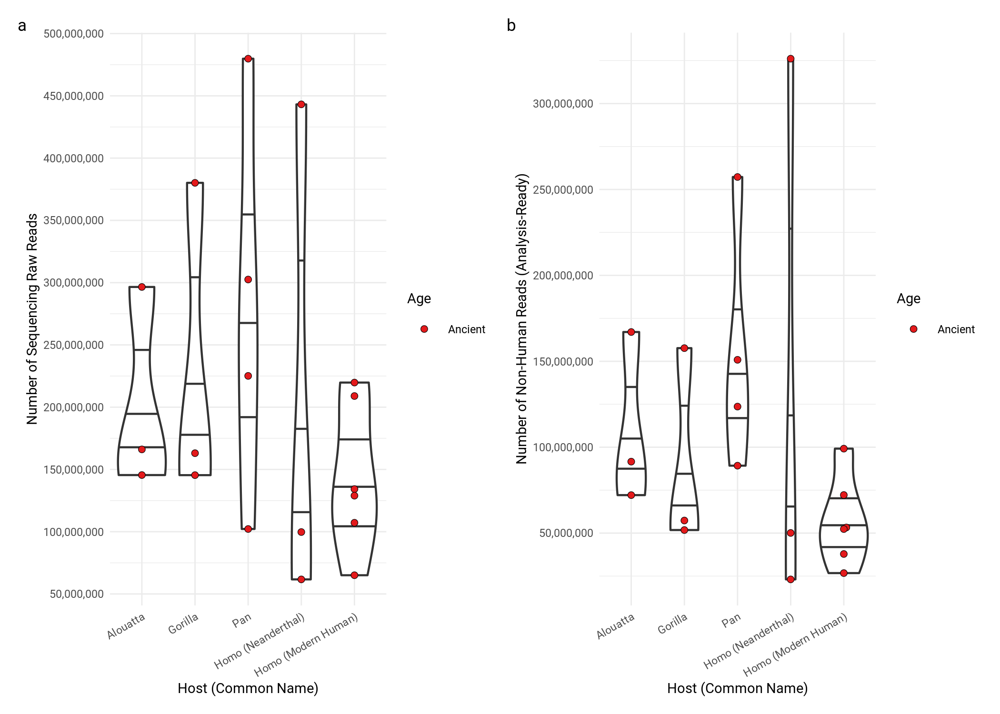

**Figure R2 | Sequencing read count distributions of the production dataset of ancient calculus samples newly sequenced during this study.** Each point represents a single indiviudal (i.e. all samples, libraries and re-sequencing runs combined). **a** Raw sequencing reads (prior adapter removal and merging), **b** Number of reads used for downstream analysis (processed reads with human sequences removed).

The general metadata file for all main individual-level pre-processing 
statistics can be seen in `06-additional_data_files` under Data R04. This file
is typically used as input for all downstream analyses, when required.

## R7 Metagenomic Screening

### R7.1 MALT

#### R7.1.1 MALT Running

For taxonomic binning of reads of the screening dataset we will use MALT, with 
a wrapper script for efficient submission. The settings are set in 
`007-malt-genbank-nt_2017_2step_85pc_supp_0.01` are as follows: a read requires 
a minimum of 85% sequence identity (`-id`), it will only retain a second hit 
if the alignment is within 1% of the bit-score of the top scoring hit (`-top`), 
it will only keep a leaf-node on the tree if it has more than 0.01 of the hits
over all the hits in the sample (`-supp`). It will only retain 100 possible hits
per node. Note that you may have to change the `INSTALL4J_JAVA_HOME` path 
within the script, as I'm currently not sure what that does. This script aligns
to the NCBI Nucleotide database (nt).

We can then run our taxonomic binning job with the following command, providing
a input directory with wild-cards to all the files and an output directory.

```bash
02-scripts.backup/007-malt-genbank-nt_2017_2step_85pc_supp_0.01 \
03-preprocessing/screening/library_merging/*/*.fq.gz \
04-analysis/screening/malt/nt
```

For the CustomRefSeq database, see [below](#r124-aadder-analysis)

> The RMA6 files are not provided here due to the large size.

#### R7.1.2 MALT Summary Statistics

To extract the summary statistics for all the MALT runs, we can run
the following on the MALT logs.

```bash
grep -e "Loading MEGAN File:" \
-e "Total reads:" \
-e "With hits:" \
-e "Alignments:" \
-e "Assig. Taxonomy" \
-e "Min-supp. changes" \
-e "Numb. Tax. classes:" \
-e "Class. Taxonomy:" \
-e "Num. of queries:" \
-e "Aligned queries:" \
-e "Num. alignments:" \
-e "MinSupport set to:" \
04-analysis/screening/malt/nt/*log | cut -d":" -f 2-99 > 00-documentation.backup/99-maltAlignedReadsSummary_raw_nt_$(date "+%Y%m%d").txt
```

Then we do a few clean up and calculation steps as in the R 
script `02-scripts.backup/099-MALT_Summary_statistics.R`, the output of which 
is recorded in `00-documentation.backup/05-MALT_taxonomic_binning_summary_statistics_nt.tsv`
and for RefSeq in 
`00-documentation.backup/05-MALT_taxonomic_binning_summary_statistics_refseq_bacharchhomo_gcs_20181122.tsv`

The MinSupport value column(s) was then manually added to the individuals column of
our main screening metadata file 
`00-documentation/02-calculus_microbiome-deep_evolution-individualscontrolssources_metadata_20190523.tsv`.

### R7.2 MEGAN

#### R7.2.1 MEGAN Running

Once MALT has completed, we need to generate an OTU table of all the alignments.
 
For this we need to use the GUI tool MEGAN6 locally on your desktop. To 
generate the OTU table, open the MALT RMA6 files in MEGAN with absolute counts, 
and ignore all unassigned reads.

To un-collapse the tree: Tree > Rank > <Taxonomic level>, then select species 
nodes with: Select > Rank > <Taxonomic level>. 

Now go File > Export > Text (CSV) format, select taxonName_to-count, summarised 
and tab as a separator.

For a 'microbial-only' OTU table (basically not prokaryotes or synthetic DNA 
sequences), we can before un-collapsing the tree select 
'collapse non-prokaryotes' under the 'Tree' menu and then do Select > Rank > 
<taxonomic level> to select only Bacteria and Archaea. We also need to export 
the same data with as a tree from MEGAN with the option: file > export > tree, 
and save as Newick. This should also be done for each non-prokaryote taxonomic 
level. 

These are saved in `04-analysis/screening/megan.backup`

The corresponding `.megan`, `.nwk`  and OTU tables at various taxonomic
levels (as exported by MEGAN) for both Nt and [RefSeq](#r125-malt-refSeq) 
databases can be seen in `06-additional_data_files` under Data R11.

#### R7.2.2 Additional Raw OTU Tables

Raw MALT OTU tables with and without bad samples and at different min. support
values are generated by the Notebook `02-scripts.backup/016-MALT_otutable_generation.Rmd`. These
tables are stored as `.tsv` files in the `04-analysis/screening/megan.backup` 
directory.

#### R7.2.3 Prokaryotic vs. Eukaryotic MALT content Comparison

Visualisation and statistical testing of whether the ratio of prokaryotic to 
eukyarotic reads differs between well-preserved and badly-preserved samples can 
be seen in `02-scripts.backup/099-cumulativedecay_vs_sourcetracker.Rmd`

### R7.3 Database Comparison

Summary statistics of numbers of reads taxonomically assigned, and also
comparison between the two MALT databases can be seen in  
`02-scripts.backup/099-MALTAssignmentResults.Rmd`.


**Figure R3 | Comparison of the mean number of taxonomically assigned non-human reads across all sources, laboratory controls and comparative sample groups.** Taxonomic assignment is from aligning to the NCBI nt (2017) and a custom NCBI refseq (2018) databases using MALT. Colours correspond to calculus host genus. Blue: _Alouatta_; Purple: _Gorilla_; Green: _Pan_; Orange: _Homo_; Grey: non-calculus. 

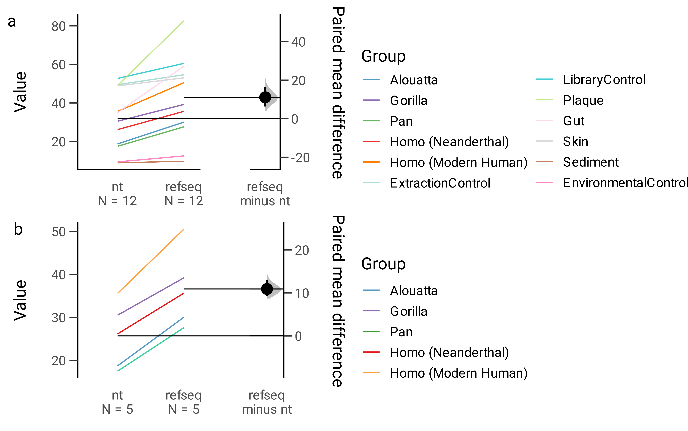

**Figure R4 | Gardner-Altman plot showing differences in the mean percent of taxonomically assigned reads between the NCBI nt (2017) and a custom NCBI RefSeq (2018) databases using MALT.** Right hand plot: dot represents mean difference between the two groups with resampling distribution (5000 bootstraps). Left hand plot: slope graph showing relationship between means percent taxonomically assigned reads between two databases per group. Vertical dark line on dot represents 95% confidence interval around the mean. Y axis represents mean percentage of taxonomically assigned reads within each group. **a** Comparison of overall mean between all calculus samples, laboratory controls and comparative sources in this study. **b** Comparison of just dental calculus samples. 

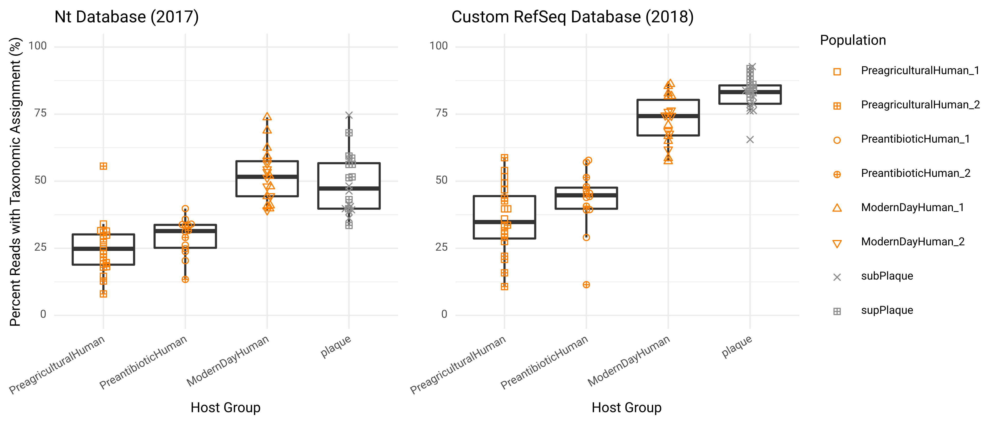

**Figure R5 | Comparison of mean percent of taxonomically assigned reads to different groups of humans, when aligning between the NCBI nt (2017) and a custom NCBI RefSeq (2018) database using MALT.** Ancient sample groups are 'pre-agricultural' and 'pre-antibiotic' humans and are taken from skeletal remains, whereas Modern Day Human calculus and HMP plaque samples come from living individuals. Colours correspond to sample type. Orange: _Homo_ calculus; Grey: non-calculus. 

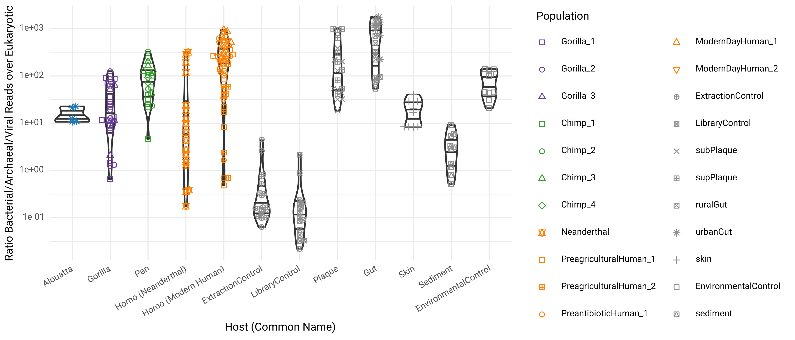

**Figure R6 | Comparison of ratios of alignments to Bacterial/Archaeal/Viral reference sequences vs. Eukaryotic reference sequences between all calculus, laboratory controls and comparative sources.** Ratios are based on the number of reads aligned the NCBI nt (2017) database using MALT. Y-axis is log10 scaled. Colours correspond to calculus host genus. Colours correspond to calculus host genus. Blue: _Alouatta_; Purple: _Gorilla_; Green: _Pan_; Orange: _Homo_; Grey: non-calculus.


**Figure R7 | Comparison of ratios of alignments to Bacterial/Archaeal/Viral reference sequences vs. Eukaryotic reference sequences between different groups of humans.** Ratios are based on the number of reads aligned the NCBI nt (2017) database using MALT. Y-axis is log10 scaled. Ancient sample groups are 'pre-agricultural' and 'pre-antibiotic' humans and are taken from skeletal remains, whereas Modern Day Human calculus and HMP plaque samples come from living individuals. Colours correspond to calculus host genus. Colours correspond to calculus host genus. Orange: _Homo_; Grey: non-calculus.

## R8 Preservation Screening

### R8.1 Cumulative Proportion Decay Plots

The OTU table itself does not give us much information about the oral signature.

Instead I came up with a simple visualisation to show how abundant the oral
signal in the samples are. This visualisation needs two things: an OTU table 
from MEGAN at species level and a database of taxa with their 'sources'. 

We have already generated the OTU above.

For the database, you can follow the steps as recorded in 
`02-scripts.backup/013-Organism_Isolation_Source_Database_Generation.Rmd`. The 
database also requires manual curation over time. This database itself can be 
seen under `06-additional_data_files` under Data R16, or stored under
`00-documentation` as `07-master_oralgenome_isolationsource_database.tsv`

With these OTU table and the database, the R notebook 
`02-scripts.backup/014-cumulative_proportion_decay_curves.Rmd` shows you how to generate
the visualisation.

The resulting list(s) of individuals passing or failing to pass this threshold 
can be seen in `06-additional_data_files` under Data R17 or
`04-analysis/screening/cumulative_decay.backup`


**Figure R8 | Schematic diagram of a cumulative percent decay method of preservation assessment.** **a** example curves of a theoretical sample consisting of purely oral taxa (top left), and a theoretical sample containing no oral taxa (top right). For the archaeological samples, a well-preserved sample (bottom left) will consist mostly of oral taxa but may include uncharacterised or contaminant taxa leading to a non-linear relationship, but remaining above an oral taxon fraction percent of 50% (as identified in modern plaque samples). An archaeological sample (bottom right) with no endogenous oral content will have few oral taxa, and may have occasional modern contaminants resulting in a non-linear relationship. **b** a representation of the method for calculating the rank from which to begin assessing whether a sample decay curve goes above the 'well-preserved' fraction threshold, accounting for high variation in mixed preservation samples with both oral and non-oral/uncharacterised taxa at higher ranks. Given the large differences between the initial ranks due to small denominators, a 'burn-in' like procedure is applied. The rank at which the difference change between each subsequent rank does not exceed the standard deviation of all rank differences, is set as the rank from which, it is assessed whether the sample curve exceeds the preservation threshold (here 50% for the NCB nt OTU table). A curve that does not exceed this threshold at any point from this rank onwards, is considered not to have sufficient preservation for downstream analysis.


**Figure R9 | Cumulative percent decay plots of fraction of oral taxa across taxa ordered by abundance rank.** Taxonomic assignment against the: **a** NCBI nt database, and **b** a custom NCBI RefSeq database showing a large number of calculus samples displayed greater levels of preservation (blue), and although a smaller number do not pass the estimated preservation threshold (red). Plots are limited to 250 rank positions (x-axis) for visualization purposes. Thresholds are selected based on observations that all sources and controls do not increase about 50% (nt) and 65% (RefSeq) of fraction of oral taxon. Point at which the per-sample threshold is considered is based on when the fluctuation of the fraction of oral taxa (i.e. fraction difference between a taxon and next abundant taxon) does not exceed the standard deviation of all differences of the rank.

**Table R1 | Summary of sample counts passing preservation thresholds as implemented in the cumulative percent decay method.** Preservation was assessed using the cumulative percent decay method with the fluctuation burn-in threshold based on the MALT OTU tables.

| Database | Host Group           | Passed | Failed | Total Samples (n) | Passed (%) |
|----------|----------------------|-------:|-------:|------------------:|-----------:|
| nt       | Howler               | 5      | 0      | 5                 | 100        |
| nt       | Gorilla              | 14     | 15     | 29                | 48.28      |
| nt       | Chimp                | 16     | 5      | 21                | 76.19      |
| nt       | Neanderthal          | 7      | 10     | 17                | 41.18      |
| nt       | PreagriculturalHuman | 16     | 4      | 20                | 80         |
| nt       | PreantibioticHuman   | 13     | 1      | 14                | 92.86      |
| nt       | ModernDayHuman       | 18     | 0      | 18                | 100        |
| refseq   | Howler               | 5      | 0      | 5                 | 100        |
| refseq   | Gorilla              | 12     | 17     | 29                | 41.38      |
| refseq   | Chimp                | 11     | 10     | 21                | 52.38      |
| refseq   | Neanderthal          | 7      | 10     | 17                | 41.18      |
| refseq   | PreagriculturalHuman | 11     | 9      | 20                | 55         |
| refseq   | PreantibioticHuman   | 13     | 1      | 14                | 92.86      |
| refseq   | ModernDayHuman       | 18     | 0      | 18                | 100        |

**Table R2 | Comparison of number of individuals with supported good- or low- preservation assignment between the nt and custom RefSeq database.** Preservation was assessed using the cumulative percent decay method with the fluctuation burn-in threshold based on the MALT OTU tables.

| Population             | Total Individuals in Population | Individuals with Matching Preservation Assignment | Individuals not Matching Preservation Assignment |
|------------------------|--------------------------------:|--------------------------------------------------:|-------------------------------------------------:|
| Chimp_2                | 7                               | 6                                                 | 1                                                |
| Chimp_3                | 6                               | 4                                                 | 2                                                |
| Chimp_4                | 1                               | 1                                                 | 0                                                |
| Gorilla_1              | 15                              | 13                                                | 2                                                |
| Gorilla_2              | 8                               | 7                                                 | 1                                                |
| Gorilla_3              | 6                               | 5                                                 | 1                                                |
| Howler_Monkey          | 5                               | 5                                                 | 0                                                |
| ModernDayHuman_1       | 10                              | 10                                                | 0                                                |
| ModernDayHuman_2       | 8                               | 8                                                 | 0                                                |
| Neanderthal            | 17                              | 15                                                | 2                                                |
| PreagriculturalHuman_1 | 10                              | 8                                                 | 2                                                |
| PreagriculturalHuman_2 | 10                              | 7                                                 | 3                                                |
| PreantibioticHuman_1   | 10                              | 10                                                | 0                                                |
| PreantibioticHuman_2   | 4                               | 4                                                 | 0                                                |

### R8.2 Source Estimation

#### R8.2.1 16S Extraction 

We next want to compare to a less-suitable but more established approach to 
compare the screening method to, which is Sourcetracker analysis. However this 
typically uses an OTU table of 16S rRNA reads for the proportion estimation of the 
sources in your sample.

As we have shotgun data, we will instead extract reads with sequence similarity
to 16S rRNA and run with that.

The script `02-scripts.backup/009-preprocessing-16s_mapping` works very much the same 
way as with the human DNA preprocessing, but mapping to the SILVA database and 
converting the mapped only reads to FASTA format with a particular header 
format (>sample.name_1) that works with QIIME.

```bash
INDIR=02-scripts.backup/03-preprocessing/screening/library_merging
OUTDIR=02-scripts.backup/03-preprocessing/screening/silva_16s_reads
SCRIPTS=02-scripts.backup/02-scripts.backup

for LIBDIR in "$INDIR"/*/; do
  LIBNAME=$(echo "$LIBDIR" | rev | cut -d/ -f2 | rev)
  if [ -d "$OUTDIR"/"$LIBNAME" ]; then
    printf "\n $LIBNAME already Processed \n\n"
  else
    mkdir "$OUTDIR"/"$LIBNAME"
    $SCRIPTS/009-preprocessing_16s_mapping.sh $OUTDIR/$LIBNAME $LIBDIR $LIBNAME
    sleep 1
  fi
done
```

To get the number of 16S rRNA reads that mapped, we can run the script 
`02-scripts.backup/06-16s_extraction_statistics.sh`, and copy the resulting file 
into our documents directory with

```bash
SCRIPTS=02-scripts.backup/02-scripts.backup

cd 02-scripts.backup/03-preprocessing/screening

## Generate stats
"$SCRIPTS"/011-16s_extraction_statistics.sh silva_16s_reads/

## Copy into documentation folder
mv silva_16s_reads/16s_extraction_statistics_"$(date +"%Y%m%d")".csv .
cp 16s_extraction_statistics_"$(date +"%Y%m%d")".csv ../../00-documentation.backup/05-16s_extraction_statistics_"$(date +"%Y%m%d")".csv
```

> The mapping results files are not provided here due to the large size.

The summary statistics for the number of 16S reads identified can be seen in 
`06-additional_data_files` under Data R12 or
`00-documentation.backup/05-16s_extraction_statistics.csv`

While we have these reads, we still don't know what taxa they are derived from.

Summary statistic visualisation of mapping can be 
seen under `02-scripts.backup/099-16sResults.Rmd` 


**Figure R10 | Distributions of percentages of 16S rRNA mapping reads extracted out of all non-human reads across all samples in the dataset, when mapping to the SILVA database.** Colours correspond to calculus host genus. Blue: _Alouatta_; Purple: _Gorilla_; Green: _Pan_; Orange: _Homo_; Grey: non-calculus.


**Figure R11 | Distributions of percentages of 16S rRNA mapping reads extracted out of all non-human reads libraries across human calculus and plaque samples by mapping to the SILVA database.** Ancient sample groups are 'pre-agricultural' and 'pre-antibiotic' humans and are taken from skeletal remains, whereas Modern Day Human calculus and HMP plaque samples come from living individuals. Colours correspond to sample type. Orange: _Homo_ calculus; Grey: non-calculus. 

#### R8.2.2 16S Clustering

For this we can use QIIME to cluster the reads by similarity then assign a
taxonomic 'name'. We will stick with OTU clustering rather than the more 
recent (and more powerful/statistically valid) ASV (amplicon sequence variant) 
methods. This is because we are not dealing directly with amplicon data, and we 
has also have damage which would affect reliability of assignment. Finally, the 
more recent version of QIIME, QIIME2, has been made much less flexible for 
non-amplicon data (at the time of writing) and I couldn't work out how to adapt 
the data. For our rough preservational screening purposes using QIIME 1 is 
sufficient.

Firstly, we have to make a combined FASTA file containing all the 16S reads 
from all the samples.

```bash
INDIR=02-scripts.backup/03-preprocessing/screening/silva_16s_reads
OUTDIR=04-analysis/screening/qiime/input

rm "$OUTDIR"/silva_16s_reads_concatenated.fna.gz
touch "$OUTDIR"/silva_16s_reads_concatenated.fna.gz

for SAMPLE in "$INDIR"/*; do
  find "$SAMPLE"  -maxdepth 1 -name '*_renamed.fa.gz' -exec cat {} >> \
  "$OUTDIR"/silva_16s_reads_concatenated.fna.gz \;
done
```

> The FASTA file is not provided here due to the large size.

For OTU clustering itself we need to define some parameter that have 
been adapted for shotgun data by LMAMR in Oklahoma, in a file named 
`02-scripts.backup/010-params_CrefOTUpick.txt` 

The parameters in this file are as in Table R3

**Table R3 | Non-default parameters used for QIIME closed-reference clustering.**

| Parameter                         | Value |
|-----------------------------------|------:|
| pick_otus:max_accepts             | 100   |
| pick_otus:max_rejects             | 500   |
| pick_otus:word_length             | 12    |
| pick_otus:stepwords               | 20    |
| pick_otus:enable_rev_strand_match | TRUE  |

To actually run the clustering analysis and generate our OTU table we need to 
do the following. 

```bash
INDIR=04-analysis/screening/qiime/input
OUTDIR=04-analysis/screening/qiime/output
GREENGENESDB=<PATH_TO>/qiime_default_reference/gg_13_8_otus/
SCRIPTS=02-scripts.backup/02-scripts.backup

gunzip "$INDIR/silva_16s_reads_concatenated.fna.gz"

pick_closed_reference_otus.py \
-i $INDIR/silva_16s_reads_concatenated.fna \
-o $OUTDIR/otu_picking \
-a \
-O 16 \
-r $GREENGENESDB/rep_set/97_otus.fasta \
-t $GREENGENESDB/taxonomy/97_otu_taxonomy.txt \
-p $SCRIPTS/010-qiime_1_9_1_params_CrefOTUpick.txt


```

Once finished we can then re-gzip the input fasta file with:

```bash
INDIR=04-analysis/screening/qiime/input

pigz -p 4 "$INDIR/silva_16s_reads_concatenated.fna"
```

To get some basic statistics about the OTU picking we can use the BIOM package
that came with the QIIME environment.

```bash
INDIR=04-analysis/screening/qiime/input
OUTDIR=04-analysis/screening/qiime/output

cd "$OUTDIR"

biom summarize-table -i "$OUTDIR"/otu_picking/otu_table.biom >> \
"$OUTDIR"/otu_picking/otu_table_summary.txt

## Check with: 
head "$OUTDIR"/otu_picking/otu_table_summary.txt -n 20
```

This summary can also be  seen in `06-additional_data_files` under Data R13.

Sourcetracker (I realised later) doesn't do rarefaction properly as it 
allows sampling with replacement of the OTUS. Therefore, we need to remove
samples that have less than 1000 OTUs (which is the default rarefaction level
in Sourcetracker - [see below](#r823-sourcetracker)). So next we need to filter our OTU table
to remove samples that have less than that threshold. Looking at the table
summary shows that fortunately this will remove very few samples and 
will remove mostly blanks.

```bash
cd 04-analysis/screening/qiime/output/otu_picking
INDIR=04-analysis/screening/qiime/output/otu_picking

filter_samples_from_otu_table.py \
-i "$INDIR"/otu_table.biom \
-o "$INDIR"/otu_table_1000OTUsfiltered.biom \
-n 1000


biom summarize-table -i "$INDIR"/otu_table_1000OTUsfiltered.biom >> \
"$INDIR"/otu_table_1000OTUsfiltered_summary.txt

## Check with: 
head "$INDIR"/otu_table_1000OTUsfiltered_summary.txt -n 20
 ```

We also only want to look at genus level assignments, given species specific 
IDs will be unreliable given damage and different mixtures of strain in 
different individuals. 

For filtering to Genus (L6) level:

```bash
cd 04-analysis/screening/qiime/output/otu_picking
INDIR=04-analysis/screening/qiime/output/otu_picking

## For Genus
summarize_taxa.py \
-i "$INDIR"/otu_table_1000OTUsfiltered.biom \
-o "$INDIR" \
-a \
-L 6

## Fixed crappy taxon ID that breaks loading into R when running Sourcetracker :+1:
sed s#\'Solanum#Solanum#g otu_table_1000OTUsfiltered_L6.txt > otu_table_1000OTUsfiltered_L6_cleaned.tsv
```

With this final OTU table - as seen (in both biom or TSV format) in 
`06-additional_data_files` under Data R14 or 
`04-analysis/screening/qiime/output/otu_picking` -  we can now run Sourcetracker.

Summary statistic visualisation of clustering can be 
seen under `02-scripts.backup/099-16sResults.Rmd`.

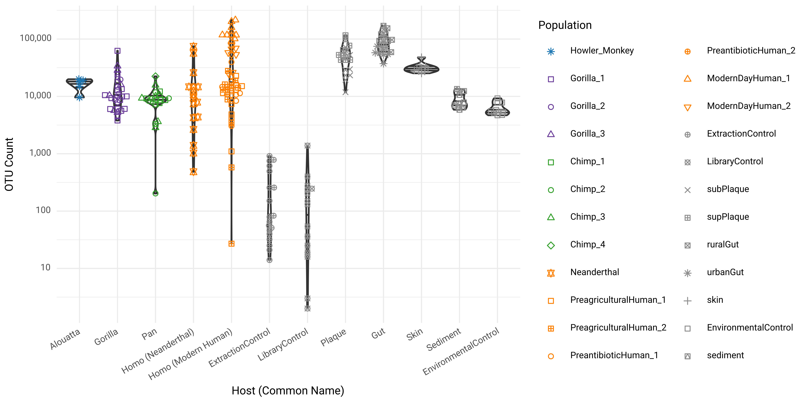

**Figure R12 | Distributions of the number of OTUs identified after closed-reference clustering of 16S rRNA reads across all calculus, laboratory controls and comparative sources in this study.** Clustering was performed in QIIME at 97% identity Colours correspond to calculus host genus. Blue: _Alouatta_; Purple: _Gorilla_; Green: _Pan_; Orange: _Homo_; Grey: non-calculus.


**Figure R13 | Distributions of the number of OTUs identified after closed-reference clustering of 16S rRNA read sequences at 97% sequence similarity in QIIME across human calculus and plaque samples.** Ancient sample groups are 'pre-agricultural' and 'pre-antibiotic' humans and are taken from skeletal remains, whereas Modern Day Human calculus and plaque samples come from living individuals. Colours correspond to sample type. Orange: _Homo_ calculus; Grey: non-calculus. 

#### R8.2.3 Sourcetracker

Sourcetracker requires a OTU table (generated above) and a metadata file
that tells the program what libraries in the OTU are a 'sink' or a 'source'.
This metadata file in this case is recorded here, 
`02-scripts.backup/02-microbiome_calculus-deep_evolution-individualscontrolssources_metadata.tsv`,
which I try to use for all downstream analysis. In particular here we need to 
ensure we have a 'Env' and a 'SourceSink' column. 

```bash
## change to new directory for output directories
INDIR=04-analysis/screening/qiime/output/otu_picking
OUTDIR=04-analysis/screening/sourcetracker.backup/

MAPPINGFILE=00-documentation.backup/02-calculus_microbiome-deep_evolution-individualscontrolssources_metadata_20190429.tsv

Rscript \
sourcetracker_for_qiime.r \
-i "$INDIR"/otu_table_1000OTUsfiltered_L6_cleaned.tsv \
-m "$MAPPINGFILE" \
-o "$OUTDIR"/otu_table_L6_1000_"$(date +"%Y%m%d")" \
-r 1000 \
-v

```

For plotting of these for comparison with the cumulative percent decay plots,
 I use the following R notebook to summarise the results: 
 `02-scripts.backup/099-cumulativedecay_vs_sourcetracker.Rmd`. 

 The final proportions (with standard deviation) can be seen in 
`06-additional_data_files` under Data R18.


**Figure R14 | Stacked bar plots representing the estimated proportion of sample resembling a given source, as estimated by Sourcetracker across all calculus samples.** Visual inspection shows general concordance between the cumulative percent decay method and Sourcetracker estimation is seen. Coloured label text indicate whether that sample passed (grey) or failed (black) the cumulative percent decay threshold (see above) based on alignments to the NCBI nt (2017) database. 

### R8.3 Ratio of Eukaryotic to Prokaryotic Alignments

We also noted that less well preserved samples appear to generally contain
larger numbers of eukaryotic alignments. If explored further, this could also 
potentially act as a guidance indicator for levels of preservation of ancient
dental calculus samples.


**Figure R15 | Comparison of ratios of bacterial/archaeal/viral over eukaryotic alignments, between ancient calculus samples that passed the cumulative decay cut off for preservation.** Samples not passing the preservation threshold as estimated with the cumulative percent decay plots, tend to have smaller ratio and therefore greater amounts of eukaryotic DNA reads being assigned. Ratios are based on the number of reads aligned the NCBI nt (2017) database using MALT.

Code for statistical testing and visualisation can also be seen in the data repository under `02-scripts.backup/099-cumulativedecay_vs_sourcetracker.Rmd`. 

### R8.4 Damage Patterns

#### R8.4.1 MEx-IPA

To rapidly screen for damage patterns indicative of ancient DNA on the observed core microbiome ([see below](#r10-core-microbiome-analysis)), we [ran MaltExtract](#r102-core-microbiome-maltextract) on all output of MALT, with the core microbiome 
as input list.

We then developed [MEx-IPA](https://github.com/jfy133/MEx-IPA) to rapidly visualise ancient DNA characteristics across all samples and core taxa.

The results files for this analysis are are stored in the MEx-IPA GitHub 
repository. Example reports for the two oldest Neanderthals (PES001 and GDN001),
can be seen below in Figure R16.

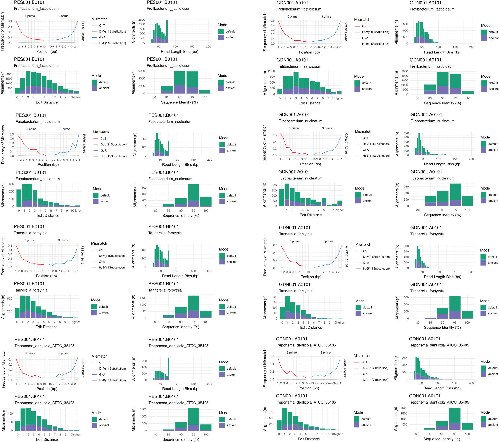

**Figure R16 | Example of MEx-IPA reports from the MaltExtract tool of the HOPS pipeline for two Neanderthal individuals, across four known oral microbiome taxa.** Individual-Taxon combination shows: C to T misincorporation lesions indicative of DNA deamination; read length distribution with a typical peak <50 bp indicative of fragmented DNA; edit distance and percent identity to the given reference which both show close similarity to the oral reference genome in most cases (1-2 edit distance peak; and 95% identity peak identity). Note that _Fretibacterium fastidiosum_ shows a higher edit distance and low percent identity score, suggesting the reads are likely derived from a relative of that taxon that does not have a genome represented in the database used (NCBI nt 2017). 

#### R8.4.2 DamageProfiler

To generate additional confirmation of damage patterns in oral taxa, the 
screening data was mapped to a subset of observed core microbiome reference 
genomes (see [below](#r111-production-dataset-sequencing-depth-calculatons)), using 
EAGER.

DamageProfiler results were collated and visualised in the R script
`02-scripts.backup/099-Coretaxa_SubSet_DamageProfiler_Summary.R`. An example of the range of damage signals in ancient Human remains can be seen below in Figure R17.


**Figure R17 | Frequency of C to T miscorporations along 5' ends of DNA reads compared to references of four representative human oral-specific species as calculated by DamageProfiler.** Neanderthal and Upper Palaeolithic individuals show damage patterns indicative of authentic aDNA, whereas a modern day individual does not.

The collated results for the whole screening dataset are stored in the file 
`00-documentation.backup/14-damageprofiler_screening_3p_5p_summaries_20191113.csv`.

### R8.5 Laboratory Contaminants

### R8.5.1 decontam

To remove possible contaminating species from our samples that are derived from
the laboratory environment, we can use the R package `decontam`. The idea here 
is to use this to reduce the number of noisy taxa in the downstream 
compositional analysis, e.g. reducing the over-plotting of the loadings of PCAs.

 We manually added the library quantification values (qPCR) to our
main metadata file 
`02-scripts.backup/02-microbiome_calculus-deep_evolution-individualscontrolssources_metadata.tsv`.

We then run Decontam following the Decontam tutorial vignette on CRAN in the 
script, and also described here `02-scripts.backup/015-decontam_contamination_detection_analysis.Rmd`.

The final list of contaminants for all methods and databases can be seen in 
`06-additional_data_files` under Data R19.

**Table R4 | Summary of OTUs detected across each shotgun taxonomic binner/classifier and databases as potential contaminants by the R package decontam.** MetaPhlAn2 was run for functional analysis [below](#r1231-metaphlan2). While MetaPhlAn2 was run as reference but wasn't utilised, the contaminants were not removed downstream due to unknown effects of removing these for [HUMANn2](#r1232-humann2).

| Binning Method | Database   | Taxonomic Level | Total OTUs Detected (n) | Contaminants Detected (n) | Contaminants Detected (%) |
|----------------|------------|-----------------|-------------------------|---------------------------|---------------------------|
| megan          | nt         | genus           | 1392                    | 651                       | 46.77                     |
| megan          | nt         | species         | 3401                    | 1557                      | 45.78                     |
| megan          | refseq     | genus           | 1241                    | 630                       | 50.77                     |
| megan          | refseq     | species         | 5195                    | 2183                      | 42.02                     |
| metaphlan2     | metaphlan2 | genus           | 675                     | 121                       | 17.93                     |
| metaphlan2     | metaphlan2 | species         | 1626                    | 310                       | 19.07                     |

### R8.5.2 Contaminant Impact Check

We observed a high number of putative contaminant OTUs when using our strict
decontam parameters. We wanted to see how much this would provisionally impact
our downstream analyses by investigating how mean actual reads the OTUs consist
of in our sample. The R notebook 
`02-scripts.backup/099-decontam_OTU_impact_check.Rmd` describes how we did this.

We that despite large numbers of contaminants are detected by decontam as a 
fraction of overall OTUs, this only makes up a minority fraction of actual
alignments in the MALT OTU table in well preserved samples - suggesting that 
the majority of contaminants are derived from low-abundant taxa.


**Figure R18 | Fraction of MALT Alignments derived from putative contaminant OTUs show only small effect on well-preserved samples** Individuals are ordered by percentage of alignments that are derived from OTUs considered putative contaminants by decontam and removed from downstream analysis. Colour indicates whether the individual was considered to be well-preserved or not based on the cumulative percentage decay curves with the within standard variation burn-in method.

## R9 Compositional Analysis

### R9.1 Principal Coordinate Analysis

To explore if we have a structure in our data that can describe differences 
between each group we want to explore, we can perform a Principal Coordinate 
Analysis to reduce
the variation between the samples to human-readable dimensions, using 
Compositional Data (CoDA) principles - here implemented with PhILR.

Due to the notebook ending up having lots of options, I also used `knitr::purl()`
to create a Script version of the R notebook that accepts arguments.

To generate the script

```r
knitr::purl("02-scripts.backup/017-PhILR_PCoA_20190527.Rmd", "02-scripts.backup/017-PhILR_PCoA_20190527_script.R", documentation = 2)
```

Now we will generate PCoAs based on different sets of combinations of variables 
of: 
 * Whether to use the NCBI nt database or custom NCBI RefSeq
 * Whether analysed at genus or species taxonomic level of taxa in the OTU table
 * Whether comparative sources are included or not
 * Whether controls are included or not
 * Whether to include low preservation samples or not
 * Which low preservation samples filtering list to use (see Cumulative Percentage Decay notebook above for explanation)
 * Either minimum support value of 7 (genus) or 4 (species) [the value in the commands are multipliers of 0.01, the default MALT min. support value set above]

```bash
i=7
  Rscript 02-scripts.backup/017-PhILR_PCoA_20190527_script.R nt genus withSources withControls in withinvariation "$i"
  Rscript 02-scripts.backup/017-PhILR_PCoA_20190527_script.R nt genus noSources withControls in withinvariation "$i"
  Rscript 02-scripts.backup/017-PhILR_PCoA_20190527_script.R nt genus withSources noControls in withinvariation "$i"
  Rscript 02-scripts.backup/017-PhILR_PCoA_20190527_script.R nt genus noSources noControls in withinvariation "$i"
  Rscript 02-scripts.backup/017-PhILR_PCoA_20190527_script.R nt genus withSources withControls out withinvariation "$i"
  Rscript 02-scripts.backup/017-PhILR_PCoA_20190527_script.R nt genus noSources withControls out withinvariation "$i"
  Rscript 02-scripts.backup/017-PhILR_PCoA_20190527_script.R nt genus withSources noControls out withinvariation "$i"
  Rscript 02-scripts.backup/017-PhILR_PCoA_20190527_script.R nt genus noSources noControls out withinvariation "$i"
  Rscript 02-scripts.backup/017-PhILR_PCoA_20190527_script.R refseq genus withSources withControls in withinvariation "$i"
  Rscript 02-scripts.backup/017-PhILR_PCoA_20190527_script.R refseq genus noSources withControls in withinvariation "$i"
  Rscript 02-scripts.backup/017-PhILR_PCoA_20190527_script.R refseq genus withSources noControls in withinvariation "$i"
  Rscript 02-scripts.backup/017-PhILR_PCoA_20190527_script.R refseq genus noSources noControls in withinvariation "$i"
  Rscript 02-scripts.backup/017-PhILR_PCoA_20190527_script.R refseq genus withSources withControls out withinvariation "$i"
  Rscript 02-scripts.backup/017-PhILR_PCoA_20190527_script.R refseq genus noSources withControls out withinvariation "$i"
  Rscript 02-scripts.backup/017-PhILR_PCoA_20190527_script.R refseq genus withSources noControls out withinvariation "$i"
  Rscript 02-scripts.backup/017-PhILR_PCoA_20190527_script.R refseq genus noSources noControls out withinvariation "$i"
done

i=4
  Rscript 02-scripts.backup/017-PhILR_PCoA_20190527_script.R nt species withSources withControls in withinvariation "$i"
  Rscript 02-scripts.backup/017-PhILR_PCoA_20190527_script.R nt species noSources withControls in withinvariation "$i"
  Rscript 02-scripts.backup/017-PhILR_PCoA_20190527_script.R nt species withSources noControls in withinvariation "$i"
  Rscript 02-scripts.backup/017-PhILR_PCoA_20190527_script.R nt species noSources noControls in withinvariation "$i"
  Rscript 02-scripts.backup/017-PhILR_PCoA_20190527_script.R nt species withSources withControls out withinvariation "$i"
  Rscript 02-scripts.backup/017-PhILR_PCoA_20190527_script.R nt species noSources withControls out withinvariation "$i"
  Rscript 02-scripts.backup/017-PhILR_PCoA_20190527_script.R nt species withSources noControls out withinvariation "$i"
  Rscript 02-scripts.backup/017-PhILR_PCoA_20190527_script.R nt species noSources noControls out withinvariation "$i"
  Rscript 02-scripts.backup/017-PhILR_PCoA_20190527_script.R refseq species withSources withControls in withinvariation "$i"
  Rscript 02-scripts.backup/017-PhILR_PCoA_20190527_script.R refseq species noSources withControls in withinvariation "$i"
  Rscript 02-scripts.backup/017-PhILR_PCoA_20190527_script.R refseq species withSources noControls in withinvariation "$i"
  Rscript 02-scripts.backup/017-PhILR_PCoA_20190527_script.R refseq species noSources noControls in withinvariation "$i"
  Rscript 02-scripts.backup/017-PhILR_PCoA_20190527_script.R refseq species withSources withControls out withinvariation "$i"
  Rscript 02-scripts.backup/017-PhILR_PCoA_20190527_script.R refseq species noSources withControls out withinvariation "$i"
  Rscript 02-scripts.backup/017-PhILR_PCoA_20190527_script.R refseq species withSources noControls out withinvariation "$i"
  Rscript 02-scripts.backup/017-PhILR_PCoA_20190527_script.R refseq species noSources noControls out withinvariation "$i"

```

The R script for summarising the results across all runs is named
`017-PhILR_PCoA_summaries.R`, and the output files for each combination are in 
  `00-documentation` under `philr_permanova_*_summary.tsv`.

Individual plots can be seen in `04-analysis/screening/philr.backup`

More specific comparisons of different parameters can be seen in Figures R18-20.

Given the sparse nature of our data, we compared between two zero-replacement
methods. This was performed with the script `02-scripts.backup/017-PhILR_PCoA_ZeroReplacementComparison_20190527.Rmd`.


**Figure R19 | Principal coordinate analysis comparing pseudocount and cumulative zero multiplication zero-replacement methods.** Reconstruction of Fig. 1 of main article (but with all sources), shows little differences in the relationships between samples between each method. Scatterplot displays euclidean distances based on genus-level PhILR ratios of all well preserved samples and sources (without controls), putative laboratory contaminants removed, and low abundant taxa removed by a minimum support value of 0.07%. Grey symbols represent comparative sources.


**Figure R20 | Validation of low-preservation sample removal with Principal Coordinate Analysis.** Visual inspection shows low preservation samples typically fall in compositional ranges of laboratory control or comparative source. PhILR transformed OTU table ordinated by Principal Coordinate Analysis with sources and controls at genus level. Low abundant taxa removed if under 0.07% of overall alignments. **a** NCBI nt database axis 1 and 2 with low-preservation samples. **b** NCBI nt database axis 1 and 2 without low-preservation samples. **c** NCBI nt database axis 2 and 3 with low-preservation samples. **d** NCBI nt database axis 2 and 3 without low-preservation samples. **e** Custom NCBI RefSeq database axis 1 and 2 with low-preservation samples. **f** Custom NCBI RefSeq database axis 1 and 2 without low-preservation samples. **g** Custom NCBI RefSeq database axis 2 and 3 with low-preservation samples. h Custom NCBI RefSeq database axis 2 and 3 without low-preservation samples. In all cases, samples noted as having low preservation generally fall outside the range of well preserved calculus samples and likely consist of large fractions similar to that of environmental and/or laboratory metagenomic content. Grey symbols represent comparative sources.


**Figure R21 | Principal Coordinate Analysis of well-preserved calculus microbiomes at prokaryotic genus taxonomic level by host genus.** Visual inspection shows distinct centroids of each host genus, albeit with overlap with others. Input is PhILR transformed OTU tables without sources and controls and low preservation samples removed. Low abundant taxa removed if under 0.07% of overall alignments ('min. support'). **a** NCBI nt database axis 1 and 2, **b** NCBI nt database axis 2 and 3, **c** Custom NCBI RefSeq database axis 1 and 2, and **d** Custom NCBI RefSeq database axis 2 and 3.

### R9.2 PERMANOVA

To provide statistical support for the observations made from the PCoAs above,
PERMANOVA analysis was additionally run alongside the PCoAs. This were run
in the same R notebook as the PCoAs above.

The PERMANOVA output related analysis can be seen in Tables R5-7

**Table R5 | Result of PERMANOVA comparing host genera at genus and species level with NCBI nt and custom NCBI RefSeq databases.** Calculus microbiomes composition of _Gorilla_, _Pan_ and _Homo_ are distinct at all taxonomic and database combinations. _Alouatta_ has been removed due to small sample size. Results of PERMANOVA as implemented in the `adonis()` function in the R package vegan and applied to euclidean distances of filtered and PhILR-transformed MALT alignment OTU tables. Putative laboratory contaminants and badly-preserved samples have been removed. Test statistic is 'pseudo-F'.

| Database | Taxonomic Level | Min Support | Test   | Term       | Degrees of Freedom | Sum of Squares | Mean of Squares | Test Statistic | R Squared | p value |
|----------|-----------------|------------:|--------|------------|-------------------:|---------------:|----------------:|---------------:|----------:|--------:|
| nt       | genus           | 0.07        | adonis | ind_groups | 3                  | 6067420        | 2022473         | 3.3775         | 0.10651   | 0.002   |
| nt       | genus           | 0.07        | adonis | Residuals  | 85                 | 50899238       | 598815          | 0.89349        | NA        | NA      |
| nt       | genus           | 0.07        | adonis | Total      | 88                 | 56966658       | 1               | NA             | NA        | NA      |
| nt       | species         | 0.04        | adonis | ind_groups | 3                  | 6659045        | 2219682         | 4.4985         | 0.13702   | 0.001   |
| nt       | species         | 0.04        | adonis | Residuals  | 85                 | 41940880       | 493422          | 0.86298        | NA        | NA      |
| nt       | species         | 0.04        | adonis | Total      | 88                 | 48599925       | 1               | NA             | NA        | NA      |
| refseq   | genus           | 0.07        | adonis | ind_groups | 3                  | 7553528        | 2517843         | 2.5456         | 0.09471   | 0.005   |
| refseq   | genus           | 0.07        | adonis | Residuals  | 73                 | 72204707       | 989106          | 0.90529        | NA        | NA      |
| refseq   | genus           | 0.07        | adonis | Total      | 76                 | 79758235       | 1               | NA             | NA        | NA      |
| refseq   | species         | 0.04        | adonis | ind_groups | 3                  | 6434342        | 2144781         | 2.6265         | 0.09742   | 0.007   |
| refseq   | species         | 0.04        | adonis | Residuals  | 73                 | 59610720       | 816585          | 0.90258        | NA        | NA      |
| refseq   | species         | 0.04        | adonis | Total      | 76                 | 66045062       | 1               | NA             | NA        | NA      |

**Table R6 | Results of permutation tests at both genus species levels, and with NCBI nt and custom NCBI RefSeq databases.** Beta dispersion of samples from the centroid is likely heterogeneous between each host genus, as calculated by the `permutest()` function in the R package vegan. Input is euclidean distances of filtered and PhILR-transformed MALT alignment OTU tables. Putative laboratory contaminants and badly-preserved samples have been removed. Test statistic is 'pseudo-F'.

| Database | Taxonomic Level | Min Support | Test      | Term      | Degrees of Freedom | Sum of Squares | Mean of Squares | Test Statistic | No. Permutations (permutest) | p value |
|----------|-----------------|------------:|-----------|-----------|-------------------:|---------------:|----------------:|---------------:|-----------------------------:|--------:|
| nt       | genus           | 0.07        | permutest | Groups    | 3                  | 1066682        | 355561          | 3.3092         | 999                          | 0.024   |
| nt       | genus           | 0.07        | permutest | Residuals | 85                 | 9132865        | 107445          | NA             | NA                           | NA      |
| nt       | species         | 0.04        | permutest | Groups    | 3                  | 586810         | 195603          | 2.4151         | 999                          | 0.079   |
| nt       | species         | 0.04        | permutest | Residuals | 85                 | 6884242        | 80991           | NA             | NA                           | NA      |
| refseq   | genus           | 0.07        | permutest | Groups    | 3                  | 1325633        | 441878          | 3.0401         | 999                          | 0.039   |
| refseq   | genus           | 0.07        | permutest | Residuals | 73                 | 10610446       | 145349          | NA             | NA                           | NA      |
| refseq   | species         | 0.04        | permutest | Groups    | 3                  | 538881         | 179627          | 1.632          | 999                          | 0.186   |
| refseq   | species         | 0.04        | permutest | Residuals | 73                 | 8034883        | 110067          | NA             | NA                           | NA      |

**Table R7 | Summary statistics of 100 runs of a bootstrapped PERMANOVA for each of genus and species, taxonomic levels and with NCBI nt and custom RefSeq Databases.** Bootstrapping was performed on _Gorilla_, _Pan_ and _Homo_ groups only, with each run having sub-sampled each genus to 10 individuals to have equal sample size. Input data is pseudo-count and PhILR transformed MALT OTU tables, with putative laboratory contaminants and badly preserved samples removed.

| Database | Taxonomic Level | Min Support | Test   | Statistic         | Mean  | Standard Deviation |
|----------|-----------------|------------:|--------|-------------------|------:|-------------------:|
| nt       | genus           | 0.07        | Adonis | p                 | 0.001 | 0.001              |
| nt       | genus           | 0.07        | Adonis | pseudo-F          | 5.228 | 1.428              |
| nt       | genus           | 0.07        | Adonis | RsquaredGroups    | 0.275 | 0.053              |
| nt       | genus           | 0.07        | Adonis | RsquaredResiduals | 0.725 | 0.053              |
| nt       | species         | 0.04        | Adonis | p                 | 0.001 | 0.001              |
| nt       | species         | 0.04        | Adonis | pseudo-F          | 6.678 | 2.525              |
| nt       | species         | 0.04        | Adonis | RsquaredGroups    | 0.322 | 0.075              |
| nt       | species         | 0.04        | Adonis | RsquaredResiduals | 0.678 | 0.075              |
| refseq   | genus           | 0.07        | Adonis | p                 | 0.001 | 0.000              |
| refseq   | genus           | 0.07        | Adonis | pseudo-F          | 6.501 | 1.648              |
| refseq   | genus           | 0.07        | Adonis | RsquaredGroups    | 0.321 | 0.054              |
| refseq   | genus           | 0.07        | Adonis | RsquaredResiduals | 0.679 | 0.054              |
| refseq   | species         | 0.04        | Adonis | p                 | 0.001 | 0.000              |
| refseq   | species         | 0.04        | Adonis | pseudo-F          | 6.886 | 1.947              |
| refseq   | species         | 0.04        | Adonis | RsquaredGroups    | 0.332 | 0.059              |
| refseq   | species         | 0.04        | Adonis | RsquaredResiduals | 0.668 | 0.059              |

The R script for summarising the results across all runs is also stored in
`017-PhILR_PCoA_summaries.R`, and the output files for each combination are in 
  `00-documentation` under `philr_permanova_*_summary.tsv`.

### R9.3 Hierarchical Clustering Heatmaps

To further visualise drivers of similarity and differences between the different
host genera, we applied hierarchical clustering on the contaminant and
preservation filtered MALT OTU tables.

This is performed in the R notebook and script 
`02-scripts.backup/045-Compositional_Heatmaps.R(md)`

The procedure script that performs CLR transformation of the OTU matrix (rather
 than PhILR, to retain actual taxa classes driving differences)
and unsupervised clustering of host taxa and microbial taxa. The used clustering
algorithm is selected automatically within the script.

The script allows filtering as above (database, taxonomic levels, with/without
sources, with/without controls, with/without bad samples (+ bad sample removal
method option)) and also additional taxon filtering, zero-replacement method,
additional min. support filtering and a prevalence filter (i.e. a taxon is
only kept if it is in _n_ number of individuals across the dataset)

We look for the parameters with the best overall bootstrap support 
in the deepest nodes (i.e. the ones we are most interested in - splits between
host genus level clades)

```bash
## Additional min. support filtering, no genus filtering
Rscript 02-scripts.backup/045-Compositional_Heatmaps_20190806_script.Rmd nt species noSources noControls out withinvariation none pseudo 4 0
Rscript 02-scripts.backup/045-Compositional_Heatmaps_20190806_script.Rmd nt species noSources noControls out withinvariation none pseudo 4 5
```

The sample clustering with no taxon filtering, additional min. support of 0.04, 
and prevalence filtering set to 5 was selected. This was based on it having
generally the highest bootstrap values in the internal nodes, and the phylogeny
showing 'cleanest' clustering of individuals of the same host genus falling 
together.

Generation of phenotyping data was performed via 
`02-scripts.backup/046-bacdive_searcher.R`, and added manually to the heatmap plots 
using Inkscape, which was recorded in the file
`00-documentation.backup/99-Heatmap_ManualBlockDescriptions_alltaxa_minsupportmultiplier4_minprevalence4_databasent_metadata.tsv`

Figures can be seen in collated in `06-additional_data_files` under Data R20 or 
individual files can in `04-analysis/screening/compositional_heatmaps.backup`.

#### R9.3.1 Zero replacement validation

Next we can check whether this result is affected by the zero replacement model,
with the same script otherwise the same settings.

```bash
Rscript 02-scripts.backup/045-Compositional_Heatmaps_20190806_script.Rmd nt species noSources noControls out withinvariation none czm 4 5
Rscript 02-scripts.backup/045-Compositional_Heatmaps_20190806_script.Rmd refseq species noSources noControls out withinvariation none pseudo 4 5
Rscript 02-scripts.backup/045-Compositional_Heatmaps_20190806_script.Rmd mp2 species noSources noControls out withinvariation none pseudo 4 5
```

Comparing the zero replacement methods shows no difference between clustering.
There is cosmetic tree topology changes but  only by clade flipping - no 
structural changes. The output is saved as in the same directory at above.

### R9.3.2 Indicator Analysis

To confirm the species corresponding to the groups in the hierarchical clustering
we ran Indicator Analysis to find species that are 'indicative' of certain 
host genera combinations. This was performed with the R notebook 
`02-scripts.backup/020-Indicator_analysis_20190808.Rmd`.

This was run using the command with

```bash
Rscript 02-scripts.backup/21-Indicator_analysis.R
```

and the results can be seen can be seen in 
`06-additional_data_files` under Data R21 or in 
`04-analysis/screening/indicspecies.backup`.

### R9.4 Clustering by Diet?

To revisit the question and results posed by Weyrich et al (2017) _Nature_ 
regarding clustering of the calculus microbiomes individuals by subsistence 
strategy, we performed PCoA, PERMANOVA, hierarchical clustering on Neanderthals 
and ancient humans. This was performed in the notebook 
`02-scripts.backup/017-PERMANOVA_HomoOnly_Dietary_20190916.Rmd` and 
corresponding script version.

The results are saved in `04-analysis.backup/screening/philr_dietary.backup/`.


**Figure R22 | Principal coordinate analysis of different Homo calculus microbiomes, comparing different lifestyles and regions.** a we do not observe clustering of calculus microbiomes of individuals from Homo by broad dietary differences, by prokaryotic OTUs at genus level, as originally reported by Weyrich et al. 6. b we do not observe a clear regional difference between microbiomes that may indicate preservational biases. Input is a genus level PhILR transformed OTU table without sources and controls, and low preservation samples removed. Low abundant taxa are removed if under 0.01% of overall alignments ('min. support'), and putative laboratory contaminants removed as per the decontam R package. 


**Figure R23 |  Hierarchical clustering of different Homo calculus microbiomes, comparing different lifestyles and regions.** We do not observe clustering of calculus microbiomes of individuals from Homo by broad dietary differences. Input is a genus level PhILR transformed OTU table without sources and controls, and low preservation samples removed. Clustering was performed with the average-linkage algorithm.  Low abundant taxa are removed if under 0.01% of overall alignments ('min. support'), and putative laboratory contaminants removed as per the decontam R package. 

## R10 Core Microbiome Analysis

### R10.1 Core Microbiome Calculation

#### R10.1.1 Core Microbiome Procedure

Given the overlap between each host genus as identified above, we also wished 
to find microbiota taxa that are potentially present across various 
combinations of the host genera. 

For this we ran a core microbiome analysis (intersection of presence/absence 
values), as shown in the R notebook 
`02-scripts.backup/018-CoreMicrobiome_20190902.Rmd`. A script version of the
notebook is also provided under 
`02-scripts.backup/018-CoreMicrobiome_20190902_script.R`. 


**Figure R24 | Schematic of parameters used for selecting taxa considered to be core to a host genus population and host genus population themselves.** Requiring half of individuals of a population (to be core to a population) allows for inter-individual biological variability and preservation variability. Requiring two-thirds of the populations of a host genus (to be core to a host genus), ensures a particular taxon is core in multiple populations or subspecies and is not unique to a single population (which may also reflect preservational or curational backgrounds). _Alouatta_ is exempt from the population level parameter due to the inclusion of only a single population.

#### R10.1.2 Min. Support Testing

Optimal parameters for prevalence and abundance were chosen by permutating
population fractions and min. support values respectively (minimising retention 
of environment contaminants and retaining well characterised oral taxa as  
reference).

Code for this procedure can be seen in `02-scripts.backup/018-CoreMicrobiome_ParameterTesting_20190902.Rmd`), we collated the results from each database and taxonomic level into 
a single set of results using the R script 
`02-scripts.backup/018-CoreMicrobiome_summaries_20190902.R`. This collected set 
of results can be seen in 

`00-documentation.backup/23-intersection_proktaxapassingthresholdsstats_20190211.tsv`

and

`00-documentation.backup/24-intersection_proktaxapassingthresholdstaxalist_20190211.tsv`

We found that parameters of 50% of a population individuals, and 66% of host 
populations requiring a taxon to be present accounted for robustness against 
preservation and biological variability, while having enough 
individuals/populations to for corroboration that a taxaon could be considered 
'core'.

Figure R25 shows the results of increasing the minimum support filter at
genus and species level for both databases.

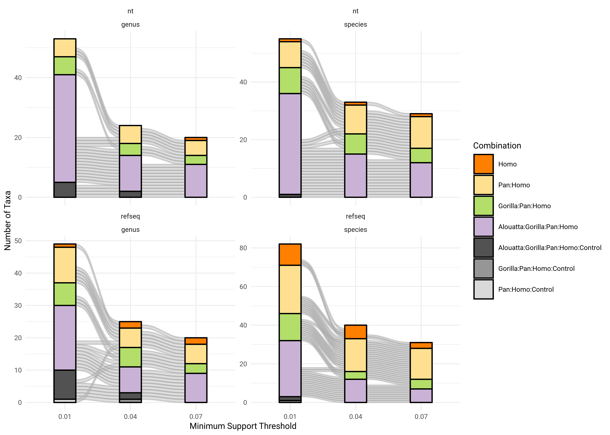

**Figure R25 | Alluvial diagram showing effects of increasing the minimum abundance threshold to the MALT OTU table-based core microbiome calculations. Increasing from 0.04% to 0.07% shows minimal changes in combination assignment.** Comparisons are between the nt (top) and RefSeq (bottom) databases, and at genus (left) and species (right) taxonomic levels. Stacked bars represent the number of taxa to each combination, and alluviums represent the assignment of a given taxon between each minimum support threshold. Plots created using the ggalluvial R package 273, with input data as MALT aligned and MEGAN exported OTU tables excluding putative laboratory contaminants, badly preserved samples, and taxa with minimum support values < 0.07% (genus level) and < 0.04% (species level).

Setting a 0.07% minimum support value at genus level and 0.04% for species was
sufficient to remove all well-known environmental or contaminant taxa while
retaining well-known oral taxa. Furthermore, these parameters generally removed
remaining laboratory contaminants being considered core to a 'controls + host 
genus' combination.

The raw data for the min. support permutation comparison can be seen under
`06-additional_data_files` in Data R23.

#### R10.1.3 Single Population Testing

We additionally also checked the effect of removing the single individual 
population in Gorillas with the script version of the core microbiome notebook,
(`02-scripts.backup/018-CoreMicrobiome_ParameterTesting_20190902.R`)
and permutating whether any populations with a single individual were dropped 
or not.

```bash
## Final being minSupport of X, 0.5 inds of population, and 66 pops of genus, 
## min. support 0.7 for genus and 0.4 for species, and testing whether dropping
## single individual populations makes a difference.

for i in 4 7; do
  Rscript 02-scripts.backup/018-CoreMicrobiome_20190429_script.R "nt" "$i" 0.5 0.66 F
  Rscript 02-scripts.backup/018-CoreMicrobiome_20190429_script.R "nt" "$i" 0.5 0.66 T
done

for i in 4 7; do
  Rscript 02-scripts.backup/018-CoreMicrobiome_20190429_script.R "refseq" "$i" 0.5 0.66 F
  Rscript 02-scripts.backup/018-CoreMicrobiome_20190429_script.R "refseq" "$i" 0.5 0.66 T
done

```

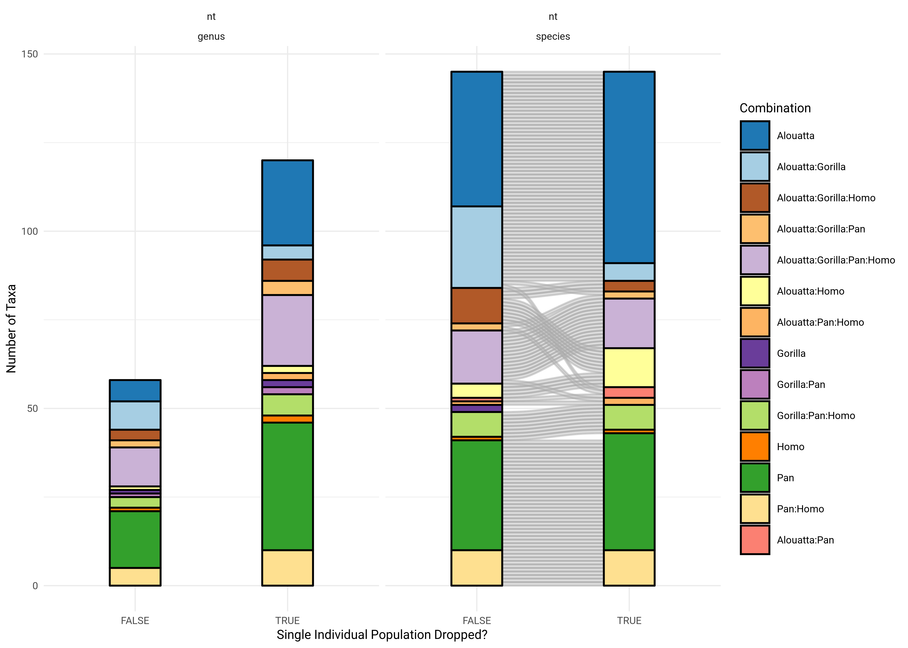

**Figure R26 | Alluvial diagram showing effects of dropping and retaining a single-individual Gorilla population in core microbiome calculations at genus and species taxonomic levels.** Dropping the single-individual population results in minor combination assignments, mostly taxa being assigned to being core to the compositionally similar Alouatta combinations. Stacked bars represent the number of taxa to each combination, and alluviums represent the assignment of a given taxon between dataset. Plots created using the ggalluvial R package, with input as MALT NCBI nt aligned and MEGAN exported OTU tables with putative laboratory contaminants, badly preserved samples, and taxa with minimum support values < 0.07% (genus level) and < 0.04% (species level) removed.

The raw data for the comparison of excluding single individual populations can 
be seen under`06-additional_data_files` in Data R24.

Individual visualisations and results for each parameter run can be seen in 
`04-analysis/screening/presenceabsence_intersection.backup/`

#### R10.1.4 Investigation into Mycobacterium as Core Genus

We also observed that _Mycobacterium_ was able to pass our minimum support 
despite being a common soil contaminant. We investigated this further 
(see main article for more details.) in an extension of the original Core
Microbiome calculation script which is under `02-scripts.backup` as
`099-CoreMicrobiome_ParameterTesting_and_MycobacteriumInvestigation_20190902.Rmd`


**Figure R27 | Alignment distribution and prevalence of Mycobacterium across well-preserved calculus microbiome samples in this study.** Approximate 'abundance' is consistent across calculus samples, however most prevalent taxa are likely well-known environmental taxa. a summary of alignments of well preserved samples and sources to _Mycobacterium_ species. b number of individuals that all _Mycobacterium_ species identified in the dataset are found in. Input is from MALT NCBI nt database OTU table at species level, excluding putative laboratory contaminants and badly preserved samples.

Finally, for each database and taxonomic level, we generated Upset plots 
summarising the number of genera and species found in each core microbiome 
combination.


#### R10.1.5 Core Microbiome Intersection Between Hosts

Due to the large number of categories, which can make reading Venn diagrams 
difficult to understand, we can summarise the number of taxa in each host 
combination in an UpSet plot. Code for this can also be seen in the 
`02-scripts.backup/018-CoreMicrobiome_ParameterTesting_20190902.Rmd` notebook.

**Figure R28 | UpSet plot showing the number of taxa shared across each host genus combination for NCBI nt (top) and custom NCBI RefSeq (bottom) and genus (left) and species (right).** Note that for the custom RefSeq database plots, a control group as a 'core' microbiome is displayed as at the corresponding minimum support value. However these taxa remain unique to the control samples only, which does not exist at the same threshold for the nt database. Plots are generated from MALT aligned and MEGAN exported OTU tables to each database; filtered for putative laboratory contaminants, badly preserved samples and a minimum support value for microbial taxa of 0.7 (genus level) and 0.4 (species level). Taxa are considered core to a host genus if taxon is present in 50% of individuals of each population, and >= 66% of the populations to a given host.

The final list of taxa at both species and genus level can also be seen in
`06-additional_data_files` under Data R22. 

Comparison of the core assignments for the two databases was generated with 
`02-scripts/18-CoreMicrobiome_database_Comparison`, and the outcome can be 
seen in `06-additional_data_files` under Data R25.

### R10.2 Core Microbiome MaltExtract

To further verify the authenticity the calculus samples - we can also run 
MaltExtract on a subset of the core taxa to check for damage patterns and 
short fragment lengths. 

We took the species level 'core' of the Anthropoids, Hominids and Homininis 
based on the MALT nt database, with a min. support value of 0.04, requiring 
a taxon being in 50% of each population having a taxon to be core to the 
population, and 66% of the populations to be core to the genus. We retain
single individual populations, and calculate intersections between each
host genus. 

This list is then given to MaltExtract as follows,

```bash
MaltExtract \
--destackingOff \
-f def_anc \
-i 04-analysis/screening/maltExtract/input/all/ECO*rma6 \
-o 04-analysis/screening/maltExtract/output/test/ \
-p 32 \
-r RMA_Extractor_Resources \
-t 04-analysis/screening/maltExtract/taxon_lists/08b-coremicrobiome_presenceabsence_upsettable_allsoftware_maltdbnt_0.04_fracinds0.5_fracpops0.66_singleindpopsdroppedF_hostgenus_species_AnthropoidsHominidaeHoiminini_20190509.tsv \
-v

```

See [above](#r841-mex-ipa) for results

## R11 Genome Reconstruction and Phylogenetics

We next want to test whether the phylogenies of specific oral taxa also
'mimic' the phylogenetic histories of the host. A common problem from 
genome construction from metagenomic sources - particularly with microbiome
data - is cross-mapping from related strains and species. This
makes genotyping difficult when dealing with the low coverage data, because
the confidence in the SNP calling is very low.

As a strategy to try and reduce cross-mapping, I came up with the idea to 
map the production dataset to a 'super-reference' of all relevant species of
a genus (including the target species of interest), and then only genotype on
the section of the super-reference including the target species of interest. The
predicted effect would be reads from off-target reads would be attracted to
the related strains/species and thus would not be present on the reference of
interest.

### R11.1 Production dataset sequencing depth calculations

For optimal phylogenetic reconstruction, high coverage genomes are generally
preferred to improve confidence in genotyping. The screening dataset 
generally yields low coverage genomes, and we wanted to work out which samples
would provide the best chance of producing multiple higher-coverage genomes of
species of interest.

To calculate this, we map to a range of taxa of interest (either from 
observations in the dataset or from broad literature review). We selected
the following species - downloaded the reference or representative strains
from NCBI, and indexed as [above](#r43-bwa-indexing).

The Initial species that were selected are:

  * _Pseudopropionibacterium propionicum_
  * _Treponema socranskii_ (only scaffolds)
  * _Rothia dentocariosa_
  * _Desulfobulbus_ sp. oral taxon 041 (<- only contigs)
    - For this selected the sp. oral taxon 041 assembly with the largest  
    assembly size, Desulfobulbus sp. oral taxon 041 str. Dsb1-5. 
    - Downloaded from the Genbank FTP server the contigs from here: 
      ftp://ftp.ncbi.nlm.nih.gov/genomes/all/GCA/000/403/865/GCA_000403865.1_Dsb1-5
  * _Fusobacterium nucleatum_
  * _Aggregatibacter aphrophilus_
  * _Streptococcus gordonii_
 * _Treponema denticola_
 * _Tannerella forsythia_
 * _Treponema denticola_

We can then map all our samples to the references listed above with EAGER.

```text
Organism: Bacteria/Other
Age: Ancient
Treated Data: non-UDG
Pairment: Single End
Input is already concatenated (skip merging): Y

Reference: [listed above]
Name of mitocondrial chromosome: [none]

FastQC: Off
AdapterRemoval: Off
Mapping: BWA
  Seedlength: 32
  Max # diff: 0.1
  Qualityfilter: 37
  Filter unmapped: On
  Extract Mapped/Unmapped: Off
Complexity Estimation: Off
Remove Duplicates: DeDup
  Treat all reads as merged: On
Damage Calculation: Damageprofiler
SNP Calling: Unified Genotyper
  Emit All Sites: On
CleanUp: On
Create Report: On
```

> EAGER Results files are not included here due to large size

We initially tried running PreSeq, but (un)fortunately the library complexity
was too high and not enough duplicates were found in most of the mappings to 
yield enough information for extrapolation.

Instead, we can do a linear estimation in an spreadsheet. For this we took the
following steps.

1. Concurrently Multiplying the current number of reads and depth coverage 
   until target depth coverage is reached (5x)
2. Remove any mapping that required more >100 million reads
3. Remove any mapping with a cluster factor 
   (reads before mapped deduplication / mapped reads after deduplication) 
   above 1.2 - suggesting lower complexity library
4. Select any sample with at least 3 mappings retained above above filtering 
   (if a host genus did not have enough samples, we went with the next highest 
   number of mappings)

Extracts of the selected samples were sent for UDG treatment and deep sequencing.

### R11.2 Super-reference construction

We decided to generate phylogenies based on the core genera 
[identified above](#R10-core-microbiome-analysis). To generate the super-reference,
we can use the notebook 
`02-scripts.backup/99-phylogeny_reference_genome_collection.Rmd`. 
This notebook downloads the NCBI Genome assembly reports, performs filtering 
based on sequencing level, quality, whether it is representative or not - and 
selects one strain for species within the genus.

Within the notebook we also perform more manual filtering of isolation source
to remove species that are very unlikely derived from the human body or in
contact with archaeological samples (such as activated sludge).

The outcome of these filtering steps can be seen in the files 
`00-documentation.backup/18-Core_Microbiome_AssemblyDownload_*`, with the final 
files used for downloading ending with  "\*filtered". This files were downloaded 
as above with `wget`.

> _Pseudopropionibacterium_ is generated in a different manner due to recent clade
> renaming, but the desire to retain common skin taxa which now have new genus
> names (see [Scholz and Kilian 2016](http://dx.doi.org/10.1099/ijsem.0.001367))

You can alternatively see a list of all genomes downloaded for each 
super-reference in `06-additional_data_files` under Data R26.

We convert the FASTA headers to a format suitable for `samtools` (given we 
don't have chromosomes) with 
`02-scripts.backup/099-fasta_header_replacer.sh <FASTA>`.

For downstream processing (in particular MultiVCFAnalyzer), we need to convert
the multiple FASTA files into a single one, with FASTA headers removed. For
this we can use the script `02-scripts.backup/099-collapse_fastas.sh`, which
combines them but exporting coordinates (also in bed format) indicating where
each species FASTA entry is present in the super-reference FASTA.

FASTAs were indexed as [above](#r43-bwa-indexing)

> Reference files and indices are not included due to large size

### R11.3 Super-reference alignment and species selection

The production dataset was then mapped to each of the core genus 
super-references with EAGER, with the following settings.

```text
Organism: Bacteria/Other
Age: Ancient
Treated Data: UDG
Pairment: Single End
Input is already concatenated (skip merging): Y

Reference: [listed above]
Name of mitochondrial chromosome: [none]

FastQC: Off
AdapterRemoval: Off
Mapping: BWA
  Seedlength: 32 
  Max # diff: 0.1
  Qualityfilter: 0
  Filter unmapped: On
  Extract Mapped/Unmapped: Off
Complexity Estimation: Off
Remove Duplicates: DeDup
  Treat all reads as merged: On
Damage Calculation: On
SNP Calling: On
  Emit All Sites: Y
CleanUp: On
Create Report: On
```

The settings above in table format can be seen in `06-additional_data_files`
under Data R27.

> The EAGER mapping results files are not provided here due to the large size, 
> other than the ReportTable files.

The EAGER runs are stored in 
`04-analysis/deep/eager/superreference_mapping/output`

To generate breadth and depth statistics for each species reference in
the super-reference we can use `bedtools`, using the BED coordinates as provided
by the `02-scripts.backup/099-collapse_fastas.sh` script.

```bash
bedtools coverage -a 01-data/genomes/"$genus"/collapsed_"$genus"_superreference.bed -b "$BAM" | pigz -p 1 > "$BAM".bedtoolsbreadth.tsv.gz 
bedtools coverage -a 01-data/genomes/"$genus"/collapsed_"$genus"_superreference.bed -b "$BAM" -mean | pigz -p 1 > "$BAM".bedtoolsdepth.tsv.gz
```

> This was adapted from a SLURM array script and should be adapted accordingly.

Output results for this statistics can also be see under 
`04-analysis/deep/eager/superreference_mapping/output` or collated in
`06-additional_data_files` under Data R28.

### R11.4 Comparative single reference mapping

#### R11.4.1 Reference selection methods

To compare the effect on genotyping when using a super-reference rather than a 
single representative genome, we also need a single genome to compare to.
Furthermore, as we wish to run phylogenies of the outcome - we want to find
taxa which are both prevalent across all host genera, as well as displaying 
sufficient coverage for genotyping.

For this we can calculate a variety of metrics, and select the best fitting
species for the two requirements above. This is described in
`02-scripts.backup/031-superreferencemapped_genotyping_stats.Rmd`. 

The final list of selected taxa via visual inspection were as follows

* _Actinomyces_              - Actinomyces_dentalis_DSM_19115 
* _Campylobacter_            - Campylobacter_gracilis
* _Capnocytophaga_           - Capnocytophaga_gingivalis_ATCC_33624
* _Corynebacterium_          - Corynebacterium_matruchotii_ATCC_14266
* _Fretibacterium_           - Fretibacterium_fastidiosum
* _Fusobacterium_            - Fusobacterium_hwasookii_ChDC_F206
* _Olsenella_                - Olsenella_sp_oral_taxon_807
* _Ottowia_                  - Ottowia_sp_oral_taxon_894
* _Porphyromonas_            - Porphyromonas_gingivalis_ATCC_33277
* _Prevotella_               - Prevotella_loescheii_DSM_19665_=_JCM_12249_=_ATCC_15930
* _Pseudopropionibacterium_  - Pseudopropionibacterium_propionicum_F0230a
* _Selenomonas_              - Selenomonas_sp_F0473
* _Streptococcus_            - Streptococcus_sanguinis_SK36
* _Tannerella_               - Tannerella_forsythia_92A2
* _Treponema_                - Treponema_socranskii_subsp_paredis_ATCC_35535

Output from the automated species selection can be seen in 
`04-analysis/deep/competitive_mapping.backup/species_selection`. This is
also summarised in Table R8.

**Table R8 | Results of ‘automated’ super-reference species selection for downstream phylogenetic analysis.** Production dataset was mapped for each genus with EAGER to a combined reference of all species of the calculus microbiome core genome calculated above. Metrics were number of reads, breadth coverage, depth coverage, competitive mapping score, percentage of species reads over all genus reads. Species were then filtered those that had a number metrics that the species exceeded the genus mean plus standard deviation of the metric was more than 1. In cases of ties, either a named species or more complete genome reconstruction selected. In cases where unnamed species are the top candidate, either the next best taxon with an official name or where the isolation source was ‘oral cavity’ were selected.

| Genus                     | Species                                                   | Metrics Passed | Selected |
|---------------------------|-----------------------------------------------------------|---------------:|----------|
| _Actinomyces_             | _Actinomyces dentalis DSM 19115_                          | 5              | TRUE     |
| _Campylobacter_           | _Campylobacter_ sp. AAUH-44UCsig-a                        | 3              | FALSE    |
| _Campylobacter_           | _Campylobacter gracilis_                                  | 2              | TRUE     |
| _Capnocytophaga_          | _Capnocytophaga gingivalis_ ATCC 33624                    | 5              | TRUE     |
| _Corynebacterium_         | _Corynebacterium matruchotii_ ATCC 14266                  | 4              | TRUE     |
| _Corynebacterium_         | _Corynebacterium_ sp.                                     | 3              | FALSE    |
| _Corynebacterium_         | _Corynebacterium durum_ F0235                             | 2              | FALSE    |
| _Fretibacterium_          | _Fretibacterium fastidiosum_                              | 4              | TRUE     |
| _Fusobacterium_           | _Fusobacterium hwasookii_ ChDC F206                       | 2              | TRUE     |
| _Olsenella_               | _Olsenella_ sp. oral taxon 807                            | 5              | TRUE     |
| _Ottowia_                 | _Ottowia_ sp. Marseille-P4747                             | 4              | FALSE    |
| _Ottowia_                 | _Ottowia_ sp. oral taxon 894                              | 3              | TRUE     |
| _Porphyromonas_           | _Porphyromonas gingivalis_ ATCC 33277                     | 4              | TRUE     |
| _Prevotella_              | _Prevotella loescheii_ DSM 19665 = JCM 12249 = ATCC 15930 | 2              | TRUE     |
| _Prevotella_              | _Prevotella_ sp. oral taxon 472 str F0295                 | 2              | FALSE    |
| _Prevotella_              | _Prevotella_ sp. S7 MS 2                                  | 2              | FALSE    |
| _Pseudopropionibacterium_ | _Pseudopropionibacterium propionicum_ F0230a              | 4              | TRUE     |
| _Selenomonas_             | _Selenomonas_ sp. F0473                                   | 2              | TRUE     |
| _Selenomonas_             | _Selenomonas_ sp. oral taxon 137 str F0430                | 2              | FALSE    |
| _Streptococcus_           | _Streptococcus sanguinis_ SK36                            | 4              | TRUE     |
| _Streptococcus_           | _Streptococcus_ sp. AS14                                  | 4              | FALSE    |
| _Tannerella_              | _Tannerella forsythia_ 92A2                               | 5              | TRUE     |
| _Treponema_               | _Treponema socranskii_ subsp. _paredis_ ATCC 35535        | 5              | TRUE     |

#### R11.4.1 Reference selection comparison and final selection

The selection based on the different metrics were performed manually and via
an automated system, which is compared in `06-additional_data_files` under
Data R29. The list above in Table R8 showed high concordance with the visual
inspection, and therefore the visual taxon selection was used only when 
there was not a clear 'winner' from the automated selection (e.g. Selenomonas) 

The reference genomes of the selected taxa can be copied from the 
[super-reference downloaded files](#r112-super-reference-construction), 
and multiple chromosomes are collapsed as again described in 
`02-scripts.backup/99-phylogeny_reference_genome_collection.Rmd`.

EAGER can then be run again with the same settings for the 
[Super-reference mapping](#r113-super-reference-alignment-and-species-selection), 
but with the single 
representative genome taxa FASTAs instead.

Summary plots of the single genome mappings can be seen under 
`02-scripts.backup/099-SingleGenome_MappingStatistics_Summary.Rmd`. Corresponding
EAGER statistics can be seen in `06-additional_data_files` under Data R32.

Summary statistics comparing mapping to a super-reference and single reference
genome can be seen in `06-additional_data_files` under Data R30.

> The reference genome files are not provided here due to the large size


**Figure R29 | Comparison mapping statistics of deep sequenced calculus microbiomes to single species representatives of core calculus microbiome genera.** Despite deep sequencing, mean fold coverage remains low - albeit with low cluster factor suggesting deeper sequencing will result in higher coverages. **a** Distributions of mean fold coverage. **b** Distributions of cluster factor. Mappings are production dataset calculus data, mapped to a single representative reference genomes of core anthropoid calculus microbiome. Post-deduplication mean fold coverage and cluster factors values are as reported by EAGER results table.

### R11.5 Performance of super-reference vs. single genome mapping

As the main target of this comparison of mapping strategies is to see if we 
can reduce the level of cross-mapping, we need a way of assessing the level
of multi-allelic positions occur in each mapping.

For this we can use MultiVCFAnalyzer, which when given a GATK UnifiedGenotyper 
VCF file where the reference ploidy was ('fakely') set to 2, will report
the fraction of reads that hold an allele in 'heterozygous' sites (i.e. 
positions where there is a possible reference and a possible alternative allele - which is not expected in haploid bacteria).

We can run MultiVCFAnalyzer as follows for each reference species of the two
mapping strategies.

```bash
java -Xmx32g -jar MultiVCFanalyzer_0-87.jar \
NA \
"$FASTA" \
NA \
<OUTDIR> \
T \
30 \
2 \
0.9 \
0.1 \
NA \
<VCF_1> \
<VCF_2> \
<VCF_3>

```

We set `T` to turn on saving of the allele frequencies in the outputted SNP 
Table, minimum coverage of 2 (to ensure at least two independent reads support
a call), a minimum fraction of reads required to have a base to be considered 
a single-allelic reference or SNP call as 0.9, and a minimum of 0.1 (but below 0.9) to be considered heterozygous.

For super-reference mappings, we still need to get the statistics for just the
positions representing the target species of interest. We can use the following
script to extract these.

```bash
for i in 04-analysis/deep/multivcfanalyzer/initial_single_genome/output/*; do 
  species="$(basename $i)"
  genus="$(echo $species | cut -d_ -f 1)"
  Rscript 02-scripts.backup/036-generate_multiVCFanalyzer_subset_statistics_20190322.R \
  04-analysis/deep/multivcfanalyzer/superreference_mapping/output/"$genus"/ \
  04-analysis/deep/eager/superreference_mapping/references/"$genus"/collapsed_"$genus"_superreference.bed \
  "$species"
done
```

Output files can be seen under `04-analysis/deep/multivcfanalyzer/superreference_mapping/output/`

> Only the snpStatistics files are provided here due to the large size of the 
> other MultiVCFAnalyzer output files.

To compare the level of heterozygosity as reported in MultiVCFAnalyzer between 
the two mapping strategies, we can look in the R notebook
`02-scripts.backup/032-multibasesites_mappingstrategycomparison_20190528.Rmd`.

A summary table of percentage of multi-allelic SNPs when running 
MultiVCFAnalyzer using both mapping methods can be seen in 
`06-additional_data_files` under Data R30.

From this script we see the super-reference mapping strategy doesn't work 
very often it reducing the number of multi-allelic SNPs, and 
further results in often a large decrease in the number of positions overall 
on the reference itself - therefore reducing the phylogenetically-informative
data. We therefore selected the single representative genome mappings for
downstream analysis.

Additionally, in the notebook we also show that we identified the most common 
fraction of a majority allele was 0.7, therefore we can use this to
increase the number of semi-confident SNP positions.


**Figure R30 | Distributions of majority allele (i.e. >50%) frequency of multi-allelic SNPs for each genus, across all production dataset calculus mappings to single genomes of representative core microbial taxa.** All mappings but _Actinomyces_ (reference: _Actinomyces dentalis_ DSM 19115) show that the most common highest frequency multi-allelic SNP bin is 70%. Calculated by selecting for each single-genome mapping the highest frequency multi-allelic SNP bin, from the 'SNP Table' of MultiVCFAnalyzer with a 'homozygous' threshold of 0.9, and 'heterozygous' threshold of 0.1 and minimum coverage threshold of 2.

Aggregation of this across all mappings can be seen in 
`04-analysis/deep/competitive_mapping.backup/multiallelic_snps/`.

### R11.6 Variant calling and single-allelic position assessment

We now re-run MultiVCFAnalyzer to create our final SNP Alignments for 
phylogenetic analysis.

We run the same MultiVCFAnalyzer command as above, but with the slightly 
relaxed homozygous fraction parameter and turning off reporting of heterozygous
positions by setting the heterozygous parameter to the same as the homozygous.

```bash
java -Xmx32g -jar MultiVCFanalyzer_0-87.jar \
NA \
"$FASTA" \
NA \
04-analysis/deep/multivcfanalyzer/superreference_mapping/output/superreference_mapping_2X_0.7_0.7/"$SPECIES" \
T \
30 \
2 \
0.7 \
0.7 \
NA \
<VCF_1> \
<VCF_2> \
<VCF_3>
```

The final snpAlignment and snpStatistics files can be seen in `04-analysis/deep/multivcfanalyzer/initial_single_genome/output/initial_single_genome_2X_0.7_0.7/`

> The remaining MultiVCFAnalyzer results are not provided here due to large size.

### R11.7 Phylogenies

For the phylogenies themselves, I wrote a custom R script that allows for 
generating a few summary statistics for the alignment, filtering based on the 
number of positions, and then pairwise-deletion neighbour-joining phylogenies.

To ensure a enough positions are present for distance calculations between 
samples we require a minimum 1000 of called positions for each sample, the 
filtering of which is included in `02-scripts.backup/042-generate_NJ_tree.R`.

e.g.

```bash

## Initial Single Genomes
for i in 04-analysis/deep/multivcfanalyzer/initial_single_genome/output/initial_single_genome_2X_0.7_0.7/*/snpAlignment.fasta.gz; do
  echo "$i"
  Rscript 02-scripts.backup/042-generate_NJ_tree.R "$i" 1000 JC69 100 none
  echo ""
done

Rscript 02-scripts.backup/042-generate_NJ_tree.R 04-analysis/deep/multivcfanalyzer/initial_single_genome/output/initial_single_genome_2X_0.7_0.7/Porphyromonas_gingivalis_ATCC_33277/snpAlignment.fasta.gz 2000 JC69 100 OME003
```

> We had to re-run _Porphyromonas_ with a higher minimum  position threshold, 
> and excluded a sample. The higher position here was due to some samples having
> insufficient position overlap to calculate a genetic distance, and inclusion
> OME003 caused bootstrapping to fail as it had an unusually higher number of
>  SNPs which ended up violating the equal base frequencies of the JC69 model.

The final Newick files and filtering statistics can be seen in 
`04-analysis/deep/multivcfanalyzer/initial_single_genome/output/initial_single_genome_2X_0.7_0.7/`

Visualisation of the phylogenies was carried out with the R notebook 
`02-scripts.backup/026-Tree_visualisation_20190611.Rmd` and PDF files of each
phylogeny for each of the taxa under `04-analysis/deep/phylogenies/plots`.


**Figure R31 | Neighbour joining trees of eight well-supported calculus core taxa trees from single representative mappings of the production dataset.** Trees generally show microbial strains clustering of individuals to those of the same host genus, and pre-14k BP European individuals consistently display a distinct clade from post-14k BP European individuals. Representative genomes were selected based on abundance and prevalence across all individuals in production dataset. SNPs were called using MultiVCFAnalyzer with a minimum coverage threshold of 2, and the majority allele threshold of 0.7. Alignments with <1000 called SNPs were removed. Genetic distance calculated using the ape R package, with the Jukes-Cantor 69 model and pairwise deletion strategy for missing data. Bootstraps are out of 100 bootstraps. Trees were selected as 'well-supported' if nodes resulting in expected host genus bifurcations equalled or exceeded 70%. Note that titles refer to the representative genome of the selected species used for the reference genome, and the alignments are mixtures of strains/species as indicated by high levels of multi-allelic sites. Grey boxes indicate European 'pre-14k BP' of the Red Lady of El Mirón and Neanderthals.

Comparison of the median fold depth of all mappings of a host genus, and
the pairwise number of overlapping bases between each sample can be seen in 
`02-scripts.backup/099-Phylogenies_SharedOverlappingSNPS.Rmd`

> You may need to `gunzip` the `.nwk` files before loading

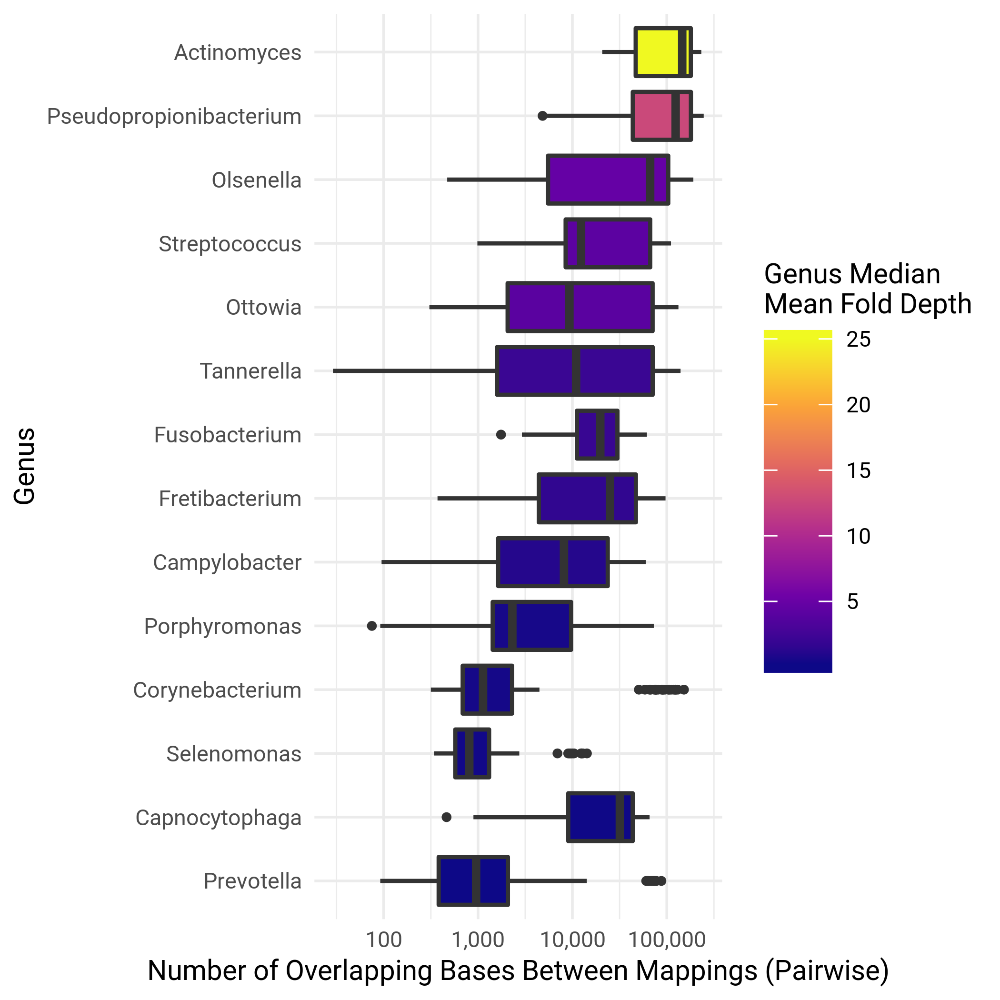

**Figure R32 | Relationship between number of positions shared, and fold depth coverage between pairwise combinations of individuals, from the production dataset mapped to representative core taxa. Higher coverage taxa generally display greater numbers of shared positions.** Shared number of bases was calculated from the MultiVCFAnalyzer 'SNP alignment' FASTA file, with alignments containing less than 1000 bases removed. Order of microbial taxa and fill colour based on the genus median of average fold coverages average across all mappings in that genus as reported by EAGER. Boxplots present 25%, 50%, 75% of data, Dots represent outliers as calculated by the geom_histogram() function of ggplot. X axis is log scaled.

### R11.8 Pre- and Post-14k BP Observation Verification

In the trees generated above, we observed that single deep sequenced pre-14ky
BP individual (Red Lady/EMN001) _always_ clustered with Neanderthals, whereas 
post-14ky BP individuals mostly fell with modern day humans. 

#### R11.8.1 Production dataset overlapping positions analysis

One possible cause of this clustering could be that the two clades could 
represent different species (due to sub-optimal reference selection), and the
clustering of the Red Lady of El Mirón (EMN001)  with the Neanderthals is 
because they share the same regions of the genome which are not present in 
the other clade (leading to more similar distance calculations). Alternatively, 
the Neanderthals and EMN001 may have very small regions of the genome covered 
(given their age) and the distance calculated is just highly conserved regions 
with low diversity.

To check this, we can build a distribution of the numbers of positions 
present in both of of all pair-wise combinations of humans. Then we can 
calculate the median number of overlapping SNPs of EMN001 with each Neanderthals,
and the same for each Human individual - and see if the 
MN001/Neanderthal median falls outside the range of the EMN001/Human and 
Human/Human combinations.

This is implemented in version three within `02-scripts.backup/044-SNPAlignment_SharedData_Analysis_20190915.Rmd`.

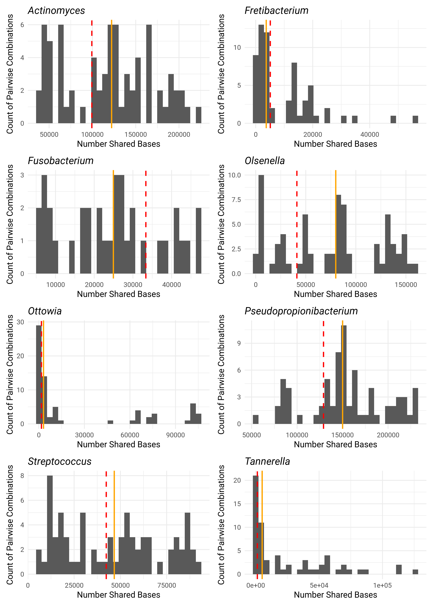

**Figure R33 | Comparison of number shared positions of EMN001 and Neanderthals, compared to humans used to generate production dataset phylogenies.** EMN001 and Neanderthal pairwise combinations do not show having shared number of positions falling outside the range of all human to human pairwise combinations. Histogram represents a count of all pairwise human combinations that have a given number of shared positions. All individuals with less than 1000 positions in each SNP alignment have been removed. Orange solid line represents median number of positions of EMN001 shared with each human, and red dashed line represents median shared between EMN001 and each Neanderthal individual.

The output files for can be seen in `04-analysis/deep/phylogenies`

#### R11.8.2 Screening datasets phylogenies

We also wanted to see if this held when adding additional European individuals.

For this, even though we will be going even _lower_ resolution, we can try
building the same phylogenies but with the screening counterparts of each sample
(i.e. with damage, and lower coverage), with a few extra individuals i.e. PLV001
and RIG001 for pre-14ky BP, and OFN001 for post-14ky BP.

We set up EAGER the same way as [above](#r111-production-dataset-sequencing-depth-calculations) 
(retaining the stricter alignment parameters to try and reduce the effect of damage).

Once completed, we check the coverage statistics of each EAGER run as in
`02-scripts.backup/056-Phylogenies_Screening_EMNCheck_EAGERResults.Rmd`. Although
we have very low coverage overall, we can try anyway to build phylogenies.

The individual ReportTables can be seen in 
`04-analysis/screening/EMN_Neanderthal_phylogeny_check/multivcfanayzer/output`

> The EAGER mapping results files are not provided here due to the large size, 
> other than the ReportTable files.

We again run MultiVCFAnalyzer with the same parameters above but to a new
directory.

```bash
java -Xmx32g -jar MultiVCFanalyzer_0-87.jar \
NA \
"$FASTA" \
NA \
04-analysis/screening/EMN_Neanderthal_phylogeny_check/multivcfanalyzer/output/"$SPECIES" \
T \
30 \
2 \
0.7 \
0.7 \
NA \
<VCF_1> \
<VCF_2> \
<VCF_3>
```

Then same as above, we attempt to make the same 8 better supported phylogenies 
with:

```bash
for i in 04-analysis/screening/EMN_Neanderthal_phylogeny_check/multivcfanalyzer/output/*/snpAlignment.fasta.gz; do
  echo "$i"
  Rscript 02-scripts.backup/042-generate_NJ_tree.R "$i" 1000 JC69 100 none
  echo ""
done
```

The results can be seen in `04-analysis/screening/EMN_Neanderthal_phylogeny_check/multivcfanayzer/output`

> Only a subset of MultiVCFAnalyzer files are uploaded here, due to large size

With these we can load into the R markdown document 
`058-Tree_visualisation_20191025_screening.Rmd` to see the trees. The PDF
figures can be seen under `04-analysis/screening/EMN_Neanderthal_phylogeny_check/phylogenies`

> You may need to `gunzip` the `.nwk` files before loading


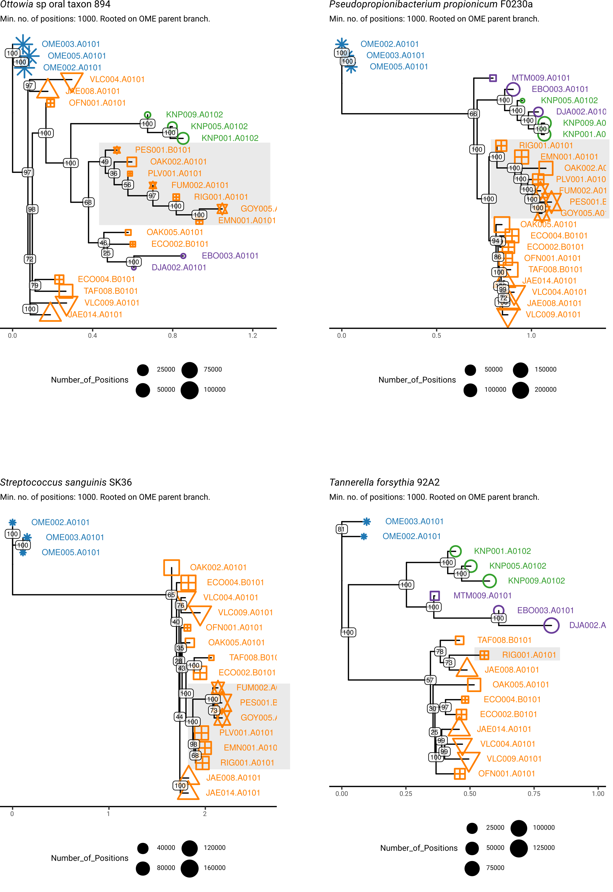

**Figure R34 | Replication of production dataset phylogenies with low-coverage and damage-containing screening dataset with additional European individuals.** The observed pattern of pre-14k BP Europeans and post-14k BP humans clustering separately in the production dataset phylogenies is replicated when including additional pre- and post-14k BP individuals when using screening dataset equivalents. Representative genomes were selected based on abundance and prevalence across all individuals in production dataset. SNPs were called using MultiVCFAnalyzer with a minimum coverage threshold of 2, and the majority allele threshold of 0.7. Alignments with <1000 called SNPs were removed. Genetic distance calculated using the ape R package, with the Jukes-Cantor 69 model and pairwise deletion strategy for missing data. Bootstraps are out of 100 bootstraps. Grey boxes indicate European 'pre-14k BP' of the Red Lady of El Mirón and Neanderthals

## R12 Functional Analysis

### R12.1 Virulence Factors

Given that we identified in the production dataset significant numbers of reads
mapping to reference genomes of classically considered and well-studied 
'red complex' pathogenic bacteria across most host genera, we were interested 
to see if we would observe any change in pathogenicity based on gain/loss of 
identified virulence factors in human strains.

For this we can first use the production mapping datasets to the references of
_Tannerella forsythia_ and _Porphyromonas gingivalis_. 

We can take the deduplicated bedfiles and run `bedtools` coverage on them, using
a collection of virulence factors described in the literature. This list 
including NCBI gene locus tags can be seen in `06-additional_data_files` under
Data R35.

```bash
bedtools coverage -a <REFERENCE>.gff -b <BAM> > <OUT FILE>.tsv
bedtools coverage -a <REFERENCE>.gff -b <BAM> > <OUT FILE>.tsv -mean
```

For the actual filtering and identification of presence/absence, we load the
 resulting TSV files into R with the notebook 
 `02-scripts.backup/054-virulence_investigation.Rmd`


**Figure R35 | Distribution of (annotated) gene counts passing a breadth threshold of 70%, as calculated from the mappings of the production dataset to two 'red complex' bacteria reference genomes.** A clear cut off of ~500 genes can be seen, reflecting the separation between low-coverage and higher coverage genomes.


**Figure R36 | Heatmap of ratios (fill) of virulence gene depth coverage and gene completeness (size), in mappings of the production dataset to two 'red complex' bacteria reference genomes.** Virulence factors associated with oral disease are found prevalent across all host genera.

### R12.2 Amylase

#### R12.2.1 Streptococcus Distribution

In the hierarchical clustering ([above](#r92-hierarchical-clustering-heatmaps)), we
observed the relative abundance and prevalence of Streptococci varied between 
host genus. We therefore wished to explore this further - given the interest
in human evolutionary history regarding the role of amylase copy number 
variation, and certain groups of Streptococci displaying amylase activity.

Firstly, we can look at the distribution of different types of streptococci groups
within each of our host genera. We generated a 'consensus' table of streptococci
groups and their reported amylase-binding protein activity (as reported in the
literature), described here in `06-additional_data_files` under Data R33 or 
under `00-documentation.backup/25-streptococcus_cladegroup_amylasegroup_database.tsv`.

Using the MALT species level OTU tables from the screening dataset, we 
can visualise as stacked bar plots the proportion of Streptococcus alignments 
deriving from each group. We can also applied the same concept to the production 
dataset - but using the _Streptococcus_ super-reference as the reference 
database, as in the notebook
`02-scripts.backup/033-streptoccocus_investigation_v2_20190826.Rmd`.


**Figure R37 | Distribution of production dataset reads to each Streptococcus group when mapping to a Streptococcus super-reference, normalised by the total number of super-reference aligned reads.** As with the screening dataset, _Homo_ are dominated by streptococci groups displaying amylase binding protein activity (sangiuinis, mitis and salivarius). See section 6. Microbial phylogenetics for details on super-reference construction and mapping. Streptococcus groups are ordered by amylase activity as reported by Haase 2017 BMC Microbiol - in which members within the sanguinis, mitis and salivarius groups showed amylase activity.

#### R12.2.2 Amylase binding protein genes abundance

Given the different distributions of the _Streptococcus_ content of each 
host-genera and the observation that Humans tend to have more prominent signals
of amylase-binding-activity positive species, we also looked at whether amylase-
binding genes can be actually detected in each host genus.

We decided to use the production dataset for this, to provide higher confidence
of gene presence given the higher whole-reference depth coverages in this 
dataset. Given that sections of amylase-binding protein genes is present in other
genes, we wanted to find all possible 'amylase-binding-protein gene'-like 
sequences in the super-reference, to maximise our sensitivity in finding related
reads.

For this we can recover all amylase-like reads in our super-reference with the 
tool panX, using the Genbank files for each reference.

```bash
## Run panX analysis
pan-genome-analysis/panX.py \
-fn <GENBANK_FILE_DIR> \
-sl Streptococcus_Superreference \
-t 32
```

In the output using the panX visualisation companion tool, we searched
for the _abpA_ and _abpB_ genes as annotated in the `_Streptococcus gordonii` genome, and downloaded the corresponding FASTA alignments of similar sequences from 
the sequence alignment table. The alignments can be seen under 

`04-analysis/screening/streptococcus_investigation.backup/panX/abpA_abpB_cluster_alignments`

We then performed a filtering procedure to the files due to
the inclusion of highly diverged sequences, as described in 
`02-scripts.backup/048-panX_streptococcus_amylasebindingproteincluster_detection.Rmd`.
The final list of annotations can be seen in `06-additional_data_files` under 
Data R34.

We then used the R script `02-scripts.backup/049-Streptoccocus_superreference_amylasebinding_coordinate_reconstruction.R` 
to recover the coordinates of these sequences from the super-reference FASTA, 
which was exported as a BED file.

> The super-reference FASTA files are not included here to large size.

For each sample's mapping to the _Streptococcus_ super-reference, we then
ran bedtools to recover statistics on the genome coverage.

```bash
## Extract reads from abpA and abpB-like regions
bedtools intersect \
-c \
-a <ABPA_OR_ABPB_BEDFILE> \
-b <SUPER-REFERENCE_BAM>
```

The resulting files were then loaded into to assess the ratio of all 
_Streptococcus_ reads to amylase binding protein-like reads as in 
`02-scripts.backup/051-streptococcus_superreference_to_amylase_comparison.Rmd`.

#### R12.2.3 Amylase bayesian skyline analysis

We additionally identified reads in the screening dataset originating from *abpA* and *abpB* by independently using BLAST and mapping against a selected set of reference sequences of *abpA* and *abpB*. All reference abpA sequences in fasta format were built into a blast database:

```bash
makeblastdb -in <abp_gene>.fasta -dbtype nucl -title <abp_gene> -out <abp_gene>
```

and then all screening samples were searched against both databases using blast command line tools: 

```bash
## ran once with <abp_database> for abpA and again with <abp_database> for abpB
gzip -dcf <SAMPLENAME>.fastq.gz | blastn -db <abp_database> -query - -out $(basename <SAMPLENAME> .fasta.gz).out -num_descriptions 20 -num_alignments 20 -num_threads 12
```

All reads that hit any reference sequence were extracted from a blast format output file to a list using the script `ncbiblastparser.pl` downloaded from `https://github.com/mel-astar/mel-ngs/blob/master/utils/ncbiblastparser.pl`

```bash
ncbiblastparser.pl <(gzip -dcf <SAMPLENAME>.out) 1 "$(echo <SAMPLENAME>)".parsed
grep -v 'No hits found' "$(echo <SAMPLENAME>)".parsed > "$(echo <SAMPLENAME>)".hits
```

The read ID of all sequences with a hit in the blast output were copied to a list 

```bash
awk '{print $1}' <SAMPLENAME>.hits > <SAMPLENAME>.list
```

This list was used to extract the reads from the original fastq files using seqtk into new files to be mapped against *apbA* and *abpB* references sequences:

```bash
zcat <SAMPLENAME>.fastq.gz | seqkit grep -f <SAMPLENAME>.list > <SAMPLENAME>.fastq
```

The individual *abpA* and *abpB* sequences were indexed with bwa for mapping: 

```bash
for f in *.fasta; do bwa index -p `basename $f .fasta` $f; done
```

and then each BLAST-hit read sample file was mapped against each *abpA* and *abpB* reference sequence:

```bash
bwa aln -n 0.01 -l 32 <reference_abp_sequence> <SAMPLENAME>.fastq > <SAMPLENAME>.abp_reference_seqence.sai

bwa samse /AP018338_abpA <SAMPLENAME>.abp_reference_seqence.sai <SAMPLENAME> > <SAMPLENAME>.abp_reference_seqence.sam
```

Finally files were converted to bam format, mapped reads selected out, duplicate reads removed from the mapped read only file, and the duplicate-removed mapped-only read file was indexed:

```bash
# convert sam to bam
for f in *.sam; do samtools view -bS $f | samtools sort - $(basename $f .sam).bam; done

# select only mapped reads
for f in *.bam; do; samtools view -b -F4 $f > $(basename $f .bam).mapped.bam; done

# remove duplicates from mapped reads
for f in *mapped.bam; do 
samtools rmdup -s $f $(basename $f .bam)_rmdup.bam 2>&1 >/dev/null  | cut -d' ' -f 6 > $(basename $f .bam)_dup.txt # collects read IDs of the duplicate reads
samtools index $(basename $f .bam)_rmdup.bam
done

# index the mapped, dupliate-removed bam files
for f in *rmdup.bam; do; samtools index $f $(basename $f .bam).bai; done
```

All alignments were visually inspected with IGV, and consensus sequences from
mapping against the *Streptococcus gordonii* str. Challis (NC_009785) reference
*abpA* and *abpB* sequences were exported from IGV if they covered at least 40%
of the reference at least 1X : On the alignment track right-click to bring up a
menu and select 'Copy consensus sequence'. All consensus sequences were pasted
into a text file in fasta format that included the NC_009785 reference sequence,
and this was used as an alignment file. The consensus sequence fasta file was
uploaded to Geneious v 8.0.5 and exported in a nexus file format.

The consensus sequence nexus file was uploaded into BEAUTi BEAUTi for Bayesian
skyline analysis with BEAST2 v 2.4.7., and dates were added, either as estimated
from archaeological context, or from known collection dates of modern data. All
parameters were left at default with the GTR substitution model, a strict clock,
and coalescent Bayesian skyline model. The MCMC chain length was 800000000 with
sampling every 80000 states. The chain converged but inspection of the tree
structure in DensiTree showed no structure for *abpA*, and we therefore did not
proceed with BEAST analysis to date expansion of *abpA*. However, we generated a
skyline plot from the *abpB* data, which is shown in Figure R38.

A list of accession numbers of abpB sequences collected for bayesian skyline
analysis can be seen in `06-additional_data_files` under Data R36. 


**Figure R38 | Bayesian skyline plot of population expansion of the amylase-binding protein B gene _(abpB)_.** The population shows expansion at ~7000 years before the present, with a decline at around 500 years before the present. However, the uneven distribution of samples across time make the results unreliable, and we do not draw any conclusions from these results.

### R12.3 HUMANn2

In addition to the taxonomic profile, the functional profile of dental calculus
microbiota may provide insight into host evolutionary patterns. The functional
profile of a metagenomic sample is determined by the gene content of species
that are present. The program HMP Unified Metabolic Analysis Network 2 (HUMAnN2,
Franzosa, *et al*. 2018) was developed to generate a metabolic functional
profile from a metagenome sample. HUMAnN2 provides both species-specific gene
assignments and general gene assignments, when the species of origin cannot be
determined, as well as grouping the genes into the metabolic pathways they
contribute to and providing a metabolic pathway profile. We assessed both the
metabolic pathway profile and the gene content profile of our samples generated
by HUMAnN2, as detailed below.

#### R12.3.1 MetaPhlAn2

In preparation for HUMANn2, we ran MetaPhlan2, running on the whole screening
dataset.

```bash

INDIR=04-analysis/screening/metaphlan2/input
OUTDIR=04-analysis/screening/metaphlan2/output

for LIBFILE in "$INDIR"/*/*.fq.gz; do
  LIBNAME=$(echo "$LIBFILE" | rev | cut -d/ -f2 | rev)
  if [ -d "$OUTDIR"/"$LIBNAME" ]; then
    printf "\n $LIBNAME already Processed \n\n"
  else
    mkdir "$OUTDIR"/"$LIBNAME"
    metaphlan2.py $LIBFILE \
    -o $OUTDIR/$LIBNAME/$LIBNAME.mp2profile.tsv \
    --input_type fastq \
    --nproc 2 \
    -t rel_ab
  fi
done

## if re-running with different parameters, here changing fastq to bowtie2out

INDIR=04-analysis/screening/metaphlan2/input
OUTDIR=04-analysis/screening/metaphlan2/output

for LIBFILE in "$INDIR"/*/*bowtie2out.txt; do
  LIBNAME=$(echo "$LIBFILE" | rev | cut -d/ -f2 | rev)
  if [ -d "$OUTDIR"/"$LIBNAME" ]; then
    printf "\n $LIBNAME already Processed \n\n"
  else
    mkdir "$OUTDIR"/"$LIBNAME"
    metaphlan2.py $LIBFILE \
    -o $OUTDIR/$LIBNAME/$LIBNAME.mp2profile.tsv \
    --input_type bowtie2out \
    --nproc 2 \
    -t rel_ab
  fi
done

## Re-running to get estimated read counts with rel_ab to rel_ab_w_read_stats

INDIR=04-analysis/screening/metaphlan2/input
OUTDIR=04-analysis/screening/metaphlan2/output_readcounts

for LIBFILE in "$INDIR"/*/*bowtie2out.txt; do
  LIBNAME=$(echo "$LIBFILE" | rev | cut -d/ -f2 | rev)
  if [ -d "$OUTDIR"/"$LIBNAME" ]; then
    printf "\n $LIBNAME already Processed \n\n"
  else
    mkdir "$OUTDIR"/"$LIBNAME"
    metaphlan2.py $LIBFILE \
    -o $OUTDIR/$LIBNAME/$LIBNAME.mp2profile_readstats.tsv \
    --input_type bowtie2out \
    --nproc 2 \
    -t rel_ab_w_read_stats
  fi
done


## Re-running to get actual rad counts with rel_ab to rel_ab_w_read_stats

INDIR=04-analysis/screening/metaphlan2/input
OUTDIR=04-analysis/screening/metaphlan2/output_readmappedcounts

for LIBFILE in "$INDIR"/*/*bowtie2out.txt; do
  LIBNAME=$(echo "$LIBFILE" | rev | cut -d/ -f2 | rev)
  if [ -d "$OUTDIR"/"$LIBNAME" ]; then
    printf "\n $LIBNAME already Processed \n\n"
  else
    mkdir "$OUTDIR"/"$LIBNAME"
    metaphlan2.py $LIBFILE \
    -o $OUTDIR/$LIBNAME/$LIBNAME.mp2profile_readsmappedstats.tsv \
    --input_type bowtie2out \
    --nproc 2 \
    -t reads_map
  fi
done
```

To merging all of the MetaPhlAn2 percentage profiles of all the libraries

```bash
cd 04-analysis/screening/metaphlan2/output

## Note, remove metaphlan2.py script in the variable here as using util scripts
METAPHLAN2=biobakery-metaphlan2-7898bf1/

INDIR=04-analysis/screening/metaphlan2/input
OUTDIR=04-analysis/screening/metaphlan2/output

"$METAPHLAN2"/utils/merge_metaphlan_tables.py "$OUTDIR"/*/*mp2profile.tsv > "$OUTDIR"/mp2_merged_abundance_table_all_"$(date +%Y%m%d)".txt
```

For merging of the estimated read count files, run the 
`016-metaphlan2_readcount_table_generator.Rmd` notebook.

For the mapped reads, method, the output actually gives both the name of the 
read and a given taxonomic ID. For this we run the following:

```bash

for i in */*; do 
  echo $(echo "$i" | cut -d "/" -f 1) $(zcat "$i" | wc -l) ; 
done > mp2_merged_readsmapped_table_all_"$(date +%Y%m%d)".txt

```

Note that all of those files need to be -1 because the count includes a header.

> Individual MetaPhlAn2 files are not provided here due to redundancy with
> combined file(s)

The summarised output MetaPhlAn2 files can be seen in `06-additional_data_files`
under Data R15.

Finally, some read statistics by applying the same 0.01% threshold used in MALT
are gained via the `099-MetaPhlan2_Summary_statistics.R` script. These were
then manually added to the metadata file.


**Figure R39 | Percentage of non-human reads mapping to the MetaPhlAn2 database.** Colours correspond to calculus host genus. Blue: _Alouatta_; Purple: _Gorilla_; Green: _Pan_; Orange: _Homo_; Grey: non-calculus.


**Figure R40 | Distributions of the number of genera and species identified by MetaPhlAn2 across each study group.** Colours correspond to calculus host genus. Blue: _Alouatta_; Purple: _Gorilla_; Green: _Pan_; Orange: _Homo_; Grey: non-calculus.

#### R12.3.2 Running HUMANn2

Once we have the MetaPhlAn2 profiles, we can run HUMANn2 with the following
command, running on the S

```bash

humann2 \
--input <INPUT_SAMPLE>.fq.gz \
--output 04-analysis/screening/humann2/output/"$SAMPLENAME"/  \
--taxonomic-profile <INPUT_MP2_PROFILE>.tsv \
--threads 8 \
--memory-use maximum

```

> This was adapted from a SLURM array script and should be adjusted accordingly
> to run on each sample

:warning: The output temporary files (which don't appear to be removed) are HUGE.
We need to remove them after successful running by doing the following:

```bash
cd 04-analysis/screening/humann2/output
rm -r */*_temp/
```

which reduces our footprint from 4.9 TERABYTES(!?!?!) down to 3.9 gigabytes.
This is mostly due to the uncompressed SAM files.

Next we need to normalise the data of each file. We only need
to do this on the genefamilies and pathabundance data, as you don't have to
do this for the [pathwaycoverage](https://bitbucket.org/biobakery/biobakery/wiki/humann2#rst-header-manipulating-humann2-output-tables)

```bash

cd 04-analysis/screening/humann2/output

for SAMPLE in */*_genefamilies.tsv; do
    humann2_renorm_table --input $SAMPLE --output ${SAMPLE%.tsv}_cpm.tsv --units cpm --update-snames
done

for SAMPLE in */*_pathabundance.tsv; do
    humann2_renorm_table --input $SAMPLE --output ${SAMPLE%.tsv}_cpm.tsv --units cpm --update-snames
done

rm */*_genefamilies.tsv
rm */*_pathabundance.tsv

# -s to search subdirectories of current directory to look for the files
humann2_join_tables --input . --output humann2_genefamilies.tsv --file_name genefamilies_cpm -s 
humann2_join_tables --input . --output humann2_pathcoverage.tsv --file_name pathcoverage -s 
humann2_join_tables --input . --output humann2_pathabundance.tsv --file_name pathabundance_cpm -s

```

We want also want to put the output in KEGG format. To do this we firstly need 
to download the re-grouping database

```bash
humann2_databases --download utility_mapping full 01-data/databases/humann2

```

Then we can regroup our table(s)

```bash
humann2_regroup_table -i humann2_pathabundance.tsv -g uniref90_ko -o humann2_pathabundance_ko.tsv
humann2_regroup_table -i humann2_genefamilies.tsv -g uniref90_ko -o humann2_genefamilies_ko.tsv
```

> HUMANn2 output files are not provided here due to large size

All analysis and figure generation for HUMAnN2 data can be found in the R markdown
document here `02-scripts.backup/144-imv-oral_evolution_humann2_fxn_cleaned.Rmd`.


We used pathway abundance data to perform PCAs, wich were plotted to visualize
the relationships between samples and controls, as well as within and between
samples.
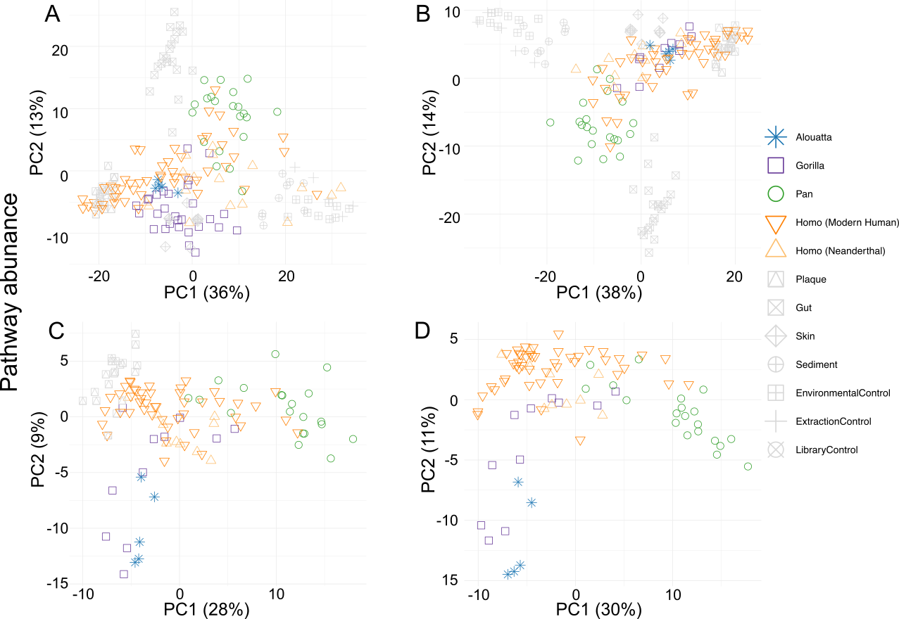
**Figure R41 | Principal components analysis of pathway abundances identified by HUMAnN2.** PCA of pathway abundances with **a** all samples and controls, **b** outlier samples removed, **c** only plaque and calculus samples, **d** only calculus samples. Outliers were determined for pathway abundances based on plotting with the controls samples (not plaque) in panel A.


The differences in the number of assignments to UniRef90 categories, KEGG
orthologs, and KEGG carbohydrate orthologs between sample groups were explored. 

**Figure R42 | HUMAnN2 read assignment statistics.** All graphs have outlier samples removed. **a** Percent of reads assigned to a UniRef90 protein, outlier samples removed. **b** Proportion of UniRef90 assignments that grouped to KEGG orthologs. **c** The total number of KEGG orthologs in any of the 15 KEGG Carbohydrate pathways in each sample. **d** Abundance of KEGG orthologs in any of the 15 KEGG Carbohydrate pathways in each sample. * P < 0.05, ** P < 0.01, *** P<0.001. 


We used KEGG ortholog abundance data to perform PCAs, wich were plotted to
visualize the relationships between samples and controls, as well as within and
between samples.
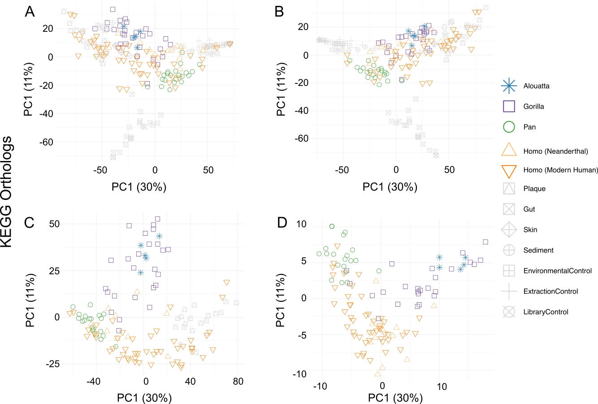
**Figure R43 | Principal components analysis of KEGG orthologs separates host genera.** PCA of pathway abundances with **a** all samples and controls, **b** outlier samples removed, **c** only plaque and calculus samples, **d** only calculus samples. Outliers were determined for pathway abundances based on plotting with the controls samples (not plaque) in panel A.


Biplots were used to visualize the KEGG orthologs with strongest loadings in PC1
and PC2, to understand what drives separation of sample groups.  
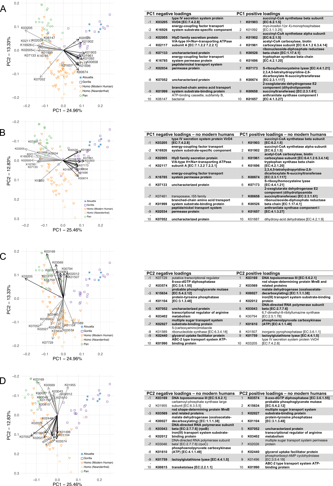
**Figure R44 | PCA biplots with the KEGG orthologs (Figure R39/SM3D above) with the top 10 strongest positive and negative loadings on PC1 and PC2.** **a** Top loadings of PC1 with all _Homo_ samples. **b** Top loadings of PC1 without modern _Homo_ samples. **c** Top loadings of PC2 with all _Homo_ samples. **d** Top loadings of PC2 without modern _Homo_ samples. Note in panels b and d (without modern _Homo_ samples) that the y-axis has been reversed to maintain orientation with the other PCAs.


The abundance of each of the orthologs plotted in the biplots above were
visualized in heat maps to visualize the difference between host groups, 
including modern _Homo_. 

**Figure R45 | Heat maps showing the centered log ratio-transformed abundance of the top 10 proteins with strongest loadings from the PCA including modern _Homo_.** Host genus is indicated by the colored bars to the right, where blue is _Alouatta_, purple is _Gorilla_, green is _Pan_, and orange is _Homo_. Symbols in _Homo_ indicate different groups, where triangle pointed up is Neanderthal, square is pre-agricultural human, circle is pre-antibiotic human, and triangle pointed down is modern day human. **a** PC1 positive top 10 KEGG orthologs with strongest loadings. **b** PC1 negative top 10 KEGG orthologs with strongest loadings. **c** PC2 positive top 10 KEGG orthologs with strongest loadings. **d** PC2 negative top 10 KEGG orthologs with strongest loadings. 


The abundance of each of the orthologs plotted in the biplots above were
visualized in heat maps to visualize the difference between host groups, 
excluding modern _Homo_. 

**Figure R46 | Heat maps showing the centered log ratio-transformed abundance of the top 10 proteins with strongest loadings from the PCA excluding modern _Homo_.** Host genus is indicated by the colored bars to the right, where blue is _Alouatta_, purple is _Gorilla_, green is _Pan_, and orange is _Homo_. Symbols in _Homo_ indicate different groups, where triangle pointed up is Neanderthal, square is pre-agricultural human, and circle is pre-antibiotic human. **a** PC1 positive top 10 KEGG orthologs with strongest loadings. **b** PC1 negative top 10 KEGG orthologs with strongest loadings. **c** PC2 positive top 10 KEGG orthologs with strongest loadings. **d** PC2 negative top 10 KEGG orthologs with strongest loadings. 


We looked at whether specific species contributed the orthologs with strongest
loadings in the biplots above to look for host-specific species contributions to
orthologs. First we looked at the orthologs in strongest positive loadings in PC1.

**Figure R47 | Microbial genus contributions to KOs with the strongest positive loadings in PC1.** Bar graphs of the genera, summed from species, that contribute >12% to the KEGG orthologs with strongest positive loadings in PC1: **a** Including modern _Homo_ samples, grouped by KEGG ortholog, **b** Including modern _Homo_ samples, grouped by host genus, **c** Excluding modern _Homo_ samples, grouped by KEGG ortholog, and **d** Excluding modern _Homo_ samples, grouped by host genus. All genera that individually contributed <12% are grouped together as g__Other.


We looked at whether specific species contributed the orthologs with strongest
loadings in the biplots above to look for host-specific species contributions to
orthologs. Then we looked at the orthologs in strongest negative loadings in PC1.

**Figure R48 | Microbial genus contributions to KOs with the strongest negative loadings in PC1.** Bar graphs of the genera, summed from species, that contribute >12% to the KEGG orthologs with strongest negative loadings in PC1: **a** Including modern _Homo_ samples, grouped by KEGG ortholog, **b** Including modern _Homo_ samples, grouped by host genus, **c** Excluding modern _Homo_ samples, grouped by KEGG ortholog, and **d** Excluding modern _Homo_ samples, grouped by host genus. All genera that individually contributed <12% are grouped together as g__Other.


We looked at whether specific species contributed the orthologs with strongest
loadings in the biplots above to look for host-specific species contributions to
orthologs. Then we looked at the orthologs in strongest positive loadings in PC2.

**Figure R49 | Microbial genus contributions to KOs with the strongest loadings in PC2 characterizing _Pan/Gorilla/Alouatta_.** Bar graphs of the genera, summed from species, which contribute >12% to the KEGG orthologs with strongest positive loadings in PC2: **a** Including modern _Homo_, grouped by KEGG ortholog, **b** Including modern _Homo_, grouped by host genus, **c** and the strongest negative loadings in PC2 excluding modern _Homo_, grouped by KEGG ortholog, and **d** Excluding modern _Homo_, grouped by host genus. All genera that individually contributed <12% are grouped together as g__Other.


We looked at whether specific species contributed the orthologs with strongest
loadings in the biplots above to look for host-specific species contributions to
orthologs. Last we looked at the orthologs in strongest negative loadings in PC2.

**Figure R50 | Microbial genus contributions to KOs with the strongest negative loadings in PC2.** Bar graphs of the genera, summed from species, that contribute >12% to the KEGG orthologs with strongest negative loadings in PC2 **a** Including modern _Homo_, grouped by KEGG ortholog, **b** Including modern _Homo_, grouped by host genus, **c** Excluding modern _Homo_, grouped by KEGG ortholog, and **d** Excluding modern _Homo_, grouped by host genus. All genera that individually contributed <12% are grouped together as g__Other.


Lastly, we looked at whether KEGG orthologs in specific metabolic pathways were
as distinct between host groups as all KEGG orthologs combined, by performing
and plotting PCAs with KEGG orthologs from only the Carbohydrate, Amino acid,
and Lipid metabolic pathways. 
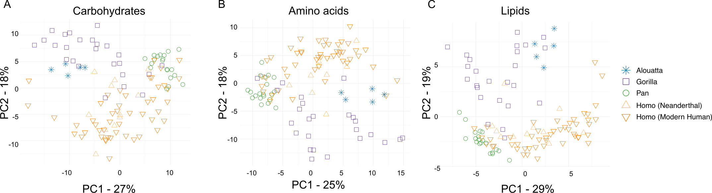
**Figure R51 | PCAs using KEGG orthologs belonging to specific metabolic pathway categories.** KEGG orthologs in pathways that process major biomolecules all separate samples by host genus in a pattern similar to that seen in taxonomy, metabolic pathways, and all KEGG orthologs. **a** All KEGG orthologs in the Carbohydrate metabolism pathways. **b** All KEGG orthologs in the Amino acid metabolism pathways. **c** All KEGG orthologs in the Lipid metabolism pathways.

### R12.4 AADDER Analysis

As a validation, we also want to use AADDERR - a tool which infers functional
characteristics based on the annotations of a MALT/MEGAN reference database. 

This uses `.gff` files to compare taxonomic assignments with annotations, which
we downloaded [above](#r42-aadder-database). A list of genomes used in this list 
can be seen in `06-additional_data_files` under Data R10.

We will run this against the filtered RefSeq genomes we built above both
with MALT (fasta files) and AADDER (gff files).

### R12.5 MALT RefSeq

We then run MALT but instead of immediately producing RMA6 files, we 
generate SAM files. This can be run with the following:

```bash
02-scripts.backup/008-malt-genbank-refseq_bacarchhomo_gcs_20181122_4step_85pc_supp_0.01 \
04-analysis/screening/malt/temp_input/*/*.fq.gz \
04-analysis/screening/malt/refseq_bacarchhomo_gcs_20181122/
```

To extract the summary statistics for the Refseq runs, we can run
the following on the MALT logs.

```bash
grep -e "Loading MEGAN File:" \
-e "Total reads:" \
-e "With hits:" \
-e "Alignments:" \
-e "Assig. Taxonomy" \
-e "Min-supp. changes" \
-e "Numb. Tax. classes:" \
-e "Class. Taxonomy:" \
-e "Num. of queries:" \
-e "Aligned queries:" \
-e "Num. alignments:" \
-e "MinSupport set to:" \
04-analysis/screening/malt/refseq_bacarchhomo_gcs_20181122/*log | cut -d":" -f 2-99 > 00-documentation.backup/99-maltAlignedReadsSummary_raw_refseq_bacarchhomo_gcs_20181122_$(date "+%Y%m%d").txt
```

The corresponding `.megan`, `.nwk`  and OTU tables at various taxonomic
levels (as exported by MEGAN) can be seen in `06-additional_data_files` under 
Data R11.

### R12.6 Running AADDER

Then we run AADDER

```bash
aadder-run \
-i 04-analysis/screening/aadder/input/*.sam.gz \
-d 01-data/databases/aadder/ \
-o 04-analysis/screening/aadder/output/ \
-v
pigz -p 112 04-analysis/screening/aadder/output/*
```

> AADDERR output files are not provided here due to large size

Finally run blast2rma to make it loadable into MEGAN

```bash
blast2rma \
--format SAM \
-i 04-analysis/screening/aadder/output/*out.gz \
-o 04-analysis/screening/aadder/rma6_2/ \
-a2seed 01-data/databases/acc2seed/acc2seed-May2015XX.abin \
-a2t 01-data/databases/acc2tax/nucl_acc2tax-Nov2018.abin \
-v
```

Once completed, the resulting RMA6 files were opened in MEGAN6CE (v6.15.2) via
MEGAN SERVER, opened in compare mode using absolute counts and 'ignore all
unassigned reads'. I then switched to the 'SEED' categories, 'uncollapse-all',
select everything then exported the table as TSV with seedPath_to_count. An
additional file that also included all unassigned reads was also exported (with
the same name but ending in `_summarised_Not_Assigned.txt)`, to be able to compare
between the host genera the percent of reads that could be assigned functions.

After performing PCA on the protein-level SEED assignments, we wanted to explore
the contribution of each microbial species to the proteins with strongest
loadings in PC1 and PC2, to see if they differed between host genera. To do
this, we opened all of the AADDER .rma6 files from each host genera in MEGAN as
a group (all *Homo* at once, only ancient *Homo* all at once, all *Gorilla* at
once, etc.). From the SEED categories, each protein in the top 10 PC1 and PC2
positive and negative loadings were individually selected, and exported to a new
document. The new document summed the total read counts from all host samples
for each microbial species, so the individual read counts per species per sample
was lost. The species list and read count for ech host genus was exported from
MEGAN as a tsv.

BBEdit was used to add an additional 6 columns with the Find and Replace function:
Host_Genus, Protein, PC1 code, PC2 code, PC1nomodcode, and PC2nomodcode. The
PC<number>code columns indicate the order of proteins from strongest loading (1)
to lowest loading (10) of the top 10 strongest loadings in PC1 and PC2, for
positive values and negative values. The PC<number>nomodcode columns indicate
the same loading order, but for the PCAs that excluded modern *Homo* samples.
For example, pc1n3 is the protein with the 3rd strongest negative loading in
PC1, and pc1p3 is the protein with the 3rd strongest positive loading in PC1.
These codes were used to make the protein names manageable and consistent in R,
which had trouble with the special characters in several protein names.

All analysis of AADDER functional profiles can be found in the R markdown
document here `02-scripts.backup/148-imv-aadder_evolution_function_cleaned.Rmd`.


**Figure R52 | SEED category statistics at different pathway levels are reported by AADDER.** **a** Proportion of total reads assigned to a SEED category by AADDER. **b** Proportion of reads assigned to the SEED Carbohydrates category at all levels, excluding outlier samples. **c** Proportion of reads assigned to an enzyme in the SEED Carbohydrate category, excluding outlier samples. **d** Total number of enzymes in the Carbohydrate category in each sample. e Total abundance (number of reads) of enzymes in the Carbohydrate category in each sample. Note the different scale in each panel. * P < 0.05, ** P < 0.01, *** P<0.001.

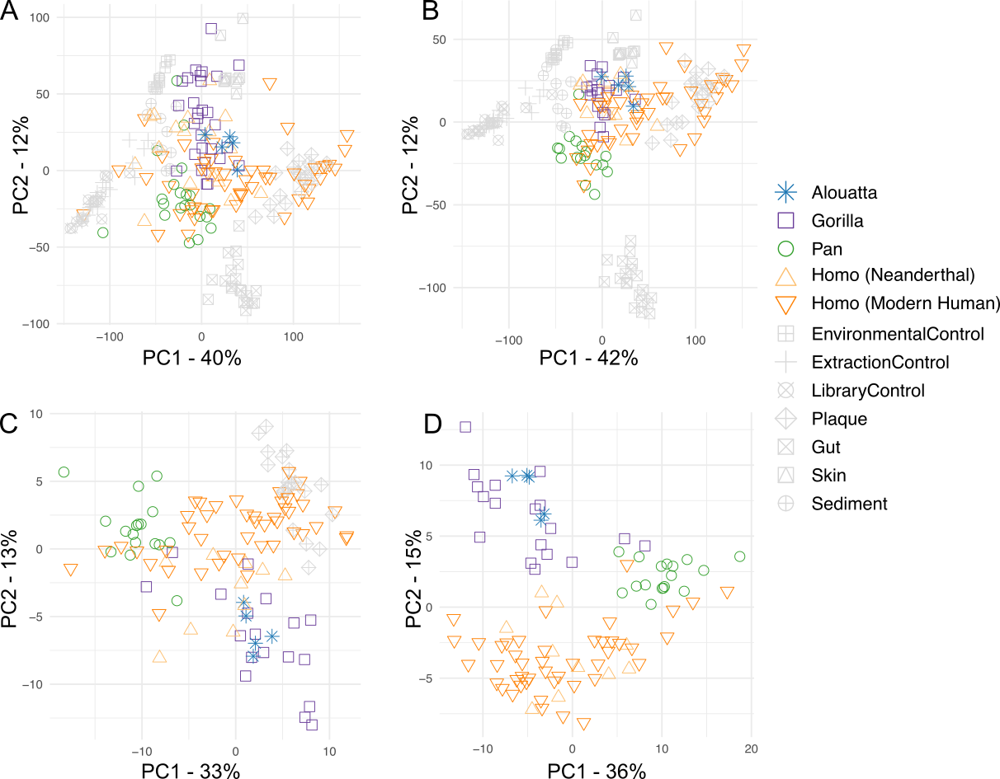
**Figure R53 | SEED-based enzyme composition of calculus samples clusters host genera distinctly.** **a** PCA with all samples and all enzymes. **b** PCA with decontam-identified enzymes removed and outlier samples removed. **c** PCA of oral samples (plaque and calculus) with decontam-identified enzymes and outlier samples removed. **d**  PCA of calculus samples with decontamination-identified enzymes and outlier samples removed.

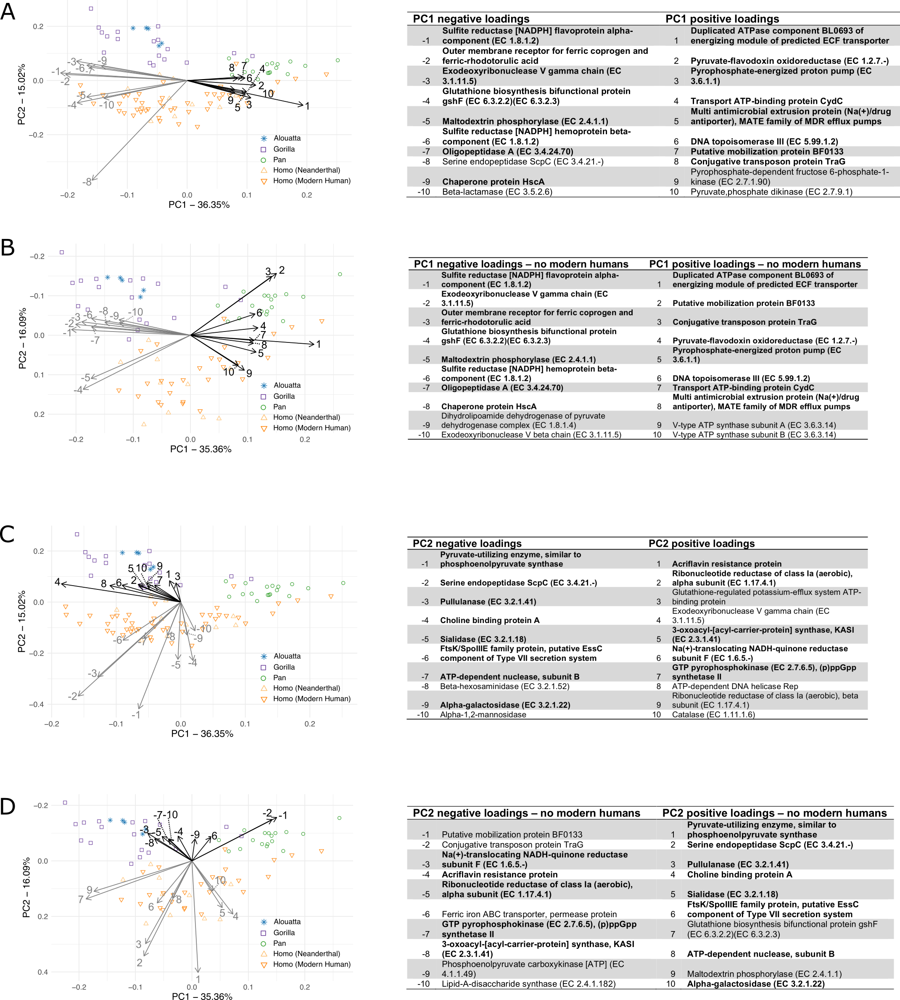
**Figure R54 | PCA biplots with the proteins with the top 10 positive and negative loadings on PC1 and PC2 of SEED protein-level entries identified by AADDER.** **a** Top loadings of PC1 including modern day humans. **b** Top loadings of PC1 excluding modern day humans. **c** Top loadings of PC2 including modern day humans. **d** Top loadings of PC2 excluding modern day humans. Bold protein names indicate these proteins remained in the top 10 when removing modern day humans from analysis. Note in panels B and D (without modern Homo samples) that the y-axis has been reversed to maintain orientation with the other PCAs.


**Figure R55 | Heat maps showing the centered log ratio-transformed abundance of the top 10 proteins with strongest loadings from the PCA including modern _Homo_.** Host genus is indicated by the colored bars to the right, where blue is _Alouatta_, purple is _Gorilla_, green is _Pan_, and orange is _Homo_. Symbols in _Homo_ indicate different groups, where triangle pointed up is Neanderthal, square is pre-agricultural human, circle is pre-antibiotic human, and triangle pointed down is modern day human. a PC1 negative top 10 proteins with strongest loadings. **b** PC1 positive top 10 proteins with strongest loadings. **c** PC2 negative top 10 proteins with strongest loadings. **d** PC2 positive top 10 proteins with strongest loadings.


**Figure R56 | Heat maps showing the centered log ratio-transformed abundance of the top 10 proteins with strongest loadings from the PCA excluding modern _Homo_.** Host genus is indicated by the colored bars to the right, where blue is _Alouatta_, purple is _Gorilla_, green is _Pan_, and orange is _Homo_. Symbols in _Homo_ indicate different groups, where triangle pointed up is Neanderthal, square is pre-agricultural human, and circle is pre-antibiotic human. a PC1 negative top 10 proteins with strongest loadings. **b** PC1 positive top 10 proteins with strongest loadings. **c** PC2 negative top 10 proteins with strongest loadings. **d** PC2 positive top 10 proteins with strongest loadings.


**Figure R57 | Species contributions to proteins with the strongest negative loadings in PC1.** Bar graphs of the species that contribute >15% to the proteins with strongest negative loadings in PC1. **a**  Including modern _Homo_ samples, grouped by protein. Symbols indicate the same proteins in panel C. **b** Including modern _Homo_ samples, grouped by host genus. **c** Excluding modern _Homo_ samples, grouped by protein. Symbols indicate the same proteins in panel A. **d** Excluding modern _Homo_ samples, grouped by host genus. All genera that individually contributed <15% are grouped together as Other. Protein names correspond to the numbers in the tables of Figure R53, where pc1/pc2 indicate the component, p/n indicate positive/negative, and the final number indicates the protein. Note different colors for panels A/B and C/D.


**Figure R58 | Microbial genus contributions to proteins with the strongest positive loadings in PC1.** Bar graphs of the species that contribute >15% to the proteins with strongest positive loadings in PC1. **a** Including modern _Homo_ grouped by protein. Symbols indicate the same proteins in panel C. **b** grouped by host genus, **c** excluding modern _Homo_ grouped by protein. Symbols indicate the same proteins in panel A. **d** with no modern day humans grouped by host genus. All genera that individually contributed <15% are grouped together as Other. Protein names correspond to the numbers in the tables of Figure R53, where pc1/pc2 indicate the component, p/n indicate positive/negative, and the final number indicates the protein. Note different colors for panels A/B and C/D.


**Figure R59 | Species contributions to proteins with the strongest PC2 loadings in the direction characterizing _Alouatta/Gorilla/Pan_.** Bar graphs of the genera, summed from species, which contribute >15% to the proteins with strongest positive loadings in PC2. a Including modern _Homo_ samples, grouped by protein. Symbols indicate the same proteins in panel C. **b** Including modern _Homo_ samples, grouped by host genus. **c** Excluding modern _Homo_ samples, grouped by protein. Symbols indicate the same proteins in panel A. **d** Excluding modern _Homo_ samples, grouped by host genus. All genera that individually contributed <15% are grouped together as Other. Protein names correspond to the numbers in the tables of Figure R53, where pc1/pc2 indicate the component, p/n indicate positive/negative, and the final number indicates the protein. Note different colors for panels A/B and C/D. 

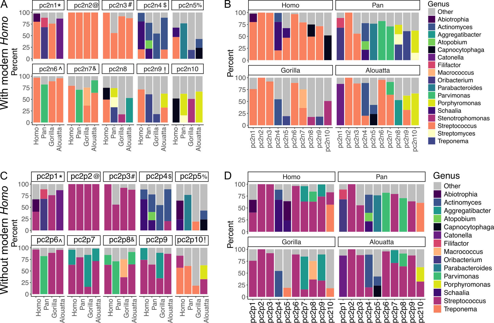
**Figure R60 | Microbial genus contributions to proteins with the strongest negative loadings in PC2.** Bar graphs of the genera, summed from species, that contribute >15% to the proteins with strongest negative loadings in PC2. **a** Including modern _Homo_ samples, grouped by enzyme. Symbols indicate the same proteins in panel C. **b** Including modern _Homo_ samples, grouped by host genus. **c** Excluding modern _Homo_ samples, grouped by enzyme. Symbols indicate the same proteins in panel A. **d** Excluding modern _Homo_ samples, grouped by host genus. All genera that individually contributed <15% are grouped together as Other. Protein names correspond to the numbers in the tables of Figure R53, where pc1/pc2 indicate the component, p/n indicate positive/negative, and the final number indicates the protein. Note different colors for panels A/B and C/D.

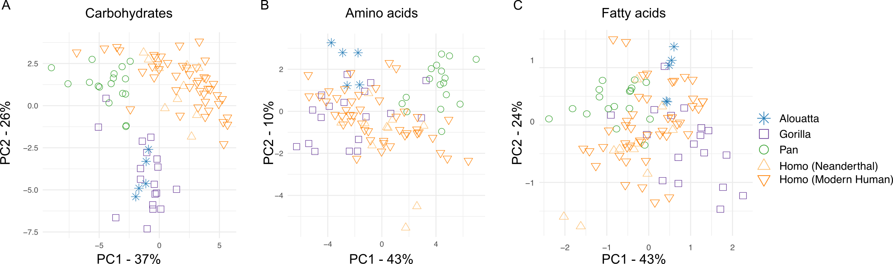
**Figure R61 | PCAs using SEED-classified proteins belonging to specific metabolic pathway categories.** Proteins in pathways that process major biomolecules do not each separate samples by host genus in a pattern similar to that seen in taxonomy, and all proteins. **a** Only proteins in the Carbohydrates category separate the samples by host genera in a pattern similar to that seen for taxonomy and all proteins. **b** Amino acid category proteins do not separate samples by host genera as distinctly as Carbohydrate category proteins. **c** Proteins in the Fatty acids, Lipids, and Isoprenoids category do not separate samples by host genera as distinctly as Carbohydrate category proteins.

### R12.7 Overlap between HUMAnN2 and AADDER

Finally, we wanted to see how many genes identified in the samples were
identified by both HUMAnN2 and AADDER, within major biomolecule procesisng
pathways (Amino acids, Carbohydrates, Fatty acids/Lipids). Both the HUMAnN2 KEGG
orthologs and the AADDER SEED proteins include the Enzyme Commission number (EC
number) on a majority of the orthologs/proteins they report, so we compared the
EC numbers between the two programs. For HUMAnN2, all orthologs that are
included in the KEGG Metabolism Pathways Amino acid, Carbohydrate, and Lipid
were individually selected out of the full HUMAnN2 ortholog list. For AADDER,
all proteins in the pathways Amino Acids, Carbohydrates, and Fatty Acids,
Lipids, and Isoprenoids were selected out of the full AADDER table. All analyses
based on EC numbers can be found in the R markdown document here
`02-scripts.backup/149-imv-aa-carbs-lipids_kegg-vs-seed.Rmd`.

